# The plan: The Galaxy Through Time

*An encyclopedia, the Great Filter, new kinds of worlds, an atlas, deep time, listening, and contact*

Aion Forge · planning document · rules version 10 → 17 · 3 Oct 2026

This plan covers eleven additions, built in the order agreed on 3 Oct 2026. The first two read what the simulation already knows and write it down: an encyclopedia entry for every object, and the Great Filter, the funnel that shows where worlds stop on the way from bare rock to a lasting civilization. The next five add physics the universe does not have yet: atmospheric escape, metallicity rising over cosmic time, moons (with the heat from inside that keeps their hidden oceans liquid), binary stars and rogue planets. Then come two ways to move through the result: an atlas, and a clock that runs the whole galaxy from its first stars to today. Last come two ways to meet its civilizations: listening for their signals, and studying what they send.

Nothing in this plan has been implemented yet. It builds on `Worlds-Up-Close.md` and `Worlds-Up-Close-Revision-1.md`, whose ground rules and resolutions (R1–R12) stay in force. Phase D of that plan (standing on the surface) is not part of this one.

## Contents

- [Summary](#summary)
- [Starting point](#starting-point)
- [Ground rules for every step](#ground-rules-for-every-step)
- [Build order and dependencies](#build-order-and-dependencies)
- [Stage 1 — Read what exists](#stage-1--read-what-exists)
  - [Step 1 — Galactic Encyclopedia](#step-1--galactic-encyclopedia)
  - [Step 2 — The Great Filter](#step-2--the-great-filter)
- [Stage 2 — New physics](#stage-2--new-physics)
  - [Step 3 — Atmospheric escape](#step-3--atmospheric-escape)
  - [Step 4 — Metallicity over cosmic time](#step-4--metallicity-over-cosmic-time)
  - [Step 5a — Heat from inside](#step-5a--heat-from-inside)
  - [Step 5 — Moons](#step-5--moons)
  - [Step 6 — Binary stars](#step-6--binary-stars)
  - [Step 7 — Rogue planets](#step-7--rogue-planets)
- [Stage 3 — Navigation](#stage-3--navigation)
  - [Step 8 — Galactic Atlas](#step-8--galactic-atlas)
  - [Step 9 — Deep Time](#step-9--deep-time)
- [Stage 4 — Contact](#stage-4--contact)
  - [Step 10 — SETI simulator](#step-10--seti-simulator)
  - [Step 11 — Civilization Communication](#step-11--civilization-communication)
- [Where the code goes](#where-the-code-goes)
- [New random streams](#new-random-streams)
- [Rules versions](#rules-versions)
- [Performance budgets](#performance-budgets)
- [Testing strategy](#testing-strategy)
- [Documentation](#documentation)
- [Risks](#risks)
- [Decisions needed](#decisions-needed)
- [Not in this plan](#not-in-this-plan)

---

## Summary

The work splits into four stages and eleven steps.

| Stage | Steps | What it adds |
|---|---|---|
| 1 · Read what exists | 1 Encyclopedia · 2 Great Filter | What the simulation already knows, written down for every object and for the universe as a whole |
| 2 · New physics | 3 Atmospheric escape · 4 Metallicity · 5a Heat from inside · 5 Moons · 6 Binary stars · 7 Rogue planets | Rules the universe does not have yet; each one changes what seeds produce |
| 3 · Navigation | 8 Atlas · 9 Deep Time | Finding things across the galaxy, and watching it change from its first stars to today |
| 4 · Contact | 10 SETI · 11 Communication | Hearing civilizations from a place in the galaxy, and studying them |

Step 5a is new in this document. Moons need it, because tidal heat keeps an ocean liquid under ice. Rogue planets need it, because they have no star. And measuring the universe for this plan showed that today's greenhouse warms worlds that receive almost no energy (see [Issues this plan fixes on the way](#issues-this-plan-fixes-on-the-way)). It is its own step so that its effect is measured on its own.

| | Decision | Meaning |
|---|---|---|
| **Decided · Deep Time** | (a) The whole galaxy over time | One cosmic clock, 0 to 13.7 Gyr, drives the galaxy view, the life and civilization markers, the atlas and the timeline. The planet view stays present-day. |
| **Decided · Communication** | Option A: answers come from the simulation | Every message, culture profile and answer is assembled from simulated facts by fixed templates. No language model is used. The same seed always gives the same answers, and nothing is said that the record does not hold. |
| **Decided · Order** | Encyclopedia → Great Filter → escape → metallicity → heat from inside → moons → binaries → rogues → atlas → Deep Time → SETI → communication | Stage 1 changes no seed. Stage 2 changes outcomes one step at a time. Stages 3 and 4 use everything before them. |
| **Consequence** | Rules version 10 → 17 | Seven steps change outcomes: 3, 4, 5a, 5, 6, 7, and phase-let DT1 of step 9. Each bumps the version once, as R10 set. Saved universes are marked and can be recounted, as they are today. |

## Starting point

Measured for this plan at commit `cb92a1a` (rules v10): seed 100000, default parameters, every one of the 2,000 stars. The measurement called the simulation's own modules; no code was changed.

| Measure | Value |
|---|---|
| Stars | 2,000: 1,807 main sequence, 92 red giants, 45 white dwarfs, 44 protostars, 7 neutron stars, 5 black holes |
| Planets | 8,537: 7,134 solid and 1,403 giants (433 heavier than Jupiter, 235 above 1,000 M⊕, 60 above 3,000 M⊕) |
| Worlds where life began / living today | 4,167 / 3,297 |
| Living worlds by stage | 3,013 microbial · 149 multicellular · 95 complex · 40 dominant |
| Living worlds frozen over today (ice above 90%) | 2,031 (62%) |
| Minds / civilizations | 90 / 89 |
| Civilizations by stage today | 39 collapsed (every one a ruin) · 9 primitive · 28 agricultural · 5 industrial · 5 information age · 3 space age |
| Systems holding two or more civilizations | 7 of the 81 systems with any |
| Mass extinctions (25% or more of living lineages) per living world | median 0, 90th percentile 2, most 6 |
| Air on solid planets today | 2,251 crushing · 2,590 thick · 1,308 moderate · 611 thin · 374 none |
| Nearest neighbouring star | median 637 ly; 10th–90th percentile 276–1,266 ly |
| Nearest other civilization at the industrial stage or later | 5,300–29,000 ly (median about 12,700 ly) |
| Light crossing the galaxy | about 110,000 years (1.1 × 10⁻⁴ Gyr), a thousandth of one world-history step |
| Time since industry, for civilizations industrial or later today | 0.48–4.74 Gyr |
| Survey of the whole universe | 59 s of CPU time; 16 s on the measuring machine's 4 cores with the worker pool |

Distances use the display convention in `ui/format.ts` (`LIGHT_YEARS_PER_UNIT`: 120 scene units shown as about 50,000 ly).

### Stars through cosmic time

A star's age is a draw (`star.ts`: `age = rng · min(lifespan, 13.7 Gyr)`), so its birth is implicit: 13.7 Gyr minus its age. Every star in the population is alive today, because a star that would have died before today is never generated. Counting the stars born by each moment:

| Cosmic time (Gyr) | 1 | 4 | 8 | 12 | 13 | 13.6 | 13.7 (today) |
|---|---:|---:|---:|---:|---:|---:|---:|
| Stars shining | 86 | 345 | 693 | 1,113 | 1,285 | 1,618 | 2,000 |
| Of which above 2 M☉ | 0 | 0 | 0 | 0 | 47 | 301 | 665 |

Massive stars live briefly, so nearly all of those shining today (618 of the 665 above 2 M☉) were born in the last 0.7 Gyr. Deep Time (step 9) will show exactly this: an early galaxy of a few dim, long-lived stars that fills in over time, with the bright blue stars appearing only at the very end. It shows the ancestors of today's stars, not every star that ever lived. That limit is stated on screen (decision 19).

### The Great Filter as the universe stands

The same universe, read as a funnel. Each gate counts the worlds that passed every gate above it. The definitions are in GF1.

| Gate | Worlds | Share of the gate above |
|---|---:|---:|
| Planets | 8,537 | |
| Solid surface | 7,134 | 84% |
| Liquid water at some time | 4,431 | 62% |
| Life began | 4,167 | 94% |
| Life used starlight | 1,706 | 41% |
| Oxygen built up after that | 355 | 21% |
| A multicellular body | 268 | 75% |
| A mind | 86 | 32% |
| Open fire possible today | 37 | 43% |
| Industry reached | 22 | 59% |
| Global communication reached | 13 | 59% |
| Spaceflight reached | 3 | 23% |
| Still active today | 3 | 100% |

In this universe the steepest drop of all is between light-using life and an oxygenated sky, and the waits are long. Medians: 1.6 Gyr from life's origin to the first light users, 0.8 Gyr more to oxygen, and 8.1 Gyr from life's origin to a mind. Of all 90 worlds with a mind, 52 cannot make fire today: 29 have no exposed land, 26 too little oxygen and 10 too thin an air (a world can fail more than one). Another 622 worlds have oxygen from escaping water and no light-using life at all; these are the spectrum's deliberate false positives.

### What the universe does not have yet

- No star has a companion, a metallicity or a moon. `PlanetType` already includes `"rogue"`, but nothing produces one.
- An atmosphere loses water to space (the moist greenhouse) but never its air. Revision 1 left "should gas escape thin the background atmosphere?" open until after C2.10.
- No world gets heat from inside in its energy balance. An ocean under ice is always liquid, however cold and old the world.
- A civilization's history is computed in closed form, and its milestones are placed by a formula afterwards.
- The survey keeps one summary per star system (`SystemLife`), not facts per planet.

### Issues this plan fixes on the way

1. **The greenhouse warms worlds that have no energy to trap.** `greenhouseK` in `climate.ts` returns a warming in kelvin set by pressure, CO₂, CH₄ and water vapour, and the loop adds it to the starlight temperature however little starlight arrives. 297 solid planets beyond 10 AU (median 24.6 AU) are warmer than 273 K today. 458 worlds with open water receive starlight that alone would hold them below 150 K. 379 solid planets in that starlight band are above freezing, and every one of them has thick or crushing air. Real greenhouses multiply the energy they hold, and a planet at 25 AU under 90 bar would be frozen. Moons far from their star and rogue planets with no star would inherit the error, so step 5a fixes it (IH2).
2. **Civilization dates are placed, not lived.** `buildMilestones` dates each milestone as `age · (1 − threshold / 1.1) · (0.8 to 1.2)`, independently of the collapse loop, and only for the stages the *final* tech level allows. Among the 89 civilizations there are 47 consecutive pairs of milestones dated out of order (a later stage further in the past than the one before it; 58 pairs counting non-adjacent ones, in 45 of the 89 civilizations), and 4 collapses dated before the industry they ended. A civilization that fell keeps only the milestones its ruined level still reaches. Its collapse cause is one of six sentences picked at random, not something the simulation knows. Deep Time, SETI and contact all need to know when things happened, so DT1 steps civilizations through time.
3. **The galaxy forms after its oldest stars.** The timeline draws the galaxy's formation 10–13 Gyr ago (`recordCosmicEvents` in `history.ts`), but the oldest star is 13.70 Gyr old. Fixed in DT7.
4. **`rogue` is a planet type that nothing produces.** Fixed in step 7.
5. **The survey computes facts for every planet but keeps only per-system summaries.** The filter, the atlas, encyclopedia comparisons and Deep Time need facts for every world. Fixed in EN0.

### Rules that contradict each other today

A review on 7 Oct 2026 read every physical rule in `simulation/` side by side, looking for two rules that describe one cause differently. These are in today's code, not introduced by this plan, and fixing them is separate work (CLAUDE.md §7). They are listed here because steps of this plan meet them. Figures are for seed 100000.

| # | Contradiction | Measured | Meets |
|---|---|---|---|
| C1 | **A dead star's light skips its red-giant phase.** `classify` gives every star a red-giant phase (0.85–0.95 of its lifespan) before it becomes a remnant, and the timeline says a white dwarf "shed its outer layers". `luminosityAt` jumps straight from the main sequence to today's remnant luminosity, and engulfment uses today's radius. So planets of white dwarfs never felt the giant's heat or its swelling. | 151 solid planets orbit white dwarfs, 29 of them living; 83 lie inside the radius their star would have reached as a red giant under the model's own rule (500 × main-sequence luminosity at 4,000 K) | DT3, AE1 (decision 44) |
| C2 | **A planet's formation air is chosen by today's starlight.** `pickAtmosphere` reads `equilibriumTemp(star.luminosity)`, today's, while the snow line and the dust-sublimation line read the luminosity at formation. A red giant's planets "formed" already stripped by heat that came billions of years later. | 244 planets: 184 drew stripped formation air because of today's (giant) star, 60 formed above 700 K but drew as if cool | AE2 (decision 43) |
| C3 | **Three models of one cloud deck.** `clouds.ts` covers worlds from 10 bar (full at 90) and by humidity, and the globe and the spectrum read it. The climate uses fixed cloud-including albedos (0.28–0.62) that ignore pressure. Life's light is dimmed by e^(−0.040 · P), calibrated on Venus's clouds. A 90-bar world looks like Venus, absorbs starlight like Earth, and gives its life Venus's gloom. | 1,661 solid planets at 50 bar or more (half or more overcast on screen and in the spectrum), 196 of them living | IH2, IH4 |
| C4 | **Two water-vapour models for one air.** `greenhouseK` doubles the dry warming for any wet world whatever its temperature; `atmosphereComposition` holds vapour by Clausius–Clapeyron at the surface temperature. On a cold world the spectrum sees no vapour while the climate counts its full warming. | 802 wet solid planets colder than 200 K get a median 35 K (90th percentile 63 K) of warming from vapour the composition says is not there | IH2 (decision 39) |
| C5 | **Water boils below its triple point.** The climate's boiling curve is anchored at 373 K and 1 atm (L/R = 4,895 K) and gives 268 K at 0.006 bar, while `atmosphereComposition` anchors vapour on the triple point (273.16 K, 0.006117 bar). With ice only below 263 K (an annual-mean convention), very thin air allows "liquid" between 263 K and that boiling point: at 0.01 bar the climate allows 263–276 K, where real water is liquid at 273–280 K. | 120 worlds hold open water under less than 0.02 bar | AE2 (decision 27) |
| C6 | **A radius for a gas envelope, a surface of rock.** Chen & Kipping's "Neptunian" branch (above 2.04 M⊕, an owner decision at rules v6) gives radii that imply a thick hydrogen envelope, but every planet up to 15 M⊕ gets a rocky surface, oceans and 0.006–90 bar of air. Its gravity and escape velocity come from the envelope's radius. | 2,171 of the 7,134 solid planets (30%) and 845 of the 3,297 living worlds (26%) | AE2 (escape velocity), MO2 |
| C7 | **The laboratory's laws reach only part of what they govern.** `gravityStrength` only moves orbits inward (`effectiveOrbitAU`); surface gravity, escape velocity, Kepler periods and tidal locking ignore it, and its comment in `config.ts` ("galaxy shape density and stellar mass distribution") describes nothing the code does. `entropyRate` shortens lifespans without making stars brighter, so stars burn the same fuel faster at the same luminosity. | every universe with non-default laws | AE2, MO2–MO3, BS2, RP1 (decision 45) |
| C8 | **Smaller ones.** A main-sequence star's temperature is jittered ±10% while its luminosity is not, so its radius from L and T (`stellarRadiusAU`) differs by up to ±20% from the radius used to set T. A planet's lock state is computed from today's age and applied to its whole history. Planets "form" at three moments: at the star's birth (snow and dust lines), 0.05 Gyr + 0.01 Gyr × index later (timeline), and 0.5 Gyr later (climate and life). | | AE1 (fluence from t = 0), EN2 |

## Ground rules for every step

All of Worlds Up Close's ground rules stay: determinism through `mixSeed` and named salts; simulation and presentation kept apart; rules, not outcomes; a header comment on every new module answering why it exists, how it works, its assumptions and its limits (CLAUDE.md §13); one phase-let, one commit; realistic, instrument-like presentation; deterministic math (`detmath.ts`) in outcome-deciding code, which the existing lint rule already enforces in `simulation/`. In addition:

- **Text comes from data (Option A).** Every sentence the encyclopedia, the filter, SETI or contact shows is a fixed template filled with simulated values. A template that would state something the simulation does not hold (a belief, a language, a reason it cannot know) is not written. Each generated sentence carries the list of fields that filled it, so a test can check that nothing is invented.
- **Every instrument says what it cannot show.** The spectrum verdict already does this. Each entry, funnel, signal and answer gets a short, specific "what the record cannot show" line.
- **A step changes only what its rule touches.** New draws come from new streams, and existing streams keep their keys. A body that a new rule removes still takes its draws, as engulfed planets already do. Each physics step has a locality test (for example: adding binary stars leaves every single-star system bit-identical).
- **Measure, then tune.** Every outcome-changing step ends with a stats-harness run appended to `Documents/stats.md`. The Worlds Up Close target stays: systems with organisms within ±25% of the previous step under the default parameters, or an owner decision recorded with the measurement. Constants change with a stated reason, never through a correction factor.
- **Bodies are named by keys, not by position alone.** Planets keep their streams (`[starId, planetIndex]`). Moons and rogues get keys built so that no planet's draws move (MO1).
- **The present is the end of the record.** Nothing in this plan simulates the future (decision 18).

## Build order and dependencies

```mermaid
flowchart LR
  subgraph S1["Stage 1 · Read what exists"]
    EN0[EN0 Universe index] --> EN1[EN1 Names + entry model]
    EN1 --> EN2[EN2 Entry writers] --> EN3[EN3 Encyclopedia panel] --> EN4[EN4 Copy + cite]
    EN0 --> GF1[GF1 Funnel] --> GF2[GF2 Where worlds stop] --> GF3[GF3 Filter panel] --> GF4[GF4 In the laboratory]
    GF3 -.-> GF5[GF5 Many seeds · stretch]
    GF1 --> GF6[GF6 Harness columns]
  end
  subgraph S2["Stage 2 · New physics"]
    AE[AE1–AE4 Atmospheric escape] --> MZ[MZ1–MZ5 Metallicity]
    MZ --> IH[IH1–IH4 Heat from inside]
    IH --> MO[MO1–MO7 Moons]
    MO --> BS[BS1–BS5 Binary stars]
    BS --> RP[RP1–RP5 Rogue planets]
  end
  subgraph S3["Stage 3 · Navigation"]
    GA[GA1–GA5 Atlas] --> DT1[DT1 Civilization chronicle]
    DT1 --> DT2[DT2 Chronicles in the survey] --> DT3[DT3 Galaxy at time T]
    DT3 --> DT4[DT4 Cosmic clock] --> DT5[DT5 Galaxy view at T] --> DT6[DT6 Panels + timeline at T]
    DT3 --> DT7[DT7 Consistent cosmic events]
    DT6 --> DT8[DT8 Entries + atlas at T]
  end
  subgraph S4["Stage 4 · Contact"]
    SE1[SE1 Emission] --> SE3[SE3 Detection]
    SE2[SE2 Post + instrument] --> SE3
    SE3 --> SE4[SE4 Hearing sphere + survey] --> SE7[SE7 SETI panel]
    SE3 --> SE5[SE5 What it would take]
    SE3 --> SE6[SE6 The Great Silence]
    CC1[CC1 Culture from the record] --> CC4[CC4 Questions]
    CC2[CC2 The message] --> CC3[CC3 Decoding view] --> CC4
    CC4 --> CC5[CC5 Contact log] --> CC6[CC6 The flow]
  end
  GF6 --> AE
  RP --> GA
  EN0 --> GA
  DT2 --> SE1
  DT1 --> CC1
  SE7 --> CC2
  SE6 --> CC4
```



| Step | Phase-lets | Changes outcomes? | Rules version after | You can see |
|---|---|---|---:|---|
| 1 | EN0–EN4 | No | 10 | An entry for the galaxy and for every star, planet, biosphere and civilization |
| 2 | GF1–GF6 | No | 10 | The Great Filter of the universe on screen, and how the laboratory moves it |
| 3 | AE1–AE4 | Yes | 11 | Worlds that lost their air; a different mix of air classes today |
| 4 | MZ1–MZ5 | Yes | 12 | Each star's metallicity; old stars with fewer, smaller planets |
| 5a | IH1–IH4 | Yes | 13 | Far worlds under thick air freeze; hidden oceans only where heat from below allows |
| 5 | MO1–MO7 | Yes | 14 | Moons, ocean moons warmed by tides, and tilts that wander on planets without a large moon |
| 6 | BS1–BS5 | Yes | 15 | Double stars, planets around both stars, and orbits a companion forbids |
| 7 | RP1–RP5 | Yes | 16 | Rogue planets drifting through the galaxy |
| 8 | GA1–GA5 | No | 16 | The atlas: layers, filters and search |
| 9 | DT1–DT8 | Yes (DT1 only) | 17 | The cosmic clock |
| 10 | SE1–SE7 | No | 17 | Listening for signals from a place in the galaxy |
| 11 | CC1–CC6 | No | 17 | Contact: messages, culture, questions |

Every phase-let has a two-letter code so that none collides with the labels of the Worlds Up Close plan (A, B, C2, D): EN encyclopedia, GF Great Filter, AE atmospheric escape, MZ metallicity, IH interior heat, MO moons, BS binary stars, RP rogue planets, GA galactic atlas, DT deep time, SE SETI, CC civilization communication.

Sizes used below: **S** about one working session, **M** two to three, **L** four to six, **XL** more than six or with research risk.

Tags: **simulation** (changes outcomes), **presentation** (drawing, text and UI only), **infrastructure**, **stretch** (optional).

---

## Stage 1 — Read what exists

Nothing in this stage changes a seed. It reads what the simulation already computes and writes it down: per object as encyclopedia entries, and for the whole universe as the Great Filter.

### Step 1 — Galactic Encyclopedia

Click any object and read an entry about it, written from what the simulation knows: what it is, what happened to it and when, what is unusual about it, and what the record cannot show. Your example is the target:

> **AF-1300-c**
>
> Ocean World orbiting a G7V star.
>
> Life emerged 8.4 Gyr ago.
>
> Survived 3 extinction events.
>
> Developed an industrial civilization 2.1 Gyr ago.

Every clause has a source the simulation already holds:

| Clause | Source |
|---|---|
| Ocean world | `planet.type`, labelled by `PLANET_TYPE_LABEL` |
| a G7 V star | `spectralType(star.temperature, star.classification)` in `ui/format.ts` |
| Life emerged 8.4 Gyr ago | `star.age − planet.life.startedGyr` |
| Survived 3 extinction events | catastrophes that ended at least 25% of the living lineages (`MASS_EXTINCTION_SHARE` in `history.ts`) and after which life went on. The entry says "mass extinctions": the model records every catastrophe that killed even one lineage as an extinction (a median living world has 19), and the timeline already calls the ones that ended a quarter or more "mass extinctions". Measured: the median living world has no mass extinction and the 90th percentile 2, so three puts a world in the top tenth. |
| Developed an industrial civilization 2.1 Gyr ago | the civilization's `industry` milestone; from DT1, the step at which its chronicle crossed the industrial threshold |

#### EN0 Universe index
`infrastructure` · **M**

- **Objective:** Give every later step the facts of every world in the universe at once, without regenerating planets on the main thread.
- **Depends on:** Nothing.
- **Deliverables:**
  - `simulation/universeIndex.ts`: the `UniverseIndex` type; `indexRowsFor(system, star, galaxySeed, config)`, which the survey calls once per system; and `mergeIndices(parts)`, which joins chunks in star order.
  - `LifeSurvey` gains `index: UniverseIndex`. The worker pool merges the chunk indices in star order, exactly as `mergeSurveys` merges `systems` today.
  - `WorldHistory` gains one additive output, `everLiquidWater`: whether any step had liquid water, open or under ice (a non-zero liquid share in any band, `bandOcean`), while its oceans were not steam. This is the definition that gives the 4,431 in the funnel; counting any step with water and no steam would give 4,771. No outcome changes.
- **Implementation:**
  - A struct of typed arrays with one row per world, in star order and then planet index order. A chunk's rows then concatenate directly, and its buffers move from a worker without copying (the `postMessage` transfer list).
  - Columns, and what reads them:

    | Column | Type | Read by |
    |---|---|---|
    | star id, planet index | Uint16, Uint8 | everything (identity) |
    | kind (planet; moon and rogue from steps 5 and 7), parent planet index | Uint8, Int8 | atlas, filter |
    | type, mass, radius, orbit (effective AU), temperature | Uint8, 4 × Float32 | encyclopedia ranks, atlas filters |
    | ocean, ice, land, pressure, O₂ (NaN for giants) | 5 × Float32 | atlas, filter breakdowns |
    | flags: rare, tidally locked, ever liquid water, fire possible today, O₂ with CH₄ in the air, CFCs in the air | Uint16 bits | filter, atlas |
    | life began, life ended (Gyr after the star formed; NaN if never) | 2 × Float32 | filter, encyclopedia, Deep Time |
    | stage, living lineages, mass extinctions, largest body (log10 kg) | 3 × Uint8, Float32 | encyclopedia, atlas |
    | firsts (light, multicellular, land, 1 kg) and oxidation, Gyr after the star formed | 5 × Float32 | filter |
    | mind (Gyr after the star formed), mind's body mass (log10 kg) | 2 × Float32 | filter, encyclopedia |
    | civilization stage today, highest stage reached, industry date, collapses, species ended ago | 3 × Uint8, 2 × Float32 | filter, atlas, SETI |

  - About 100 bytes per row, under 1 MB for the 8,537 planets of seed 100000. The index is cached with its survey (the client keeps the 16 most recent).
  - The two air flags are read once per living world from `atmosphereComposition`, in the worker. No spectra are computed.
- **Verification:** For seeds 100000, 42 and 7777, every row equals what `generatePlanetsFor`, `generateBiosphere` and `generateCivilization` give on the main thread. The pooled index deep-equals a single-worker run. The survey's existing totals are unchanged, and survey time rises by under 5%.

#### EN1 Designations and the entry model
`presentation` · **S**

- **Objective:** One name for each object on every screen, and one structure that every entry follows.
- **Depends on:** Nothing.
- **Deliverables:** `ui/encyclopedia/entry.ts` with the types below; a `citation` helper in `ui/format.ts`.
- **Implementation:**
  - Designations stay as they are: `Star 1300` and planet `1300 c` (`starName`, `planetName`). Moons (step 5) add a lower-case Roman numeral after a hyphen, `1300 c-ii`, the convention proposed for exomoons. Rogue planets keep their birth designation, `1300 e`, with "rogue" in their title.
  - A citation adds the universe for text copied out of the app: `AF-U-0001-86A0 · 1300 c` (`makeUniverseId`).
  - Your form `AF-1300-c` is decision 1.
  - `makeUniverseId` reads only the seed, and steps 3–7 and DT1 change what a seed produces. A citation therefore also names the rules version, and marks non-default parameters: `AF-U-0001-86A0 · v10 · 1300 c` (decision 1).
  - The entry model:

    ```ts
    type SubjectRef =
      | { kind: "galaxy" }
      | { kind: "star"; starId: number }
      | { kind: "planet" | "biosphere" | "civilization"; starId: number; planetIndex: number };

    interface Sentence {
      text: string;
      /** The fields that filled it, e.g. ["planet.life.startedGyr", "star.age"]. For tests; never shown. */
      sources: string[];
      link?: SubjectRef;
    }

    interface Entry {
      subject: SubjectRef;
      designation: string;                               // "1300 c"
      citation: string;                                  // "AF-U-0001-86A0 · 1300 c"
      title: string;                                     // "Ocean world"
      lede: Sentence[];                                  // the summary paragraph
      facts: { label: string; value: string }[];         // formatted with units (format.ts)
      chronicle: { agoGyr: number; sentence: Sentence }[]; // oldest first
      notable: Sentence[];                               // what is unusual, each with its measure
      seeAlso: SubjectRef[];
      limits: Sentence[];                                // what the record cannot show
    }
    ```
- **Verification:** Format tests for the citation and for moon designations.

#### EN2 Entry writers
`presentation` · **M**

- **Objective:** Entries for the galaxy, stars, planets, biospheres and civilizations.
- **Depends on:** EN0, EN1.
- **Deliverables:** `ui/encyclopedia/entries.ts` with `galaxyEntry`, `starEntry`, `planetEntry`, `biosphereEntry` and `civilizationEntry`: pure functions of simulation data, plus the index for comparisons. The timeline's event summaries (`WORLD_EVENT` and `FIRST_EVENT` in `history.ts`) are exported so the timeline and the encyclopedia say the same thing.
- **Implementation:**
  - **A planet's lede**, in this order, each sentence only when its data exists:
    1. "{Type} orbiting a {spectral type} star at {a} AU." For giants: "… with cloud tops at {T} K."
    2. "Formed {x} ago." This uses the timeline's formation rule: star age − 0.05 Gyr − 0.01 Gyr × orbital index.
    3. "Life emerged {x} ago.", or "Life emerged {x} ago and ended {y} ago."
    4. "Survived {n} mass extinction(s)." Only when n ≥ 1.
    5. "Developed an {highest stage} civilization {x} ago.", followed by its fate: "It collapsed {y} ago.", "Its species died out {y} ago." or "It is active today." When the highest stage is agricultural or earlier and the world cannot hold fire, the sentence names the conditions that fail: "Its civilization never had fire: no exposed land, and too little oxygen (0.04 bar)." These are the three conditions of `canSustainFire`: exposed land at least 1%, pressure at least 0.5 bar, O₂ at least 0.16 bar.
    6. Today, from the surface: "Frozen over today; liquid water lies under the ice.", "Covered by ocean.", or "Its oceans were lost to space {x} ago."
  - **Facts by kind.** A planet's: designation, type, orbit, period, mass, radius, gravity, escape velocity, day length or "tidally locked", tilt, ocean / land / ice, pressure and class, mean temperature and range, the three most abundant gases (from `atmosphereComposition`), habitability, life stage, living lineages, largest organism, first mind, civilization stage. A star's: spectral type, mass, age, share of its lifespan used, luminosity, temperature, distance from the galaxy's centre, its planets and which have life; [Fe/H] from MZ2 and its companion from BS1. A biosphere's: stage, living lineages, food-chain levels, largest body, oldest living lineage, the light users' pigment (absorption peak), with a link to the field guide. A civilization's: its species (field-guide designation such as `1300 c · L-17`, body mass, habitat), stage, age, population, fire, the gases it adds to its air.
  - **Chronicle.** The planet's world events, life's beginning and end, life's firsts, its mass extinctions, its mind, and its civilization's milestones, with the timeline's summaries.
  - **Notable.** Ranks against the universe, read from the index, and only for measures in the top or bottom 5%: "Life here is older than 97% of the galaxy's.", "One of 95 worlds with complex life." Plus `isRare` with its reason ("rare: a temperate ocean world, 240–310 K"). `isRare` is stored as a bare flag, so `planet.ts` gains an additive `rareReason` beside it rather than the entry repeating the rule. `MASS_EXTINCTION_SHARE` (history.ts) is exported for the same reason.
  - **Limits by kind.** A planet: "Its continents were drawn once and never move." and "When life began is a chance event in this model; its date is not predicted by the conditions." A biosphere: "The record keeps at most 32 living lineages at once." A civilization: "Curiosity, cooperation and resilience were drawn by chance: no evolved trait supplies them yet." Until DT1 also: "Its milestone dates are placed by formula, not lived." A star: "How it formed is not modelled." and "Stars that died before today are not in the galaxy."
  - **The galaxy's entry:** type, number of stars, age of the oldest, worlds where life began and the first of them, minds, civilizations and how many endure, and the steepest gate of its Great Filter (after GF1).
  - **Style.** Numbers to three significant figures, durations in Gyr or Myr by `formatGyr`, units always, and no adjective that is not a measure: "remarkable" appears only with its reason.
- **Verification:** For every planet in samples of three seeds: no "undefined" or "NaN" in any text; every sentence has at least one source; chronicle dates fall between formation and today and are sorted; the mass-extinction count equals the biosphere's own. Snapshot tests for five reference entries: an Earth-like world, an ocean world with complex life, a frozen living world, a world of ruins, and a gas giant. The same entry generated twice is identical.

#### EN3 Encyclopedia panel
`presentation` · **M**

- **Objective:** Read entries and follow their links.
- **Depends on:** EN2.
- **Deliverables:** `ui/EncyclopediaPanel.tsx`; an **Entry** tab in `StarPanel`, in `PlanetPanel` (beside Overview and Spectrum), in `BiospherePanel` and in `CivilizationPanel`; a **Galaxy entry** item in the sidebar.
- **Implementation:** A catalogue-page layout in the existing inspector vocabulary. Links lead within the open system, to its star and to the galaxy; navigation across the galaxy belongs to the atlas (GA4). The panel keeps its own back stack. Keyboard and ARIA follow the existing inspectors.
- **Verification:** Screenshots in both themes; keyboard navigation; every link lands on its subject.

#### EN4 Copy and cite
`presentation` · **S**

- **Objective:** Take an entry out of the app.
- **Depends on:** EN3.
- **Deliverables:** **Copy entry** (Markdown with the citation); **Save** to a discovery collection through the existing API, with the existing categories.
- **Verification:** The copied text matches the rendered entry.

### Step 2 — The Great Filter

The Great Filter (Hanson 1998) asks which step on the way from dead matter to a lasting civilization is the hard one. Here it is measured rather than argued. The panel shows the funnel above for the universe on screen, the worlds that stopped at each gate, the conditions they share, and how long the worlds that passed had to wait. Changing the laws in the Reality Laboratory moves the filter, and the comparison shows where it went.

#### GF1 The funnel
`presentation` · **S**

- **Objective:** Count the worlds that pass each gate.
- **Depends on:** EN0.
- **Deliverables:** `simulation/greatFilter.ts` (pure, like `detection.ts`): `GATES` and `funnelOf(index)`.
- **Implementation:** Each gate is a predicate on an index row. A world reaches gate k when it passes gates 1 to k.

  | # | Gate | A world passes when |
  |---|---|---|
  | 1 | Solid surface | it has a surface |
  | 2 | Liquid water | some step of its history had liquid water, open or under ice, and no steam (`everLiquidWater`, EN0) |
  | 3 | Life | life began |
  | 4 | Starlight | a lineage used light (the first `light`) |
  | 5 | Oxygen | its air oxidised at or after its first light user (oxygen left only by escaping water does not count). The `oxidation` event is recorded once, so a world first oxidised by escaping water does not pass even if life adds oxygen later |
  | 6 | Multicellular | a body above 10⁻⁹ kg appeared (the first `multicellular`) |
  | 7 | Mind | a mind appeared |
  | 8 | Fire | open fire is possible today (`canSustainFire`); from DT1, at some step while its civilization lived |
  | 9 | Industry | its civilization reached industry |
  | 10 | Global communication | it reached the information age |
  | 11 | Spaceflight | it reached the space age |
  | 12 | Endures | its civilization is active today |

  After steps 5 and 7, moons and rogue planets join as worlds, with a selector: planets, moons, rogues, or all.

  The universe's filter is the gate with the lowest pass share among gates that at least 10 worlds reach, so that tiny numbers cannot name it.
- **Verification:** Counts never rise down the funnel; they equal direct counts for three seeds; for seed 100000 they reproduce the table in [Starting point](#the-great-filter-as-the-universe-stands).

#### GF2 Where worlds stop
`presentation` · **M**

- **Objective:** Show what the worlds that stopped at a gate have in common, and whether time may simply not have run out for them, without claiming causes.
- **Depends on:** GF1.
- **Deliverables:** `stoppedAt(index, gate)` and `breakdown(index, gate)` in `greatFilter.ts`.
- **Implementation:**
  - **Shared conditions.** For each gate, the share of stopped worlds and the share of passing worlds that have each of a fixed set of conditions: host star class (M, K, G, F or hotter); frozen over today; no exposed land; tidally locked; gravity above 1.5 g; thick or crushing air; a star younger than 2 Gyr; life that has ended. Each condition is shown as two bars, for example (illustrative figures) "64% of the worlds that stopped here are frozen over, against 12% of those that passed." Every table is headed "Shares, not causes."
  - **Waiting.** For the gates with dates (starlight, oxygen, multicellular, mind): the distribution of waits among the worlds that passed (Gyr since the gate before), and the share of stopped worlds that have had less time than the median wait. For example (illustrative figure): "38% of the worlds stopped here have waited less than the 0.8 Gyr that half of the passing worlds needed." This separates *not yet* from *perhaps never*.
  - **Fire.** The counts of each failing condition (no land, thin air, little oxygen), as measured in [Starting point](#the-great-filter-as-the-universe-stands).
- **Verification:** Shares lie in 0–1; stopped plus passed equals arrived; waits are never negative.

#### GF3 Great Filter panel
`presentation` · **M**

- **Objective:** An instrument-style panel for the funnel.
- **Depends on:** GF2.
- **Deliverables:** `ui/GreatFilterPanel.tsx`, opened from the sidebar.
- **Implementation:** A vertical funnel of bars on a logarithmic scale, with counts and pass shares beside them and the filter gate marked. Clicking a gate opens GF2's breakdown and a list of the worlds stopped there (designation, star, and the measure that matters most for that gate). Each world opens its system and its entry. Both themes; keyboard operation.
- **Verification:** Screenshots; the values match GF1.

#### GF4 The filter in the laboratory
`presentation` · **S**

- **Objective:** Show how changing the laws moves the filter.
- **Depends on:** GF3.
- **Deliverables:** `buildSnapshot` carries the funnel. The comparison panel shows both funnels side by side and names the gates whose pass share moved most, for example (illustrative figures) "Intelligence 0.3: the mind gate passes 6% of multicellular worlds instead of 32%."
- **Implementation:** Funnels are not stored in the database (decision 4). A saved experiment's summary text names the gates that moved.
- **Verification:** A comparison of a universe with itself shows no movement.

#### GF5 Many seeds
`presentation` · `stretch` · **M**

- **Objective:** Separate a universe's luck from its laws.
- **Depends on:** GF3.
- **Deliverables:** Run the funnel for 5–50 seeds under the current parameters in the worker pool, and show each gate's median and range. It costs one survey per seed (16 s each on the measuring machine), with progress and a cancel button.
- **Verification:** One seed reproduces GF1; the medians do not depend on the order in which seeds finish.

#### GF6 Funnel columns in the stats harness
`infrastructure` · **S**

- **Objective:** Record how every later physics step moves the filter.
- **Depends on:** GF1.
- **Deliverables:** `stats/universe.ts` records each gate's count, and every stats entry in `Documents/stats.md` gains the funnel per universe.
- **Verification:** Two runs give identical counts.

---

## Stage 2 — New physics

Six steps that change what seeds produce, ordered by how much of the simulation each touches. Escape changes one quantity inside the world history. Metallicity changes how massive planets are. Heat from inside changes every climate. Moons add new worlds. Binaries add new light and new limits on orbits. Rogue planets need both heat from inside and binaries. Each step bumps the rules version once and ends with its own measurement, so its effect on the universe, and on the Great Filter, is recorded on its own.

### Step 3 — Atmospheric escape

A world's air is not permanent. A young star's ultraviolet heats the upper atmosphere, and a world whose gravity is weak for the energy it receives loses its air to space. In the Solar System a single line, the *cosmic shoreline* (Zahnle & Catling 2017), separates the bodies with air from those without, and it is drawn as insolation against the fourth power of escape velocity. This step lets each world's history decide which side of that line it ends on, and settles the question Revision 1 left open.

Measured: by the bolometric form of that index, 2,737 of the 7,134 solid planets lie beyond Mars's place on the shoreline, and 3,266 beyond Titan's. Many are hot worlds close to bright stars. 1,443 of the 3,297 living worlds orbit stars cooler than 3,900 K, whose ultraviolet stays strong for billions of years. This step will change a great deal, and AE4 measures it before anything is tuned.

#### AE1 The star's ultraviolet history
`simulation` · **S**

- **Objective:** How much extreme ultraviolet (XUV) a star gives at each moment of its life.
- **Depends on:** Nothing.
- **Deliverables:** `xuvLuminosityAt(star, tGyr)` and `xuvFluence(star, t0, t1)` in `star.ts`. The red-dwarf activity lifetime moves from `evolution/environment.ts` to `star.ts`, so that flares and XUV read one function. As written they would not agree: flares fade as e^(−t / lifetime) from birth (37% at one lifetime), while the XUV stays saturated until t_sat and then falls as a power law (100% at one lifetime). One activity curve must serve both (decision 42).
- **Implementation:**

  ```text
  L_XUV(t) = f_sat · L_bol(t)                         t < t_sat
           = f_sat · L_bol(t) · (t / t_sat)^(−1.23)     t ≥ t_sat
  f_sat = 10^(−3.13) ≈ 7.4 × 10⁻⁴   the saturated share (Wright et al. 2011)
  −1.23                             the decay of a Sun-like star's XUV (Ribas et al. 2005)
  t_sat = 0.1 Gyr for stars at or above 3,900 K; below that, the existing red-dwarf activity
          lifetime: 0.8 Gyr at 3,900 K rising to 8 Gyr at 2,700 K (West et al. 2008)
  After the main sequence: the value at its end, held.
  ```

  The fluence over a step uses the exact integral of the power law with that step's L_bol, so the result does not depend on the step length. The fluence a world receives before its history begins (the first 0.5 Gyr, mostly the saturated phase) is the loop's starting value.

  This law describes stars whose magnetic activity comes from a convective envelope: late F, G, K and M stars. Stars above about 7,000 K have no such envelope and are X-ray faint (L_X / L_bol about 10⁻⁷ or less), so the law overstates their XUV by orders of magnitude. The model's mass draw makes this matter: 606 of seed 100000's 2,000 stars are main-sequence stars above 7,000 K, with 1,984 solid planets and 61 living worlds (decision 37).

  Check: the Sun today gives 7.4 × 10⁻⁴ × 46^(−1.23) ≈ 6.7 × 10⁻⁶ L☉, within a factor of two of the measured value of about 3.4 × 10⁻⁶ L☉.
- **Verification:** The XUV falls monotonically after saturation and is continuous at t_sat; red dwarfs stay saturated longer; fluence over two adjacent intervals equals the fluence over both.

#### AE2 Escape in the world history
`simulation` · **M**

- **Objective:** Let each world's air thin over its history, and read today's class from what is left.
- **Depends on:** AE1.
- **Deliverables:** `simulation/atmosphericEscape.ts`, holding the rule and its header; XUV fluence and air retention as state in `worldHistory.ts`; `PlanetSurface.backgroundBar` becomes today's background; a new world event, `"air-lost"`. R6 is amended: the background gas is no longer fixed.
- **Implementation:**

  ```text
  X(t)   = ∫ L_XUV / a² dt               the world's XUV fluence, in units of Earth's to date (X⊕ = 1)
  X_crit = K · (v_esc / 11.2 km/s)⁴       the fluence its gravity can hold out against, K = 10
  r(t)   = max(0, 1 − (X / X_crit)²)      the share of its air it keeps
  ```

  - At each step the background gas is P_bg,0 · r(t), and CO₂, O₂ and CH₄ each lose the same share the background lost in that step: escape takes the whole air, not one gas. A world past its shoreline (r = 0) keeps nothing, so whatever its volcanoes add in a step is lost in that step.
  - The squared form leaves worlds well inside the shoreline almost untouched and strips those near it quickly, as the sharp boundary in the Solar System suggests. r is a share, so the same fluence strips 90 bar as completely as 0.1 bar. Escape driven by XUV removes a mass of gas in proportion to the energy received, so in nature a thicker atmosphere lasts longer (decision 38). With K = 10, around a Sun-like star at 4.6 Gyr:

    | Body | v_esc (km/s) | Orbit (AU) | X / X_crit | Keeps |
    |---|---:|---:|---:|---:|
    | Earth | 11.2 | 1 | 0.10 | 99% |
    | Venus | 10.4 | 0.72 | 0.26 | 93% |
    | Titan-like (as a planet) | 2.64 | 9.5 | 0.36 | 87% |
    | Ganymede-like | 2.7 | 5.2 | 1.0 | 0% |
    | Mars | 5.0 | 1.52 | 1.1 | 0% |
    | Mercury | 4.3 | 0.39 | 32 | 0% |
    | Moon-like | 2.4 | 1 | 49 | 0% |

  - Water keeps its own loss rule (the moist greenhouse). That rule and this one describe one process, escape powered by the star's ultraviolet, in opposite ways: water is lost above 340 K at a rate ∝ 1 / v_esc and whatever the star's activity, while air is lost by XUV fluence against v_esc⁴ and whatever the temperature. A world stripped of its air by a flaring red dwarf keeps its oceans if it stays below 340 K (decision 40). R3 boils the oceans when the mean temperature passes the boiling point under the air alone. With no air left, that point is 268 K on the model's curve (273 K at the real triple point, C5), close to the equilibrium temperature at which a water world absorbs more than the runaway limit, about 282 W/m² (T_eq ≈ 266 K; Goldblatt et al. 2013). So escape does not make runaways that the physics would not. Measured: of the 1,720 worlds with open water today, the preview strips 446, and 201 of those absorb more than the limit. The opposite gap already exists: under thick air the model keeps oceans on worlds absorbing more than the limit (decision 6).
  - Below water's triple point (0.006 bar in total) there is no open water: oceans are ice, or, from IH3, liquid only beneath ice (decision 27).
  - Today's class is read from the final pressure, as now (`atmosphereClassOf`). `formationAtmosphere` stays the class the world formed with.
  - Escape draws nothing; it is deterministic.
  - An interaction to measure: thinner air lowers the boiling point, and R3's water-phase rule turns the oceans of a world above its boiling point to steam. If escape alone doubles the share of runaway greenhouses, the water-phase rule is revisited before K is tuned (decision 6).
- **Verification:** The reference table above, as tests. r never rises; more XUV means less air; higher escape velocity means more; the Earth reference climate stays within 0.5 K of before; giants are unaffected; determinism.

#### AE3 Lost air on screen
`presentation` · **S**

- **Objective:** Show what escape did.
- **Depends on:** AE2.
- **Deliverables:** Planet panel: "Formed with thick air · thin today" when the two classes differ (both fields exist), and "Air lost to space 3.2 Gyr ago" for a stripped world. Timeline: "The last of its air was lost to space." (historic). An encyclopedia sentence for both.
- **Verification:** Format tests; screenshots.

#### AE4 Measure and tune
`simulation` · **S**

- **Objective:** Record what escape changed, and tune only with a stated reason.
- **Depends on:** AE3.
- **Deliverables:** Stats-harness columns: the share of solid planets stripped, today's class mix, the runaway-greenhouse share, and living worlds by host-star class. A new `Documents/physics.md` (on the model of `evolution.md`) records the constants, their reasons and the measurements.
- **Implementation:** The ±25% target for systems with organisms. If escape lands outside it, K is tuned with a stated reason, or the owner records the drift.
- **Verification:** The harness run; the Great Filter columns before and after.

### Step 4 — Metallicity over cosmic time

Every generation of stars returns heavier elements to the gas the next generation forms from, so the galaxy's metallicity rises over time, fastest in its dense centre. Planets are built from those elements. A star born early from nearly pristine gas has little to build planets with; a star born late near the crowded centre has plenty. Measured: 1,605 planets (19%) orbit stars older than 10 Gyr, so this step reaches a fifth of all planets.

#### MZ1 The galaxy's enrichment
`simulation` · **S**

- **Objective:** The metallicity of the gas at any place and moment in the galaxy.
- **Depends on:** Nothing.
- **Deliverables:** `simulation/metallicity.ts`: `gasMetallicity(rFraction, tGyr)`.
- **Implementation:**

  ```text
  Z(R, t) = Z_floor + y · (1 − e^(−t / τ(R)))    metals in the gas, relative to the Sun's (Z☉ = 1)
  τ(R)    = τ_core · e^(R / R_τ)                  the dense centre turns its gas into stars sooner
  [Fe/H]  = log10 Z
  R = distance from the centre in the disc plane, √(x² + z²), as a share of the galaxy's scale
  t = cosmic time, Gyr after the universe began
  Z_floor = 10⁻³ ([Fe/H] = −3, like the oldest halo stars)
  y       = 1.6 (the centre levels off near +0.2)
  τ_core  = 1 Gyr
  R_τ     = 0.233, so that gas where and when the Sun formed (R = 0.52, t = 9.1 Gyr) is solar
  ```

  This is the simplest form of a galaxy that turns its gas into stars while fresh gas falls in: the metallicity approaches the yield, faster where stars form faster ("inside-out" formation). Checks: today's gradient between R = 0.4 and 0.6 is about −0.05 dex per kpc (observed: about −0.06). At the Sun's distance, stars born at 1, 3, 6 and 13.7 Gyr have [Fe/H] of about −0.8, −0.4, −0.1 and +0.1.

  One law serves every galaxy type. An elliptical's stars sit closer to its centre (`posElliptical`), so they come out metal-rich even when old; an irregular's sit between the two. Measured median distance from the centre in the disc plane, as a share of the scale: spirals 0.61–0.64, the irregular 0.52, ellipticals 0.33–0.36 (seeds 100000, 3141592, 137035, 271828, 404040, 161803); the oldest stars of an elliptical are still metal-poor (about −0.5 for a star born at 1 Gyr at R = 0.34). The differences come from where the stars are, not from constants per type (decision 7).
- **Verification:** Z rises with t and falls with R; the Sun's reference point; Z stays within its floor and its ceiling.

#### MZ2 Each star's metallicity
`simulation` · **S**

- **Objective:** Give every star the metallicity of the gas it formed from.
- **Depends on:** MZ1.
- **Deliverables:** `Star.metallicity`, [Fe/H] in dex.
- **Implementation:** [Fe/H] = log10 Z(R★, t_birth) + a normal scatter of 0.1 dex from a new stream, `mixSeed(galaxySeed, starId, SALT.METALLICITY)`, with t_birth = 13.7 Gyr − age. The star stream (`SALT.STAR`) is untouched, so positions, masses and ages stay bit-identical. The observed scatter at fixed age near the Sun is about 0.2 dex, much of it from stars migrating radially, which is not modelled. Metallicity's effect on the star itself is not modelled: metal-poor stars are slightly hotter and shorter-lived.
- **Verification:** Stars are unchanged apart from the new field; the scatter's standard deviation over the population is 0.1 dex; determinism.

#### MZ3 Planets from the disk's solids
`simulation` · **M**

- **Objective:** A planet's mass follows how much solid material its star's disk held.
- **Depends on:** MZ2.
- **Deliverables:** The planet mass rule in `planet.ts`.
- **Implementation:**

  ```text
  mass = min(M_max, planetMassFromDraw(u) · 10^(α · [Fe/H])),   α = 1,   M_max = 4,000 M⊕ (13 Jupiter masses)
  ```

  - A disk's solids scale with its metallicity, and so does every planet built from them. At [Fe/H] = −1, a draw that would have made a Jupiter makes a Neptune, and one that would have made an Earth makes a body lighter than Mars. At +0.2 everything is 1.6 times heavier, and more cores grow into giants.
  - A planet that falls below the smallest planet mass (`MASS_DRAW.min`, 0.018 M⊕) is not a planet. It is dropped, its draws are taken and its index is left as a gap, as with engulfed planets. This is how the oldest stars come to have fewer planets: not through a rule about age, but because they had less to build with.
  - Draw alignment: `pickAtmosphere` takes a draw only for some masses today (none above 15 M⊕ or below 0.05 M⊕), so a planet whose mass now crosses one of those lines would shift every later draw in its system. MZ3 makes it take exactly one draw for every planet, so a system's draws no longer depend on masses. That moves later planets' draws once, inside this step's rules bump, and keeps them fixed afterwards.
  - Measured afterwards: how often stars host giants against their [Fe/H], beside the observed relation (proportional to 10^(2[Fe/H]), Fischer & Valenti 2005). If the slope is far off, that is recorded and decided by the owner (decision 8). α is not quietly changed.
- **Verification:** Over a sample, a metal-poor star's planets are never heavier than the same draws at solar metallicity; masses never exceed M_max; planets below the minimum are dropped with their draws taken; the star stream is untouched; determinism.

#### MZ4 Metallicity on screen
`presentation` · **S**

- **Objective:** Show each star's metallicity.
- **Depends on:** MZ2.
- **Deliverables:** Star panel: "[Fe/H] −0.42 · metal-poor" (metal-poor below −0.3, metal-rich above +0.2, solar between). Encyclopedia: "Born 11.8 Gyr ago from gas with a sixth of the Sun's metals." (10^[Fe/H] as a fraction).
- **Verification:** Format tests.

#### MZ5 Measure and tune
`simulation` · **S**

- **Objective:** Record what metallicity changed.
- **Depends on:** MZ3.
- **Deliverables:** Stats columns: the median [Fe/H] by star age; planets per star, the giant share and the solid-planet share by [Fe/H]; systems with organisms. y is tuned, with a stated reason, if the median star moves far from solar.
- **Verification:** The harness run.

### Step 5a — Heat from inside

Two of the next steps need worlds warmed from below: moons, whose oceans under ice are kept liquid by tides, and rogue planets, which have no star at all. Today's climate has no such heat, keeps every ocean under ice liquid regardless, and lets its greenhouse add warmth whatever energy arrives (Issue 1). This step adds one source of heat, corrects the greenhouse, and makes liquid water under ice depend on the heat that keeps it liquid.

Measured: the 2,031 frozen living worlds have water layers with a median depth of 6.9 km (10th percentile 0.6 km, 90th percentile 22 km) and surfaces with a median temperature of 240 K (10th percentile 137 K). Their median mass is 0.21 M⊕ and their stars' median age 7.4 Gyr: small, cold, old worlds whose interiors give little heat. Some of them will freeze solid.

#### IH1 Interior heat
`simulation` · **S**

- **Objective:** How much heat flows out of each world's interior at each moment.
- **Depends on:** Nothing.
- **Deliverables:** `simulation/interiorHeat.ts`: `interiorHeatFlow(planet, tGyr)` in W/m² and `interiorTemperatureK(q)`.
- **Implementation:**

  ```text
  q_int(t) = q⊕ · τ(t) / τ⊕       q⊕ = 0.087 W/m² (Earth's mean surface heat flow)
                                  τ⊕ = 0.5627 (Earth today in the model, e^(−4.6/8))
  T_int    = (q / σ)^(1/4)        Earth: 35 K
  ```

  τ(t) is the existing `tectonicActivity`, √M · e^(−t / 8 Gyr): larger and younger worlds give more heat, through the same rule that already sets their volcanism. Full activity (τ = 1) corresponds to q_full = 0.155 W/m². MO3 adds tidal heat to q.

  The existing loop scales outgassing as τ · g² in pressure, that is, gas per unit area ∝ τ · g, while this rule makes heat per unit area ∝ τ. Both measure what comes out of the interior, so a 1.5 g world vents 1.5 times Earth's gas per unit of heat, and a 0.3 g world 0.3 times (decision 41).
- **Verification:** q never rises with time; Earth today gives 0.087 W/m² and T_int ≈ 35 K.

#### IH2 The energy balance holds interior heat, and the greenhouse multiplies the energy it holds
`simulation` · **M**

- **Objective:** Surface temperatures that follow from the energy a world actually has.
- **Depends on:** IH1.
- **Deliverables:** `surfaceMeanK(eqK, intK, greenhouseK)` in `climate.ts`, used by the band solve, the 642-cell present-day solve and the weathering balance in the loop, so the three cannot disagree.
- **Implementation:**

  ```text
  T_eff⁴ = T_eq⁴ + T_int⁴                              starlight plus heat from below
  T_mean = T_eff · (1 + G / 255 K)                     G = greenhouseK(...), unchanged; 255 K is Earth's T_eq
  T_k    = T_mean + contrast(P) · (S_k − 1) · T_eq⁴ / T_eff⁴      only the starlight is uneven
  ```

  - For Earth, T_eff = 255.02 K and T_mean = 288.03 K, 0.03 K warmer than today: in effect unchanged. Everywhere else the greenhouse now scales with the energy the air holds: the same 90 bar keeps a world at 1 AU hot and leaves one at 25 AU frozen. For a grey atmosphere of fixed optical depth, the surface temperature is proportional to the effective temperature (T_s = T_eff · (1 + ¾τ)^¼); this is that rule, anchored on Earth.
  - `greenhouseK` doubles its dry warming for a wet world (`VAPOUR_FEEDBACK`, from the water inventory) whatever its temperature. Below freezing, water vapour's pressure falls tenfold for every 15–25 K of cooling (Clausius–Clapeyron over ice), so a frozen world at 150 K has essentially no vapour greenhouse. `atmosphereComposition` already reads vapour from Clausius–Clapeyron; the climate does not (decision 39).
  - `equilibriumTemperatureK` floors luminosity at 10⁻⁴. That floor is removed where a flux of exactly zero is meant (rogue planets, step 7).
- **Verification:** The Earth reference is unchanged within 0.1 K. A wet 90-bar reference world at 25 AU around the Sun falls below 273 K. For a world with no starlight, T_mean = T_int · (1 + G / 255). The climate's floor of 30 K (`MIN_TEMPERATURE_K`, meant for airless night sides) would override this wherever q < 0.046 W/m²; it goes where heat from inside sets the floor. Band contrast is unchanged where T_int is far below T_eq. Revision 1's thermostat, hysteresis and snowball-escape tests still pass.

#### IH3 Ice shells
`simulation` · **M**

- **Objective:** Liquid water under ice exists only where the heat from below can keep it liquid.
- **Depends on:** IH2.
- **Deliverables:** The liquid share of frozen bands in `worldHistory.ts`, and the same rule in the present-day solve.
- **Implementation:**

  ```text
  d = (651 W/m / q) · ln(271 K / T_surface)
      shell thickness, for conduction through ice whose conductivity is 651/T W/(m·K) (Petrenko & Whitworth 1999; Klinger 1980 gives 567/T, which makes every shell 13% thinner)
  liquid under a frozen band = the area deeper than d below sea level
                             = areaBelow(band.hypsometry, seaLevel − d)
  ```

  - Examples: with Earth's heat flow, a 240 K surface sits on 0.9 km of ice and a 100 K surface on 7.5 km. Europa (q ≈ 0.05 W/m², 100 K) gets 13 km, within the 10–30 km estimated for its real shell. A world whose water is deeper than its shell keeps a dark ocean. A world whose water is shallower freezes solid, and its life dies, since the engine already ends lineages that have no habitat. A new world event, `"frozen-solid"`, records it.
  - The rule applies to every frozen band of every world; it is not a special case for moons. The deep-water habitat (`environment.ts`) and the origin of life both read the liquid area, which now follows this rule.
- **Verification:** d falls as q rises and as the surface warms, and is zero at 271 K. A reference world with 20 km of water and Earth-like heat keeps liquid under a 100 K surface; with 1 km of water it freezes solid. Determinism.

#### IH4 Measure and tune
`simulation` · **S**

- **Objective:** Record what heat from inside changed.
- **Depends on:** IH3.
- **Deliverables:** Stats columns: open water today, living worlds frozen over, worlds frozen solid, life ended by freezing solid, systems with organisms. Expected: far fewer warm worlds far from their stars (the 458 measured above), and many frozen living worlds frozen solid: applying IH1 and IH3 to today's records at each world's mean temperature, 851 of the 2,031 (42%) have a shell thicker than their water (823 with Klinger's conductivity), before IH2 cools anything. Recorded against decisions 9 and 10.
- **Verification:** The harness run.

### Step 5 — Moons

Giant planets build satellite systems in the disks around them, and those moons are warmed by tides as well as by their own interiors: one formula gives Io its volcanoes and Europa its ocean. A rocky planet may gain one large moon from a giant impact, and such a moon holds its planet's tilt steady.

#### MO1 Body keys
`infrastructure` · **S**

- **Objective:** Let moons draw from their own streams without moving any planet's.
- **Depends on:** Nothing.
- **Deliverables:** `bodyKey(body)`: the stream-key parts for a world. For planets it returns `[starId, planetIndex]`, exactly today's parts; for moons, `[starId, planetIndex, MOON_TAG, moonIndex]`. Every `mixSeed(galaxySeed, planet.hostStarId, planet.id, SALT.X, …)` becomes `mixSeed(galaxySeed, ...bodyKey(body), SALT.X, …)`. Moon keys read `"<starId>-<planetIndex>-m<moonIndex>"`.
- **Verification:** Every planet's streams stay bit-identical (the existing determinism tests pass unchanged); keys are unique across planets and moons.

#### MO2 Regular moons of giants
`simulation` · **M**

- **Objective:** Give each giant the moons its disk would build.
- **Depends on:** MO1.
- **Deliverables:** `simulation/moons.ts`: `moonsOf(giant, star, galaxySeed, config)`; `Planet.moons`.
- **Implementation:**

  ```text
  satellite system mass  M_sat = 10⁻⁴ · M_p                      (Canup & Ward 2006)
  number                 n = 2 + ⌊4u⌋, so 2–5
  masses                 M_sat split at n − 1 sorted uniform draws
  orbits                 a₁ = 5 R_p · (1 + 0.5u);  a(i+1) = a(i) · (1.6 + 0.4u)    (the Galilean ratios are 1.6–2.1)
  limit                  no moon beyond half the planet's Hill radius, a_p · (M_p / 3 M★)^(1/3) / 2
  radius                 typicalRadiusForMass · (0.8 to 1.2)
  water                  from the planet's orbit and the snow line, as for planets
  tilt                   the planet's (regular moons orbit in its equatorial plane)
  rotation               locked to the planet: a day equals the moon's orbit around it
  ```

  Draws come from `mixSeed(galaxySeed, starId, planetIndex, SALT.MOON, …)`.

  A moon also needs the air it formed with, which sets its background gas (R6). It takes an atmosphere class by the planets' rule (`pickAtmosphere`, one draw from `SALT.MOON`), and escape (AE2) then decides how much it keeps. A Titan-like moon at 9.5 AU keeps its air; a Ganymede-like one at 5.2 AU loses it, as in the Solar System.

  Measured: 286 giants are heavy enough (720 M⊕ or more) that four moons sharing 10⁻⁴ of their mass would each pass 0.018 M⊕, and 432 (320 M⊕ or more) that each would pass Europa's 0.008 M⊕. Only 2 giants have no room inside half their Hill radius.

  The heaviest giants (up to 4,000 M⊕) have satellite systems of up to 0.4 M⊕, so their largest moons can be heavier than Mars and, under the existing rules, keep air (above 0.05 M⊕). Pandora-like moons are therefore a consequence of super-Jupiters, not a separate rule.
- **Verification:** The satellite mass ratio is exact; every orbit lies inside half the Hill radius; planets' draws are unchanged; determinism.

#### MO3 Tidal heat
`simulation` · **S**

- **Objective:** Heat raised in moons by their planet's tides.
- **Depends on:** MO2, IH1.
- **Deliverables:** `tidalHeatFlow(moon, planet)` in `interiorHeat.ts`.
- **Implementation:**

  ```text
  Ė       = (21/2) · (k₂/Q) · G · M_p² · R_m⁵ · n · e² / a⁶      (Peale, Cassen & Reynolds 1979; Segatz et al. 1988)
  q_tidal = Ė / (4π R_m²)
  k₂/Q    = 0.015, as measured for Io (Lainey et al. 2009)
  e       = log-uniform 0.001–0.01: kept up by neighbours' resonances (the Galilean moons: 0.001–0.009)
  τ_eff   = min(1, (q_int + q_tidal) / q_full)     tidal heat also drives volcanism and vent energy
  ```

  Io check: 9 × 10¹³ W, 2.2 W/m² (measured: about 2.5). Europa: 0.2 W/m², four times the 0.05 W/m² that IH3 uses for it; through IH3 that gives Europa a 3.3 km shell instead of 13 km, below the 10–30 km estimated. Io's k₂/Q describes a hot, partly molten body and overstates an icy moon's heat (decision 34). Heat is constant over a moon's life; orbital evolution is not modelled.
- **Verification:** The Io and Europa references; heat rises with planet mass (as M_p^2.5 once n = √(G M_p / a³)), moon radius and eccentricity, and falls with distance as a^−7.5 (a⁻⁶ from the tide, a^−1.5 from the orbital rate).

#### MO4 Moons as worlds
`simulation` · **L**

- **Objective:** Moons large enough to be worlds get the same physics, history, life and civilizations as planets.
- **Depends on:** MO3, IH3.
- **Deliverables:** Every moon of at least the smallest planet mass (0.018 M⊕) runs `derivePhysics`, `buildGeography` and `runWorldHistory`. Smaller moons are listed with mass, radius, orbit and heat, but have no history.
- **Implementation:**
  - Starlight at its planet's distance from the star. Eclipses by the planet and the planet's own glow are not modelled.
  - Interior heat plus tidal heat (IH1, MO3); escape (AE2) with the moon's own escape velocity.
  - Not locked to its star: annual-mean insolation with its planet's tilt.
  - Its own life, minds and civilizations, read by the existing biosphere and civilization code.
  - The threshold is decision 11. Estimated from the MO2 and MO5 rules over seed 100000's planets: about 880 moons of giants and 530 large moons of rocky planets reach 0.018 M⊕, about 1,400 histories in all; at Europa's mass, moons of giants alone number about 1,300.
  - Water: under the planets' rule (`waterDepthKm` = W · 33.75 km · g with W at most 1, and W reduced in proportion below 0.1 M⊕) a Ganymede-mass moon at the median water draw holds under 1 km of water and a Europa-mass one about 0.2 km, where the real moons hold on the order of 100 km. With heat from inside alone (q ≈ 0.014 W/m² for a Ganymede-mass body at 4.6 Gyr) its shell would be about 40 km, so a moon keeps liquid only with tidal heat approaching 1 W/m². Without a water rule of their own, moons will almost never have hidden oceans (decision 35).
  - Counts: civilizations on moons are included in `civilizationCount`. Living moons get their own count (`lifeBearingMoons`), shown beside planets and not added to the stored `lifeBearingPlanets` (decision 13).
- **Verification:** An icy Ganymede-mass moon of a Jupiter-mass planet at 5 AU keeps liquid under its ice only with enough heat; moons' histories are deterministic; survey time is measured (MO7).

#### MO5 Large moons of rocky planets, and tilts that wander without one
`simulation` · **M**

- **Objective:** A large moon keeps its planet's tilt steady; without one, the tilt wanders.
- **Depends on:** MO4.
- **Deliverables:** Large moons in `moons.ts`; tilt wander in `worldHistory.ts`.
- **Implementation:**
  - A solid planet has one large moon with chance 0.25 (one of the Sun's four rocky planets has one). This is a roll, as the origin of life is, because giant impacts are not simulated. Its mass ratio is log-uniform 0.002–0.03 (the Moon: 0.0123), its orbit 30–60 planet radii. It runs a history only if it passes the moon threshold.
  - A tilt wanders because other planets' pull makes its precession resonate with their orbits (Laskar et al. 1993), so a planet with no siblings in its system keeps its tilt.
  - A moon with a mass ratio of 0.01 or more holds its planet's tilt steady. Without one, the tilt wanders: each world-history step adds a normal step with σ = 5°, reflected to stay within ±20° of the formation tilt and within 0–90° (Lissauer, Barnes & Chambers 2012; decision 12). Tidally locked planets do not wander, because their bands face the star.
  - Band insolation is recomputed when the tilt changes (`bandGeometry`: 18 bands, cheap). The present-day solve uses the final tilt.
  - Draws: the moon from `SALT.MOON`; the wander from the WORLD stream with a new purpose, `PURPOSE.TILT = 4`.
- **Verification:** A planet with a stabilising moon keeps its tilt exactly; wandering tilts stay within bounds; band insolation follows `relativeInsolation`; determinism.

#### MO6 Moons on screen
`presentation` · **M**

- **Objective:** See and inspect moons.
- **Depends on:** MO4.
- **Deliverables:** In the system view, moons orbit their planet at scaled distances with the existing orbit animation, and moons with surfaces get globes from the same baker as planets, within the existing cache of five. The planet panel gains a Moons section: designation, mass, radius, orbit in planet radii, day length, tidal heat (W/m²), water under ice, life. **Approach** works for a moon as for any solid world. Encyclopedia entries for moons. Life markers count moons.
- **Verification:** Screenshots; no growth in GPU memory across repeated visits.

#### MO7 Moons in the survey, index and stats
`infrastructure` · **S**

- **Objective:** Count and measure moons.
- **Depends on:** MO4.
- **Deliverables:** Moon rows in the index (kind = moon). Stats columns: moons per universe, moons with histories, moons with liquid water (open or under ice), living moons, moon civilizations, planets with wandering tilt, and survey time before and after (decision 14).
- **Verification:** The harness run.

### Step 6 — Binary stars

About half of Sun-like stars have a companion. A companion adds light that brightens and fades on its own clock, and it limits where planets can orbit: close to one star, or far out around both, but not in between.

#### BS1 Companions
`simulation` · **S**

- **Objective:** Decide which stars have a companion, and what it is.
- **Depends on:** Nothing.
- **Deliverables:** `simulation/binary.ts`; `Star.companion: Companion | null`, drawn from `mixSeed(galaxySeed, starId, SALT.COMPANION)`.
- **Implementation:**

  ```text
  chance of a companion  0.26 below 0.5 M☉ · 0.46 at 0.5–1.3 M☉ · 0.6 at 1.3–5 M☉ · 0.75 above
                         (Duchêne & Kraus 2013; Raghavan et al. 2010)
  mass ratio q           uniform 0.1–1; companion = q · primary
  separation             log-normal period, median 10^5.03 days, σ = 2.28 dex (Raghavan et al. 2010), to AU by Kepler
  eccentricity           0 below a 12-day period (tidally circular); otherwise uniform 0–0.8
  age                    the primary's; lifespan, class, temperature and luminosity by the rules for any star
  ```

  The population stays 2,000 star systems. Companions belong to a system and are not new members, and the star stream is untouched.
- **Verification:** The fractions per mass bin match within sampling error; no companion is heavier than its primary; stars are unchanged apart from the new field; determinism.

#### BS2 Where planets can orbit
`simulation` · **M**

- **Objective:** Remove the planets a companion would not allow.
- **Depends on:** BS1.
- **Deliverables:** The stability limits in `binary.ts`, applied in `generatePlanetsFor`.
- **Implementation:**

  ```text
  S-type (around the primary)  a < a_b · (0.464 − 0.380μ − 0.631e + 0.586μe + 0.150e² − 0.198μe²)
  P-type (around both)         a > a_b · (1.60 + 5.10e − 2.22e² + 4.12μ − 4.27eμ − 5.09μ² + 4.61e²μ²)
  μ = m₂ / (m₁ + m₂)                                          (Holman & Wiegert 1999)
  ```

  A planet drawn between the two limits cannot stay. It is removed, with its draws taken and its index left as a gap; from step 7 it becomes a rogue planet. In nature a companion also truncates the disk, so many such planets would never have formed rather than been thrown out; counting them all as rogues is a choice (decision 17). Planets beyond the P-type limit orbit both stars.
- **Verification:** The limits at reference values of μ and e; no planet is left between them; single stars are unaffected.

#### BS3 Light from two stars
`simulation` · **M**

- **Objective:** Every world in a binary receives the light of both stars, each evolving on its own clock.
- **Depends on:** BS2.
- **Deliverables:** `irradianceAt(system, body, tGyr)` in `star.ts`, read wherever starlight is read today; a world event, `"companion-leaves-main-sequence"`.
- **Implementation:**
  - S-type: L₁(t) / a² + L₂(t) / (a_b² · √(1 − e²)), the orbit-averaged inverse square. P-type: (L₁ + L₂) / a².
  - Every reader of starlight takes it: the climate (through the flux), the environment (light, and UV from each star's blackbody share weighted by its flux), escape (XUV from both stars), and the engine's `lightMatch`, which becomes the flux-weighted mean over the two spectra.
  - Engulfment by either star, at the planet's distance from that star.
  - What is not modelled: the habitable zone moves as each star evolves, but changes within one orbit (a companion approaching and receding, eclipses) average out within a 100 Myr step.
- **Verification:** With no companion, the irradiance equals `luminosityAt / a²` exactly. Locality: every single-star system is bit-identical before and after BS1–BS3. Determinism.

#### BS4 Two stars on screen
`presentation` · **M**

- **Objective:** See double stars and their planets.
- **Depends on:** BS3.
- **Deliverables:**
  - Galaxy view: one point per system, its colour from the flux-weighted temperature and its size from the combined luminosity, since the pair is unresolved at galactic scale.
  - Star panel: "Binary · companion K3 V, 0.62 M☉, 42 AU, e 0.31".
  - System view: an S-type companion drawn at its distance (a marker with the distance when it lies outside the view); a P-type pair circling their common centre.
  - Planet table: "orbits both stars".
  - Spectrum (B2, B3): the transit depth diluted by the companion's light, L₁ / (L₁ + L₂), and photon noise from both, since both stars are in the telescope's beam.
- **Verification:** Screenshots; a dilution test.

#### BS5 Measure and tune
`simulation` · **S**

- **Objective:** Record what binaries changed.
- **Depends on:** BS3.
- **Deliverables:** Stats columns: the binary share by mass, planets removed by instability, planets orbiting both stars, and living worlds in binaries.
- **Verification:** The harness run.

### Step 7 — Rogue planets

Planets do not only form; some are thrown out. Two neighbours too close to share their orbits cannot both stay, and a companion star forbids a whole band of orbits. The planets removed by those two rules leave their systems and drift through the galaxy in the dark.

#### RP1 Unstable neighbours
`simulation` · **S**

- **Objective:** Neighbouring planets too close to share their orbits cannot both stay.
- **Depends on:** Nothing.
- **Deliverables:** The neighbour rule in `simulation/rogues.ts`, applied in `generatePlanetsFor`.
- **Implementation:**

  ```text
  mutual Hill radius   R_H = ((m₁ + m₂) / 3 M★)^(1/3) · (a₁ + a₂) / 2
  two neighbours closer than 2√3 · R_H cannot both stay (Gladman 1993): the lighter is thrown out
  ```

  The rule is applied from the innermost pair outward until no pair is too close. Measured: 229 of the 6,793 neighbouring pairs are closer than this today, 227 of them involving a giant, and the lighter member's median mass is 1.08 M⊕. So roughly 230 planets per universe, with a median mass close to Earth's, would be thrown out by their giant neighbours, before binaries add theirs. Ejection rather than collision needs the heavier planet's escape velocity to exceed √2 times the orbital velocity (a Safronov number above 1). 226 of the 229 pairs meet it, so "thrown out" holds; the other 3, close in (median 0.24 AU), would more likely collide.

  Not modelled: the survivor keeps its orbit (real scattering would make it eccentric or move it), and collisions.
- **Verification:** No neighbouring pair closer than the limit remains; the lighter planet is the one removed; removed planets' draws are taken.

#### RP2 Ejection
`simulation` · **S**

- **Objective:** Planets removed by RP1 or BS2 become rogue planets.
- **Depends on:** RP1, BS2.
- **Deliverables:** `Rogue` in `rogues.ts`; rogue rows in the index (kind = rogue).
- **Implementation:**
  - A rogue is the planet as it was drawn, with the same key and the same streams, so its physics and geography are what they would have been. It is ejected during assembly, before its history begins (decision 17).
  - Drift:

    ```text
    ejection speed  v = 1–5 km/s (uniform); direction prograde or retrograde (one draw), from SALT.ROGUE
    position at cosmic time t: the birth star's position, turned about the galaxy's axis by Δφ = ±v · (t − t_ej) / R★
    R★ = the birth star's distance from the galaxy's centre
    ```

    It keeps its star's distance from the centre and height above the disc, and drifts along its orbit around the galaxy, as shear spreads ejected bodies along their orbit rather than away from it. For a flat rotation curve, a kick Δv along the orbit moves the rogue's guiding radius by R★ · Δv / v_c and makes it drift relative to its star at almost exactly Δv, which is this rule. A forward kick makes it fall behind; since the direction is a draw, that changes nothing. Over 5 Gyr at 3 km/s that is about 15 kpc of arc (decision 16). The galaxy's rotation, which would carry star and rogue alike, is not modelled, as for stars.
  - Designation: "1300 e · rogue, from Star 1300".
- **Verification:** The rogue count equals the planets removed; a rogue's physics equals its planet's before ejection; its position stays at its star's distance from the centre.

#### RP3 A starless history
`simulation` · **M**

- **Objective:** A rogue's world history with no starlight at all.
- **Depends on:** RP2, IH3.
- **Deliverables:** Zero irradiance from the first step of a rogue's history.
- **Implementation:** T_eff = T_int and T_mean = T_int · (1 + G / 255) (IH2). Liquid water exists only under ice, where IH3 allows. Chemical energy follows τ. There is no light, no UV and no XUV escape. None of what follows is written as a rule; it comes out of the rules above. A water-rich rogue (formed beyond its snow line, with about 17 km of water at Earth's gravity) keeps a dark ocean under about 8 km of ice while its interior is young and warm (an Earth-mass rogue at 0.5 Gyr: q ≈ 0.15 W/m²). Vent life can begin there, but it never meets light, never oxidises its air and stays microbial. As the interior cools, the shell thickens, and the ocean may freeze solid (for that Earth-mass rogue, after about 6 Gyr), ending its life (`"frozen-solid"`, IH3).
- **Verification:** No light ever reaches a rogue; no rogue oxidises; a dry rogue freezes solid; a water-rich one with enough heat keeps liquid; determinism.

#### RP4 Rogues on screen
`presentation` · **M**

- **Objective:** Find and inspect rogue planets.
- **Depends on:** RP3.
- **Deliverables:** In the galaxy view, faint points (not star glows), shown with a sidebar switch (an atlas layer from GA2). Selecting one opens a rogue panel: the planet panel without a star ("No star · drifting 3.1 km/s · thrown out of Star 1300"). An encyclopedia entry. **Approach** draws the globe lit only by its own heat (a dim ambient light: a presentation choice).
- **Verification:** Screenshots; selection and approach work.

#### RP5 Measure
`simulation` · **S**

- **Objective:** Count rogues and what they hold.
- **Depends on:** RP3.
- **Deliverables:** Stats columns: rogues per universe by cause (neighbours, binaries), rogues with liquid water under ice, living rogues.
- **Verification:** The harness run.

---

## Stage 3 — Navigation

### Step 8 — Galactic Atlas

A searchable, filterable map of the galaxy. One layer at a time recolours the stars (star types, life, minds and civilizations, biosignature gases, and, after stage 2, metallicity, binaries, moons with life and rogue planets), filters dim what does not match, and every result opens its system and its entry.

#### GA1 Atlas data
`presentation` · **S**

- **Objective:** Answer "which worlds and systems match" from the universe index.
- **Depends on:** EN0, RP5.
- **Deliverables:** `ui/atlas/query.ts`: the `AtlasFilter` type, `matchWorlds(index, filter)`, `matchSystems(index, stars, filter)` (a system matches through its star's facts or any of its worlds) and `layerValues(index, stars, layer)`.
- **Implementation:** Everything comes from the index and the star list; nothing is regenerated. Scans of about 10,000 rows in typed arrays take under 5 ms.
- **Verification:** For three seeds, counts equal direct counts from generation.

#### GA2 Layers
`presentation` · **M**

- **Objective:** Colour the galaxy by one measure at a time.
- **Depends on:** GA1.
- **Deliverables:** `rendering/atlasLayers.ts`, which writes the star buffer's colour attribute and never touches the simulation; a legend with each class's count.
- **Implementation:**

  | Layer | Colour by | Available from |
  |---|---|---|
  | Stars | spectral class (today's look) | now |
  | Life | the most advanced stage in the system | now |
  | Minds and civilizations | the highest civilization stage, with ruins distinct | now |
  | Biosignature air | a world whose air holds O₂ (at least 1%) together with CH₄ (at least 1 ppm), the pair the spectrum reads as a strong biosignature: "in the air, not yet observed" | now |
  | Technosignature air | CFCs in a world's air | now |
  | Age | the star's age | now |
  | Metallicity | [Fe/H] | MZ2 |
  | Binaries | single; planets around one star; planets around both | BS1 |
  | Moons with life | systems where a moon holds life | MO4 |
  | Rogue planets | rogue points, by liquid water and life | RP4 |

  Point sizes are kept, so the galaxy still looks like itself. Palettes are categorical or sequential, checked in both themes, and never reuse the life markers' colours for a different meaning.
- **Verification:** Legend counts sum to the stars shown; screenshots in both themes.

#### GA3 Filters and search
`presentation` · **M**

- **Objective:** Find what matches.
- **Depends on:** GA1.
- **Deliverables:** Filters, a search box and a result list in `ui/AtlasPanel.tsx`.
- **Implementation:**
  - Filters, combined with AND: star class, age range, [Fe/H] range, binarity; world kind (planet, moon, rogue), type, temperature range, open water today, life stage at least, mind, civilization stage, biosignature air, technosignature air. Stars that do not match dim to 15% rather than vanish, so the galaxy keeps its shape.
  - Search: designations (`1300 c`, `Star 1300`, `1300 c-ii`), and a few named shortcuts that set filters ("ocean worlds", "complex life", "civilizations").
  - Results: systems or worlds, sortable by any shown field, with counts.
- **Verification:** Keyboard operation; counts match GA1.

#### GA4 Fly to and read
`presentation` · **S**

- **Objective:** From a result to the object.
- **Depends on:** GA3, EN3.
- **Deliverables:** Choosing a result moves the camera to its star (the existing focus tween), selects it and opens its entry. Worlds open their system first.
- **Verification:** Every result lands on its subject.

#### GA5 Saved views
`presentation` · **S**

- **Objective:** Return to a filter set.
- **Depends on:** GA3.
- **Deliverables:** Named filter sets with their layer, kept per browser (localStorage, like the life-marker preference), with JSON export and import.
- **Verification:** A saved view restores the same results.

### Step 9 — Deep Time

One cosmic clock runs the whole galaxy from its first stars to today. Stars appear at their births and change as they age; life spreads world by world; minds appear; civilizations rise, fall and sometimes die out; the timeline follows the clock. Everything shown at a moment is what the simulation already decided happened then. Deep Time adds no new history except for civilizations, whose dates are placed rather than lived today (Issue 2), so DT1 comes first.

#### DT1 Civilization chronicle
`simulation` · **L**

- **Objective:** Step each civilization through time with the same rules as today, so that every stage, collapse and recovery has the date at which it happened.
- **Depends on:** Nothing in this plan (it reads the world history).
- **Deliverables:**
  - `simulation/civilizationChronicle.ts`: `chronicleCivilization(mind, planet, worldSteps, galaxySeed)`.
  - `generateCivilization` returns the present state read from the chronicle (its interface unchanged, so panels and the survey keep working) plus `chronicle`.
  - `WorldHistory` records one byte per step from the mind's appearance: whether open fire was possible at that step, read from that step's air and land with today's three thresholds.
- **Implementation:**
  - Kept: the species (its first four draws from the CIV stream, unchanged); the drawn potential, cohesion, efficiency and collapse risk (their four draws, unchanged); the growth driver g (no draw); the stage thresholds; the population rule; the fire ceiling.
  - Stepped at 0.1 Gyr from the mind's appearance to the present, or to the species' end:

    ```text
    growth    T ← P − (P − T) · e^(−3.5 · g · Δt)     P = the drawn potential (0.7–1.0): today's curve, lived
    fire      while a step has no fire, T ≤ 0.42 − ε    (the ceiling read from that step's air, not today's)
    collapse  per step, chance 1 − (1 − 0.18 · risk)^(Δt / 0.25 Gyr)    (today's rate: one check per 0.25 Gyr)
              severity s from 0.2 to 0.8: T ← T · (1 − 0.5 s); cohesion ← cohesion · (1 − 0.4 s)
    recovery  cohesion relaxes back to its base at 2 · (0.7 · resilience + 0.3 · cooperation) per Gyr;
              T regrows by the growth rule
    terminal  a collapse that strikes while cohesion is below 0.25 is terminal: T ← 0.3 · T, and growth stops
    species   when the mind's species dies out (phylogeny), the civilization ends at that step (R8)
    ```

  - Milestones are the steps at which T first crosses each threshold: first cities 0.05, agriculture 0.12, writing 0.22, industry 0.42, global communication 0.64, spaceflight 0.85. Collapse and recovery are dated at their steps (recovery is when T regains its stage from before the collapse). A golden age is the first step with cohesion at least 0.85 and T at least 0.4; a dark age is a collapse whose recovery takes longer than 0.5 Gyr. Every date is when it happened.
  - Collapse descriptions say what the record holds ("Technology fell by 38% and cohesion by 25%") instead of one of six causes picked at random (decision 20).
  - Per-step draws come from `mixSeed(galaxySeed, starId, planetIndex, SALT.CIV, step, purpose)`, so changing one rule touches only its own draws.
  - Output: `CivilizationChronicle { states: { tGyr, techLevel, stage, population, cohesion }[]; events: { kind, tGyr }[] }`, with a state kept only when the stage changes or a collapse strikes.
  - Efficiency, collapse risk, the replaced final check and a clamp on negative growth are decision 33.
  - Rules bump to v17. Tuning target: the civilization stage mix within ±25% of rules v16 under the default parameters, with the terminal-collapse threshold as the constant to tune.
- **Verification:** Milestone order inversions: none (47 consecutive pairs today). Every collapse comes after the stage it ends; the present state equals the chronicle's last state; the fire ceiling holds at every step; species traits are unchanged from v16; determinism.

#### DT2 Chronicles in the survey
`infrastructure` · **M**

- **Objective:** Every world's dated transitions, for the whole universe.
- **Depends on:** DT1, EN0.
- **Deliverables:** `simulation/chronicle.ts`; `LifeSurvey.chronicles`.
- **Implementation:**
  - For every world: life began; stage changes (the C2.5 stage computed from the living lineages at each step, kept only when it changes); life ended; world events; the mind; civilization stage changes, collapses and end.
  - Four flat typed arrays for the universe (world row, cosmic time, kind, value), sorted by world and then by time. Cosmic time = 13.7 Gyr − star age + t. Estimated at about 25,000 records, about 0.3 MB.
- **Verification:** For every world of three seeds, the state its chronicle gives at the present equals its present-day data (life stage and civilization stage).

#### DT3 The galaxy at time T
`simulation` (read-only) · **M**

- **Objective:** What existed, and in what state, at any moment.
- **Depends on:** DT2.
- **Deliverables:** `simulation/deepTime.ts`: `starAt(star, T)`, `worldAt(row, T)`, and `galaxyCountsAt(T)`.
- **Implementation:**
  - `starAt`: absent before its birth. Otherwise its class is `classify(mass, T − birth, lifespan)` (private in `star.ts` today; DT3 exports it), with the temperature and luminosity of that class: on the main sequence `luminosityAt`; in other phases the generation rules, using the star's own temperature draw, which is kept on `Star` as `temperatureDraw` (the draw is already taken, so storing it changes nothing). Today's light history skips the red-giant phase of stars that are now remnants (C1), so a remnant drawn as a red giant at T would shine with a light its planets never felt (decision 44).
  - `worldAt`: it exists from its formation (the timeline's rule), with its life stage and civilization stage at T from DT2. Rogues' positions at T come from RP2, and companions from BS1.
  - Galaxy counts at T: stars shining, worlds with life, minds, active civilizations, and civilizations at the industrial stage or later ("radio-loud").
- **Verification:** `starAt(star, 13.7)` deep-equals the star; a star's class never goes backwards in time; the number of stars born never falls as T rises.

#### DT4 The cosmic clock
`presentation` · **M**

- **Objective:** One control that sets the moment for every view.
- **Depends on:** DT3.
- **Deliverables:** `ui/CosmicClock.tsx` and `ui/useCosmicClock.ts`.
- **Implementation:** A slider along the bottom of the galaxy view from 0 to 13.7 Gyr ("Cosmic time 9.1 Gyr · 4.6 Gyr ago"), with ticks every Gyr and legendary events as marks; **Now**; play and pause (by default 1 Gyr every 4 s, with speeds from ¼× to 4×); ← and → step one world-history step (0.1 Gyr); Home and End. Counters at T sit beside it. Under reduced motion, play steps without fades. At Now everything is exactly as it is today.
- **Verification:** Keyboard operation; Now always restores today's view exactly.

#### DT5 The galaxy view at T
`presentation` · **M**

- **Objective:** Draw the galaxy as it was.
- **Depends on:** DT4.
- **Deliverables:** `rendering/deepTimeStars.ts`, which rewrites the star buffer's colour and size attributes for T; life and civilization markers at T; atlas layers at T for fields that have chronicles (other fields are marked "today").
- **Implementation:** Unborn stars have size zero, and stars fade in over a fraction of a step at birth. Stars that end as neutron stars or black holes flash briefly when their cores collapse, which happened in the past for every remnant in the population. The dust, the nebulae and the sky backdrop are the galaxy's present look and do not change; this is stated.
- **Verification:** At most 8 ms per clock change; screenshots at four moments.

#### DT6 Panels and the timeline at T
`presentation` · **M**

- **Objective:** Every panel reads the clock.
- **Depends on:** DT5.
- **Deliverables:**
  - Star panel: "At 9.1 Gyr: main sequence, 1.2 Gyr old, 0.92 L☉ · Today: …". For a star not yet born: "Not yet formed (forms at 11.4 Gyr)".
  - System view at T: planets not yet formed are hidden, and labels are read at T.
  - **Approach** sets the clock to Now, with the notice "The planet view shows the world today" (decision 19).
  - Timeline: events after T dimmed, a line at T, and clicking an event moves the clock to it; the existing replay drives the clock.
- **Verification:** Screenshots; clicking an event sets the clock to its date.

#### DT7 Consistent cosmic events
`presentation` · **S**

- **Objective:** Fix Issue 3.
- **Depends on:** DT3.
- **Deliverables:** The galaxy's formation is dated just before its oldest star (the oldest age plus 0.1 Gyr, at most 13.7 Gyr ago), and the "unusual density of neutron stars" event is dated from the remnants' own collapse times. The timeline is not part of any stored count, so this changes no rules version.
- **Verification:** No star is older than its galaxy.

#### DT8 Entries and the atlas at T
`presentation` · **S**

- **Objective:** Entries and filters respond to the clock.
- **Depends on:** DT6.
- **Deliverables:** Entries stay records of the whole history. Under the clock, the chronicle line nearest T is highlighted and the lede gains "As of 9.1 Gyr: microbial life, 2.3 Gyr old". Atlas filters on chronicle fields (life stage, civilization stage) apply at T.
- **Verification:** At Now, entries and filters are unchanged.

---

## Stage 4 — Contact

### Step 10 — SETI simulator

Listen for civilizations from one place in the galaxy, with a stated instrument, and find out what can be heard, what cannot, and why. Signals come from what civilizations do in the simulation, and their strength falls with distance. Noise is deterministic, and candidates must repeat to count.

#### SE1 What civilizations emit
`presentation` · **S**

- **Objective:** The radio power of each civilization at each moment.
- **Depends on:** DT2.
- **Deliverables:** `simulation/seti.ts`: `transmitterPowerW(civilizationState)`.
- **Implementation:**

  ```text
  EIRP(t) = P⊕ · (N / N⊕) · 10^((T − T⊕) / 0.2)    while industrial or later and not collapsed; otherwise 0
  P⊕ = 2 × 10¹³ W   Earth's strongest transmissions (planetary radar, narrowband)
  N⊕ = 8 billion
  T⊕ = 0.64         where the information age begins: the model's Earth today
  ```

  Energy use per head grows tenfold for every 0.2 of tech level. For the 13 civilizations at the industrial stage or later in seed 100000 (populations 10–222 billion, tech levels 0.49–0.91), that gives about 2 × 10¹³ to 6 × 10¹⁵ W.

  Not modelled: transmissions are taken to reach every direction. Beams, duty cycles and deliberate beacons are not modelled.
- **Verification:** Zero before industry and after collapse; tenfold per 0.2 of tech level; Earth's reference gives 2 × 10¹³ W.

#### SE2 The listening post and the instrument
`presentation` · **S**

- **Objective:** Where the observer listens from, and with what.
- **Depends on:** Nothing.
- **Deliverables:** The `Instrument` and `ListeningPost` types in `seti.ts`.
- **Implementation:**
  - Post: the selected star, or a civilization's home world.
  - Instrument: dish diameter 10 m–10 km (presets 100 m, 300 m and 500 m), aperture efficiency 0.7, system temperature 20 K, two polarisations, 1 Hz channels, integration from 1 s to 1 year (default 300 s), detection threshold SNR 10.
  - Distance: the display convention becomes the physical scale for signals (decision 21). For worlds in the same system, the difference of their orbits in AU.
- **Verification:** Unit tests for distances, including same-system ones.

#### SE3 Detection
`presentation` · **M**

- **Objective:** Whether a listen hears a civilization.
- **Depends on:** SE1, SE2.
- **Deliverables:** `listen(post, target, instrument, listenNumber, T)` in `seti.ts`.
- **Implementation:**

  ```text
  flux density   S = EIRP / (4π d² · 1 Hz)
  noise          σ = 2 k T_sys / (A_eff · √(2 · Δν · t)),   A_eff = 0.7 · π · (D / 2)²
  SNR            S / σ
  ```

  - With a 300 m dish and 300 s, an Earth-strength signal (2 × 10¹³ W) is audible within about 2,000 ly, and the measured civilizations within about 1,800 to 35,000 ly.
  - Each listen measures the true SNR plus a normal draw from `mixSeed(galaxySeed, postKey, targetStarId, SALT.SETI, listenNumber)`. Noise also makes false candidates: in each listen, the strongest noise peak among 10⁹ channels is a Gumbel draw, and above the threshold it is a candidate that the next listen does not repeat. A detection is confirmed by three listens in a row above the threshold. As written, false candidates cannot occur at a threshold of 10σ (decision 32).
  - Light time: a signal heard at T left its source at T − d/c, and is read from the chronicle at that moment. Civilizations at the industrial stage or later have been so for 0.48–4.74 Gyr, while light crosses the galaxy in 110,000 years, so the delay rarely changes what is heard. When it does, the panel says so, for example (illustrative figure) "this signal left them 41,000 years ago; they have collapsed since".
- **Verification:** SNR rises as √t and as D²; the 2,000 ly reference; the same listen always gives the same result; over many targets a real signal repeats and a noise candidate does not; silent civilizations are never confirmed.

#### SE4 The hearing sphere and the survey
`presentation` · **M**

- **Objective:** See how far the instrument reaches, and listen to many targets.
- **Depends on:** SE3.
- **Deliverables:** `rendering/setiSphere.ts`: a translucent sphere around the post marking where an Earth-strength signal would be audible with the current instrument; it grows with D and with √t. A survey listens to every star within a chosen radius, or to all of them, and lists target, distance, measured SNR and status (nothing, candidate, confirmed). The truth is not revealed until a detection is confirmed.
- **Verification:** The sphere's radius equals the Earth-strength range; the survey reproduces single listens.

#### SE5 What it would take
`presentation` · **S**

- **Objective:** For each civilization, the instrument that would hear it.
- **Depends on:** SE3.
- **Deliverables:** For every civilization in the record: the dish needed at the current integration time, or the integration time needed with the current dish, to reach SNR 10. For example (illustrative figures) "Audible with a 300 m dish after 41 days", "A 12 km dish listening for a year", or "They emit nothing a radio telescope can hear" for a civilization before industry or after its fall.
- **Verification:** Plugging the answer back into SE3 gives SNR 10.

#### SE6 The Great Silence
`presentation` · **S**

- **Objective:** How alone each civilization is in its own sky.
- **Depends on:** SE3.
- **Deliverables:** From every civilization's home, how many others it could hear at T with the reference instrument (300 m, one day), and the galaxy-wide distribution, for example (illustrative figures) "Of 13 radio-loud civilizations, 9 hear no one". Shown in the SETI panel and beside the Great Filter. Sister civilizations in one system (7 systems in seed 100000) hear each other across a few AU whenever both transmit.
- **Verification:** The count is symmetric for equal transmitters; it never exceeds the number of radio-loud civilizations.

#### SE7 SETI panel
`presentation` · **M**

- **Objective:** One panel for listening.
- **Depends on:** SE4–SE6.
- **Deliverables:** `ui/SetiPanel.tsx`, opened by **Listen** in the sidebar: post, instrument, survey, results, sphere switch, what it would take, and the Great Silence. The first confirmed signal can be saved as a discovery under the existing category "extraordinary-civilizations" (decision 25).
- **Verification:** Screenshots; keyboard; values match SE3.

### Step 11 — Civilization Communication

Your flow, in order: observe a civilization, receive its messages, study its culture, ask it questions. The civilization becomes an object of scientific investigation. Under Option A every word comes from the simulation: a civilization's message is a description of itself built from its simulated facts, its culture is what its traits, history and world show, and its answers are those facts again, arriving after the light has travelled there and back.

#### CC1 Culture from the record
`presentation` · **M**

- **Objective:** A culture profile that says only what the record shows.
- **Depends on:** DT1.
- **Deliverables:** `ui/contact/culture.ts`: `cultureProfile(civilization, species, planet, star, index)`, each item with its derivation.
- **Implementation:**
  - **Their world as they live in it:** day length, year, gravity, temperature range, the colour of their daylight (the star's peak wavelength, named: "orange-red daylight"), the main gases they breathe, where they live (habitat), their body mass.
  - **Origins:** when their mind appeared, how long life took to get there, and what their ancestors ate (the share of consumers in their line).
  - **Character:** curiosity, cooperation, aggression, adaptability and resilience, each with its rank among this universe's civilizations ("more cooperative than 84% of them"). The three drawn by chance are marked as such.
  - **History:** stages with dates, collapses and recoveries (DT1), and the longest span without a collapse.
  - **Technology and footprint:** stage, energy use (SE1), population, fire or why not, and the gases they add to their air.
  - **What the record cannot show:** their language, art and beliefs, how they look beyond their body plan, and why they did anything they did.
- **Verification:** Every item has sources; no item appears for a civilization whose record lacks its data.

#### CC2 The message
`presentation` · **M**

- **Objective:** What a signal carries, and how long it takes to receive.
- **Depends on:** SE3.
- **Deliverables:** `messageOf(civilization, …)` in `ui/contact/message.ts`; `decodedBits(snr300, seconds)` in `seti.ts`.
- **Implementation:**

  | Section | Facts | Bits |
  |---|---|---:|
  | Counting and units | binary numbers 1–16; their day and their body length as units | 1,000 |
  | Their star | temperature, luminosity, metallicity | 500 |
  | Their system | the planets' orbits with their world marked; moons | 2,000 |
  | Their world | gravity, day, year, temperature, ocean and land, gases | 2,000 |
  | Their body | a silhouette from their body plan (C2.8, 64 × 128), mass, habitat, energy source | 8,500 |
  | Their numbers | population, the age of their civilization, stage | 500 |
  | Their history | stages, collapses and recoveries, in their years | 2,000 |
  | Their sky | the civilizations they can hear (SE6), with directions | 1,000 |

  Sections arrive in order at log₂(1 + SNR₁ₛ) bits per second, Shannon's limit for one 1 Hz channel, where SNR₁ₛ is the ratio of signal power to noise power in the channel, S · A_eff / (k · T_sys · Δν). That is √2 times SE3's detection SNR after one second. A signal with an SNR of 10 in 300 s delivers the whole message (about 17,500 bits) in about 6 hours; a faint one takes days.

  The assumption is stated in the panel: a signal carries a description of its senders, and decoding it yields facts the simulation holds. This is the model's convention, in the spirit of the Arecibo message and the Voyager record, not a claim about real civilizations.
- **Verification:** The section facts equal the record; the bits received rise with listening time and with SNR.

#### CC3 Decoding view
`presentation` · **M**

- **Objective:** Watch a message arrive.
- **Depends on:** CC2.
- **Deliverables:** Sections shown as plates. A locked plate says how much longer it needs ("3.2 more days at this dish"). A received plate shows its content: a system diagram, the body silhouette (drawn by the existing specimen code), a gas table, numbers in binary and in decimal. An optional raw view shows the bits as a grid (`stretch`).
- **Verification:** Screenshots; plates unlock in order.

#### CC4 Questions and answers
`presentation` · **M**

- **Objective:** Ask a civilization questions and receive answers drawn from its record.
- **Depends on:** CC1, CC3, SE6.
- **Deliverables:** `ui/contact/questions.ts`: a fixed set of questions, each a template over data.
- **Implementation:**

  | Question | Answered from |
  |---|---|
  | Where are you? | their star's class and place, their orbit |
  | What is your world like? | their surface facts |
  | What do you breathe? | their air, their lineage's energy source |
  | What are you? | their body plan, mass, habitat, information processing |
  | How many are you? | their population |
  | How old are you? | their mind's age, their stages with dates |
  | What came before you? | their lineage's ancestors (phylogeny) |
  | What have you survived? | mass extinctions, world events, collapses |
  | Are you alone? | SE6 from their home, and other life in their system |

  - Timing: a question asked at the clock's time T arrives at T + d/c and is answered from their state at that moment, with the record's last state taken to continue past the present. The reply's round trip is shown (for example "Round trip: 25,400 years") rather than waited for (decision 24). If, when the question arrives, they no longer transmit (a collapse or extinction the record holds), no reply comes, and the panel says why.
  - Nothing in an answer goes beyond the record, and a question the record cannot answer is not offered.
- **Verification:** Every number in an answer equals its source field; the round trip is 2d/c; silent civilizations never reply; no template leaves a placeholder unfilled.

#### CC5 Contact log
`presentation` · **S**

- **Objective:** Keep what was received.
- **Depends on:** CC4.
- **Deliverables:** A log per civilization: sections received, questions and replies with their times; copy as Markdown; save as a discovery's description through the existing API.
- **Verification:** The log reproduces what the panel showed.

#### CC6 The flow
`presentation` · **S**

- **Objective:** Observe, receive, study, ask, in one place.
- **Depends on:** CC5.
- **Deliverables:** A **Contact** tab in `CivilizationPanel`:
  1. **Observe:** its entry, its spectrum's technosignatures, its signal from the current listening post.
  2. **Receive:** CC2–CC3. This needs a confirmed signal (decision 23); the civilization's record stays readable without one.
  3. **Study:** CC1, with items they have told you marked "told" and the rest "from the record".
  4. **Ask:** CC4.
- **Verification:** The tab follows the order above; without a confirmed signal, Receive and Ask say what is missing.

---

## Where the code goes

| Path | Contents | Layer | Steps |
|---|---|---|---|
| `simulation/universeIndex.ts` | per-world index, merged in star order | infrastructure | EN0 |
| `simulation/greatFilter.ts` | gates, funnel, breakdowns | presentation (pure) | GF |
| `simulation/atmosphericEscape.ts`, `star.ts` | XUV history and fluence; air retention | simulation | AE |
| `simulation/metallicity.ts` | the enrichment law; star metallicity | simulation | MZ |
| `simulation/interiorHeat.ts`, `climate.ts` | heat flow, tidal heat, ice shells; the energy balance | simulation | IH, MO3 |
| `simulation/moons.ts` | moons of giants and large moons of rocky planets | simulation | MO |
| `simulation/binary.ts` | companions, stability limits, irradiance | simulation | BS |
| `simulation/rogues.ts` | unstable neighbours, ejection, drift | simulation | RP |
| `simulation/civilizationChronicle.ts` | civilizations through time | simulation | DT1 |
| `simulation/chronicle.ts`, `simulation/deepTime.ts` | dated transitions per world; `starAt`, `worldAt` | simulation | DT2, DT3 |
| `simulation/seti.ts` | emission, detection, decoding rate, the Great Silence | presentation (pure) | SE, CC2 |
| `ui/encyclopedia/` | entry model, writers, panel | presentation | EN |
| `ui/GreatFilterPanel.tsx` | the funnel | presentation | GF |
| `ui/atlas/`, `ui/AtlasPanel.tsx` | queries and the panel | presentation | GA |
| `ui/CosmicClock.tsx`, `ui/useCosmicClock.ts` | the clock | presentation | DT4 |
| `ui/SetiPanel.tsx` | listening | presentation | SE |
| `ui/contact/` | culture, message, questions, contact tab | presentation | CC |
| `rendering/atlasLayers.ts`, `deepTimeStars.ts`, `setiSphere.ts`, `systemMoons.ts`, `rogues.ts` | drawing only | presentation | GA2, DT5, SE4, MO6, RP4 |
| `workers/surveyTask.ts` | index and chronicles merged with the survey | infrastructure | EN0, DT2 |
| `stats/universe.ts` | new columns, step by step | infrastructure | all |
| `Documents/physics.md`, `Documents/seti.md` | rules, constants, reasons, measurements, limits | documentation | 3–7, 10–11 |

`UniverseRenderer.ts` is 1,183 lines and `App.tsx` 1,022. New views live in their own modules, and each new panel brings its own hook (`useCosmicClock`, `useAtlas`, `useListening`), so `App.tsx` only wires them together.

## New random streams

| Salt | What it draws | Phase-let |
|---|---|---|
| `METALLICITY` (new) | a star's scatter about the gas metallicity | MZ2 |
| `MOON` (new) | moons of giants, large moons of rocky planets, eccentricities | MO2, MO3, MO5 |
| `COMPANION` (new) | a star's companion | BS1 |
| `ROGUE` (new) | ejection speed and direction | RP2 |
| `SETI` (new) | listening noise and noise peaks | SE3 |
| `WORLD` (existing) | tilt wander, as a new purpose, `TILT = 4` | MO5 |
| `CIV` (existing) | collapses and their severities, keyed per step | DT1 |

Escape, interior heat, ice shells, irradiance, the Great Filter, the encyclopedia, Deep Time and contact draw nothing.

## Rules versions

| Version | Step | What changes |
|---:|---|---|
| 11 | 3 Atmospheric escape | air thins over each world's history; today's classes shift |
| 12 | 4 Metallicity | planet masses scale with their star's metallicity; one atmosphere draw per planet |
| 13 | 5a Heat from inside | the greenhouse scales with the energy it holds; liquid under ice needs heat |
| 14 | 5 Moons | moons become worlds; tilts wander without a large moon |
| 15 | 6 Binary stars | companions add light and remove planets from forbidden orbits |
| 16 | 7 Rogue planets | too-close neighbours are thrown out; rogues have starless histories |
| 17 | 9 Deep Time (DT1) | civilizations are stepped through time |

## Performance budgets

These are estimates to measure, as CLAUDE.md §11 asks; nothing is optimised before it is measured.

| Work | Budget | Where it runs | Reasoning |
|---|---|---|---|
| Universe index, built during the survey | ≤ 5% of survey time; transfer ≤ 20 ms | worker | about 100 bytes per world, typed arrays transferred, not copied |
| Encyclopedia entry | ≤ 5 ms | main | templates over data already in memory |
| Funnel and breakdowns | ≤ 20 ms | main | scans of about 10,000 rows |
| Escape, per world history | ≤ +5% | worker | a few numbers per step |
| Heat from inside and ice shells | ≤ +10% | worker | one area lookup per frozen band per step |
| Moons | survey time ≤ +25% | worker | about 1,400 more histories at 0.018 M⊕ (MO4 estimate; decision 14) |
| Binaries | ≤ +5% | worker | a second luminosity per step |
| Rogue planets | about 0% | worker | they were planets already |
| Atlas filter or layer change | ≤ 5 ms | main | |
| Deep Time clock change | ≤ 8 ms | main + GPU | 2,000 star attributes; about 25,000 chronicle records, read by binary search |
| Civilization chronicle | ≤ 0.1 ms per civilization | worker | at most 132 steps (13.7 Gyr less the 0.5 Gyr formation delay) |
| SETI survey of every star / the Great Silence | ≤ 50 ms / ≤ 5 ms | main | |
| Whole survey after stage 2 | ≤ 1.4 × today (about 83 s of CPU for seed 100000 on the measuring machine) | worker pool | measured after every step |

If the survey goes over its budget, the first thing measured is which bodies can never hold liquid water at any point in their history (for example an airless moon whose ice shell is always thicker than its water): life can skip them. That is a rule about the physics, not an approximation.

## Testing strategy

- **Determinism** for every new generator: the same seed gives deep-equal output, and different seeds differ.
- **Property tests, not golden numbers.** For example: air retention never rises; the ice shell thins as heat rises; metal-poor stars' planets are never heavier than the same draws at solar metallicity; milestone dates never run out of order.
- **Locality tests for every physics step.** Metallicity leaves the star stream untouched; moons leave every planet's draws untouched; binaries leave every single-star system bit-identical; rogue planets have the physics they would have had as planets.
- **Solar System references.** Escape: Earth, Venus, Mars, Mercury, a Titan-like and a Moon-like body. Heat: Io, Europa, and Earth's 0.087 W/m². Metallicity: the Sun's point. SETI: an Earth-strength signal audible within about 2,000 ly with a 300 m dish in 300 s.
- **Consistency.** The index equals direct generation; each chronicle's state at the present equals the present-day data; every entry sentence has sources.
- **Text under Option A.** No template leaves a placeholder unfilled; every sentence lists its sources; every number in an answer equals its field; no question is offered that the record cannot answer.
- **Statistics harness** after every outcome-changing step, with the funnel columns, appended to `Documents/stats.md`.
- **Workers.** The pooled survey, index and chronicles deep-equal a single-worker run.
- **Rendering.** Screenshots of the atlas layers, the galaxy at four moments, moons and binaries in the system view, and rogue planets.

## Documentation

- `Documents/physics.md` (new): for steps 3–7, on the model of `evolution.md`: every constant, why it has its value, the measurements before and after, and the surprises worth keeping.
- `Documents/seti.md` (new): on the model of `spectrum.md`: how listening and contact work, what they measured, and what they cannot show.
- `Documents/evolution.md`: IH3 changes life under ice, and DT1 changes the Minds and civilizations section.
- `Documents/stats.md`: harness entries after every outcome-changing step.
- `README.md`: the status section, step by step, and the navigation map (atlas, clock, listening).

## Risks

| Risk | Effect | Mitigation |
|---|---|---|
| Escape strips many living worlds | Far fewer living worlds | A preview of AE1–AE2 as written (K = 10), applied to today's records of seed 100000: 2,631 of the 7,134 solid planets and 782 of the 3,297 living worlds (24%) end with no air. Red dwarfs are not singled out: 359 of the 1,443 living worlds around stars below 3,900 K (25%), 423 of the 1,854 around hotter stars (23%). Most red-dwarf living worlds receive less than a tenth of Earth's starlight (1,160 of 1,443: warm only from thick air, Issue 1); among the 82 that receive 0.5–2 times Earth's, 48 (58%) are stripped. f_sat is the X-ray share only (Wright et al. 2011), so the full XUV is higher still. AE4 measures by host class; decision 26 settles the target before AE2 |
| The greenhouse correction heats hot worlds | More steam and lava worlds; the habitable zone's inner edge moves out | IH2 multiplies the greenhouse by T_eff / 255 K on both sides: a dry 90-bar CO₂ world at T_eq 500 K goes from about 684 K to about 861 K. IH4 also records the runaway share and the lava-world count |
| Far and starless worlds warmed by air that would have frozen | Warm rogues and far moons that should be frozen | The model has no air freezing out: CO₂ condenses near 195 K and N₂ near 63–77 K, yet RP3 applies their greenhouse at T_eff ≈ 40 K. Real warm rogues need hydrogen air (Stevenson 1999). Decision 28 |
| Moons have too little water for hidden oceans | Step 5's ocean moons almost never appear | The planets' water rule gives Ganymede- and Europa-mass moons 0.2–0.8 km of water; liquid under ice then needs tidal heat approaching 1 W/m² (MO4). Decision 35 |
| Tidal heat without a ceiling | Inner moons of super-Jupiters become molten worlds | At fixed a / R_p, Ė grows as M_p^2.5: a 13 Jupiter-mass giant's inner moon gets roughly 600 × Io's heat, over 1,000 W/m². Real bodies self-limit (melt lowers Q). MO7 counts tidally molten moons; decision 29 |
| SETI false candidates never occur | A feature and its test that never run | With Gaussian noise in flux density and a threshold of SNR 10, the largest of 10⁹ channels lands near 6σ (chance per channel above 10σ about 10⁻²³). Decision 32 |
| Thin air plus R3 boils oceans | Runaway greenhouses that should not happen | Measured in AE4; decision 6 |
| The greenhouse correction cools far worlds | Fewer warm worlds; the habitable zone narrows | It removes an artefact; measured in IH4; ±25% or an owner decision |
| Ice shells end life on many frozen worlds | The surprise "most life lives in the dark" weakens | Measured; whatever happens is recorded as it is |
| Moons and binaries slow the survey | Longer waits after generating | Budgets; decision 14; the physics skip rule measured first |
| The chronicle shifts civilization outcomes | Saved universes show different civilizations | Species draws kept; ±25% on the stage mix; the rules bump marks saved universes |
| SETI hears nothing, or everything | A dull or a trivial instrument | Anchored on Earth; "what it would take" stays informative either way; the measured spread is shown |
| Template text feels thin or repetitive | Contact disappoints | Many facets, ranks and honest limits. If civilizations need more character, the remedy is evolved traits, under the genome changelog's rule, not more prose |
| Deep Time's early galaxy looks empty | Confusion | Stated on screen; stars that died before today are listed in [Not in this plan](#not-in-this-plan) |
| Labels collide with the Worlds Up Close plan | Confusing commits and discussions | Two-letter codes for every phase-let |
| Scope grows | The project stalls | Every step is usable when it ends; stretch items are marked; [Not in this plan](#not-in-this-plan) |

## Decisions needed

| # | Question | Recommendation | Needed before |
|---:|---|---|---|
| 1 | Keep the designations `Star 1300` and `1300 c`, with a citation line `AF-U-0001-86A0 · v10 · 1300 c` that names the rules version (and marks non-default parameters), or adopt your form `AF-1300-c` on every screen? | Keep, and add the citation: every screen already uses the current form. The rules version is needed because a seed's planets change at every outcome-changing step | EN1 |
| 2 | Seeded variety of phrasing in entries? | No: one template per fact, as a catalogue would | EN2 |
| 3 | The twelve gates as defined, with fire read from today's air until DT1? | Accept | GF1 |
| 4 | Store funnels with saved experiments? | No: shown live; the experiment's summary names the gates that moved | GF4 |
| 5 | Escape: r = 1 − (X / X_crit)², K = 10, acting on all gases? | Accept as starting values | AE2 |
| 6 | If escape alone doubles runaway greenhouses, revisit the water-phase rule (R3) before tuning K? Physics: a runaway is set by absorbed flux above about 282 W/m², not by background pressure. R3's boiling rule happens to match it when the air is gone (268 K against 266 K), but under thick air it keeps oceans on worlds past the limit | Yes; if R3 is revisited, trigger the runaway from absorbed flux | AE4 |
| 7 | One enrichment law for every galaxy type? | Yes: star positions already differ by type | MZ1 |
| 8 | Planet masses proportional to the disk's solids (α = 1), dropping planets below 0.018 M⊕, with the giant–metallicity slope measured rather than forced? Alternative: scale only the giants' path, since small planets' occurrence barely depends on metallicity (Buchhave et al. 2012; Petigura et al. 2018), whereas α = 1 for every planet turns old stars' Earths into bodies of about 0.16–0.4 M⊕ | Accept, and compare small-planet masses by [Fe/H] in MZ5 | MZ3 |
| 9 | The greenhouse multiplies the energy it holds (fixing Issue 1)? | Yes | IH2 |
| 10 | Liquid under ice only where the heat from below allows (ice shells)? | Yes, knowing that some frozen living worlds will freeze solid | IH3 |
| 11 | The smallest moon with a world history? | 0.018 M⊕, the smallest planet: Ganymede-sized moons yes, Europa-sized no | MO4 |
| 12 | How far a tilt wanders without a large moon? | Within ±20° (Lissauer et al. 2012), rather than chaotically over 0–85° (Laskar et al. 1993); and only in systems with other planets, whose pull drives it | MO5 |
| 13 | Moons in stored counts? | Civilizations include moons; "life-bearing planets" stays planets; living moons are shown separately | MO4 |
| 14 | Survey time after moons? | Accept up to +25%, measured; the physics skip rule before anything else if it is more | MO7 |
| 15 | Planets of their own around companion stars? | Not in this plan | BS1 |
| 16 | How rogue planets drift? | Along their star's orbit around the galaxy, at their ejection speed | RP2 |
| 17 | When rogue planets are ejected? And are planets in a companion's forbidden zone thrown out, or never formed? | During assembly, so a rogue's whole history is starless; companion-forbidden planets count as rogues, stated as a simplification | RP2 |
| 18 | Deep Time's range? | From the galaxy's formation to the present, with no future | DT4 |
| 19 | The planet view under the clock? | Present day only; Approach returns the clock to Now; the "ancestors of today's stars" limit is stated | DT6 |
| 20 | Civilization chronicle: terminal collapse when cohesion is below 0.25, and collapse text from the record instead of six random causes? | Accept | DT1 |
| 21 | SETI distances: the display convention becomes the physical scale for signals? | Yes: it is already how distances are shown | SE2 |
| 22 | SETI anchor: Earth today = tech level 0.64, 8 billion people, 2 × 10¹³ W, tenfold per 0.2 of tech level? Note: 2 × 10¹³ W is Arecibo's radar, beamed into about a millionth of the sky; treating it as sent in every direction overstates Earth's ordinary leakage by many orders of magnitude, and this choice alone sets the 2,000 ly range | Decide explicitly: either keep it as a stated "always pointed at the listener" convention, or anchor on leakage | SE1 |
| 23 | Does contact need a confirmed signal from the listening post? | Yes; the civilization's record stays readable without one | CC6 |
| 24 | Reply timing? | Answered from their state when the question arrives; the delay is reported, not waited for | CC4 |
| 25 | A discovery category for signals? | Reuse "extraordinary-civilizations", so the backend needs no change | SE7 |
| 26 | Escape will strip about a quarter of living worlds (782 of 3,297 in the preview; see Risks), and most red-dwarf worlds that receive Earth-like starlight. Accept that outcome in advance, as JWST's bare TRAPPIST-1 b and c suggest, or set K and f_sat (X-ray only, or full XUV) knowing it? | Decide before AE2, so that K is not tuned afterwards to rescue a count | AE2 |
| 27 | No open water below water's triple point (0.006 bar in total): a new rule introduced with escape | Accept, named as its own rule in `physics.md` | AE2 |
| 28 | Air that should freeze out on far and starless worlds: a rule (gases condense below their freezing points, removing their greenhouse), or a "what the record cannot show" line? | A limit line now; a condensation rule only if IH4 and RP5 show it matters | IH2 |
| 29 | Tidal heat: no ceiling, or a cap where a moon's interior melts? | No ceiling at first; count molten moons in MO7, then decide | MO3 |
| 30 | Satellite system mass: 10⁻⁴ of the planet (Canup & Ward 2006), or 2 × 10⁻⁴ (Jupiter's Galilean moons)? At 10⁻⁴ about half of Jupiter-mass planets (250–400 M⊕) get a moon above 0.018 M⊕; at 2 × 10⁻⁴ nearly all do | 10⁻⁴, with the consequence stated | MO2 |
| 31 | Neighbour spacing: 2√3 mutual Hill radii (Gladman 1993, two planets alone), or about 8–10 (Chambers et al. 1996, many planets over billions of years)? Measured: 229 of the 6,793 neighbouring pairs are closer than 2√3, and 1,133 closer than 10 | Decide before RP1; 10 would throw out about five times as many planets | RP1 |
| 32 | SETI noise: power noise (exponential, many false alarms, as in real searches), or candidates flagged at about 6σ and confirmed at 10σ three times in a row? | Two thresholds: keeps the noise model and makes false candidates appear | SE3 |
| 33 | Civilization chronicle against today's code: resource efficiency contains `techLevel · 0.3` and collapse risk reads efficiency, so both must be either fixed (from the drawn potential) or recomputed each step; the terminal-collapse rule replaces today's final check (`collapseRisk > 0.55`); `growthDriver` can be as low as −0.15, so tech must be clamped at zero | Recompute each step; state the replaced check; clamp | DT1 |
| 34 | k₂/Q for moons: Io's 0.015 for every moon (Europa then gets 0.2 W/m² and a 3.3 km shell), or a lower value for icy moons? | A lower value for icy moons (formed beyond the snow line), chosen so that Europa's shell falls within the 10–30 km estimated; recorded in `physics.md` | MO3 |
| 35 | Moons' water: the planets' rule (at most W · 33.75 km · g, reduced below 0.1 M⊕), which leaves Ganymede- and Europa-mass moons 0.2–0.8 km of water and almost no hidden oceans, or a rule of their own for moons formed beyond their planet's snow line (ice-rich, a large share of their mass)? | A rule of their own, since hidden oceans are one of the reasons for step 5a; without it, record that moon oceans do not appear | MO2 |
| 36 | XUV saturation time: 0.1 Gyr at and above 3,900 K but 0.8 Gyr just below it, so by 4.6 Gyr a world's XUV fluence jumps about fivefold across one kelvin of host temperature. Make t_sat continuous (for example rising from 0.1 Gyr for G stars to 0.8 Gyr at 3,900 K)? | Yes, continuous; the flare activity rule keeps its own cut-off | AE1 |
| 37 | XUV of stars above about 7,000 K, which have no convective envelope: the f_sat law (orders of magnitude too strong), or the photosphere's own extreme-ultraviolet share (its blackbody, as `environment.ts` already does for UV)? | The photosphere's share above 7,000 K; the f_sat law below | AE1 |
| 38 | Escape as a share of the air (r, as written) or as a mass removed, so that thick atmospheres last longer? | Keep the share for this step, calibrated on the Solar System, and record the limitation; revisit if AE4 shows thick-air worlds stripped that a mass rule would keep | AE2 |
| 39 | The greenhouse's water-vapour doubling: from the water inventory alone (today), or also from temperature through Clausius–Clapeyron, so cold worlds lose it? | From temperature too, inside IH2, since IH2 is where cold worlds' warmth is corrected | IH2; it is also contradiction C4 |
| 40 | Water escape and air escape describe one process differently (∝ 1/v_esc above 340 K, against XUV fluence and v_esc⁴). Should water loss also read the XUV fluence and the same gravity law? | Yes: one escape budget for water and air, so a world cannot keep its oceans while losing its air to the same ultraviolet | AE2 |
| 41 | Interior heat per area ∝ τ (IH1) but outgassing per area ∝ τ · g (today). Which scaling is the interior's? | One for both. Heat per area ∝ τ keeps Europa's radiogenic 0.008 W/m² right; outgassing would then become ∝ τ · g in pressure | IH1 |
| 42 | One activity curve for flares and XUV: saturated then a power law (Wright, Ribas), or exponential decay from birth (today's flares)? | Saturated then a power law for both, since it is the one measured for XUV | AE1 |
| 43 | Escape at formation: `pickAtmosphere` already strips planets above 700 K (by today's luminosity, C2) and below 0.05 M⊕ before their histories begin. With AE2 the same cause would act twice. Retire both shortcuts? | Yes: one atmosphere draw for every planet from formation conditions (MZ3 already takes one draw for every planet), and AE2 alone decides what each keeps | AE2 |
| 44 | Remnants' light history (C1): add the red-giant phase to `luminosityAt` (and engulfment by the giant's radius), or have DT3 draw remnants' past from `luminosityAt` as it is? | Add the phase, as an outcome-changing fix in its own commit with a rules bump, before DT3; until then, DT3 follows `luminosityAt` so the galaxy view never shows light the planets did not feel | DT3 |
| 45 | The laboratory's gravity (C7): should the new gravity-based rules (escape velocity, Hill radii, tidal heat, stability limits) read `gravityStrength`? | No, as today's surface gravity does not; state it in the laboratory's description, and recommend a separate review of what each law reaches | AE2 |

## Not in this plan

- The planet view at past moments (Deep Time option b). The world history keeps every step, so a later plan could draw a world as it was.
- The future beyond the present.
- Stars that died before today (a population of remnants), and the effects of their supernovae on nearby life.
- Photoevaporation of giant planets (the Neptune desert and the radius valley). The escape rule here is for solid worlds' air.
- Planetary systems around companion stars.
- Life travelling between worlds (panspermia), and civilizations settling other stars.
- Deliberate beacons, or any choice by a civilization to transmit.
- Transit spectra that depend on distance.
- A language model playing a civilization (Option B, declined).
- Metallicity's effects on the stars themselves (colour, lifespan).

---

*Prepared for the Aion Forge `ccr-5fa42206-l8tt5a` branch at commit `cb92a1a` (rules v10). Measurements from seed 100000 with default parameters, all 2,000 stars, made with the simulation's own modules on a 4-core machine. Decisions on Deep Time (a), Option A and the build order recorded from the project owner's answers on 3 Oct 2026. Checked again on 7 Oct 2026 with an independent script over the same seed: every value in [Starting point](#starting-point) reproduces, as do the measured figures in steps 3–7, SE1 and the Risks (the two definitions that needed stating are now in EN0 and Issue 2). The previews of escape and ice shells and the moon counts are estimates from the rules as written, not runs of the new rules.*
