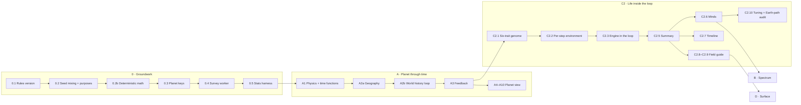

# Worlds Up Close — Revision 1

*Planetary and biological evolution, stepped together*

Aion Forge · planning document · amends `Worlds-Up-Close.md` · 26 Sep 2026

This revision changes how planets and life are simulated in the Worlds Up Close plan. It is read alongside the original. Every phase-let that is not mentioned here stays as written. Where this document and the original disagree, this document wins.

Nothing in this revision has been implemented yet.

## Contents

- [Decisions recorded](#decisions-recorded)
- [Why a revision](#why-a-revision)
- [What changes at a glance](#what-changes-at-a-glance)
- [The world history loop](#the-world-history-loop)
- [Revised Phase A](#revised-phase-a)
- [Revised Phase C2](#revised-phase-c2)
- [Effects on Phases 0, B and D](#effects-on-phases-0-b-and-d)
- [Revised build order](#revised-build-order)
- [Performance budgets](#performance-budgets)
- [Testing additions](#testing-additions)
- [Risks](#risks)
- [Decisions still needed](#decisions-still-needed)
- [Resolutions after the consistency review](#resolutions-after-the-consistency-review)

---

## Decisions recorded

| # | Question | Decision | Consequence |
|---|---|---|---|
| 1 | Is a planet a snapshot, or does it change over time? | **A planet and its life change together over time.** | A new world history loop steps the planet and its biosphere together from formation to the present. |
| 2 | Must a seed produce the same history in every browser? | **Yes (reversed on 26 Sep 2026; see R1).** The coupled loop has two stable climate states, so a tiny floating-point difference could flip a whole history, and universes are shared by id. | All outcome-deciding code uses deterministic math built from exact IEEE operations (new phase-let 0.2b). |
| 3 | A full genome from the start, or a small one that grows? | **A small starting genome that grows only when the data shows a need.** | C2.1 is replaced by a six-trait genome and a documented rule for adding traits. |
| 4 | Should Earth's path be expected? | **Earth's path (oxygen, then land, then limbs, then minds) is one possible outcome, not the expected one.** | Hard prerequisites become energy costs, so the order of evolutionary firsts can differ from world to world. The stats harness measures how often Earth's order occurs. |

## Why a revision

These are the findings from reviewing the original plan against the current code (`planet.ts`, `biosphere.ts`, `civilization.ts`, `rng.ts`) and CLAUDE.md.

1. **The planet is frozen while life evolves.** In the original, A2 solves the climate once, and C2.3 then evolves life for billions of years on that fixed planet. Only oxygen changes over time (C2.4). In reality stars brighten by roughly 30% over their main-sequence life, volcanism fades, water is lost to space, and life changes the greenhouse gases that set the climate. With the climate fixed, snowball episodes, runaway greenhouses and worlds that were habitable once but are not now cannot happen. These are among the most interesting outcomes the project could show, and they would come from a few simple rules working together (CLAUDE.md §3, principles 1 and 3).
2. **The greenhouse effect is a lookup table.** Today's `surfaceTemp` adds a fixed warming per atmosphere class. The original plan keeps that. With a carbon cycle, the warming responds to the planet's state, and a stable climate emerges instead of being assigned.
3. **The C2.1 genome encodes Earth's history.** Fifteen traits, a fixed ladder of organisation levels, and prerequisites (oxygen thresholds for tissues, ozone before land, "social plus manipulators" for a mind) trace the single path Earth took. Every world would follow it. This is the plan's biggest risk of overengineering (principle 3), and it authors outcomes rather than letting them emerge (principle 1).
4. **Fitness is a set of separate factors.** Thermal match, light capture, an oxygen ceiling, a gravity ceiling and a nervous-system cost are multiplied together. Each is a tuning knob, and their interactions are hard to reason about. Expressing all of them as energy gives one unit that everything trades against.
5. **Random draws inside evolution come from one long stream.** Adding a trait or reordering a step then shifts every later draw, and every planet's history reshuffles. This makes before-and-after comparisons in the stats harness hard to read, and it weakens experimentation ("what if I change one constant?").
6. **Catastrophes are generated inside the biosphere.** In the coupled model, many catastrophes come from the planet itself (a snowball onset or a volcanic pulse). They should be an input to evolution, not an internal dice roll.
7. **Atmospheric pressure is still a dice roll.** A1 takes surface pressure from the rolled atmosphere class, and pressure drives climate, habitability and the spectrum. This revision keeps the class but reads it as a fixed background gas pressure, with CO₂, O₂ and CH₄ added on top as they change (R6).

Finding 2 from the earlier discussion (browser-dependent floating point) was first set aside by decision 2, then taken up again after the consistency review (R1).

## What changes at a glance

| Phase-let | Status | Change |
|---|---|---|
| 0.1–0.5 | Amended, one new phase-let | 0.1 bumps once per build step (R10). 0.2 also adds per-lineage stream keys (see C2.3). New 0.2b: deterministic math (R1). 0.5 gains new columns. |
| A1 Physical properties | **Amended** | Tectonic activity and stellar brightness become functions of time. |
| A2 Surface and climate | **Split** | A2a keeps the static geography (plates, relief, sea-level method). A2b is new: the world history loop with a banded climate. |
| A3 Feedback | **Amended** | Planet type and habitability are read from the present-day cell solve (R5); emergence is the loop's per-step roll (R4). Giant and lava types are derived, not rolled (R7). The aquatic-mind cap becomes a rule about combustion. |
| A4–A10 | Unchanged | They draw the present-day state the loop produces. |
| C2.1 Genome | **Replaced** | Six traits plus a rule for adding traits. |
| C2.2 Environment | **Amended** | The environment is per-step, not fixed. |
| C2.3 Engine | **Amended** | Energy-budget fitness, per-lineage streams, catastrophes as input, runs inside the loop. |
| C2.4 Oxygen and ozone | **Absorbed** | Oxygen, ozone and methane become state variables of the world history loop. |
| C2.5 Biosphere summary | **Amended** | Stage thresholds read body mass and food-chain depth instead of an organisation ladder. |
| C2.6 Minds | **Amended** | A mind is defined by information processing alone. Technology limits come from the world. |
| C2.7 Timeline | **Amended** | Adds planetary events from the loop. |
| C2.8–C2.10 | Amended lightly | Morphology reads the smaller genome. C2.10 adds the Earth-path measurement. |
| B1 Composition | **Simplified** | Reads O₂, CH₄, CO₂ and H₂O from the loop's final state. |
| D | Unchanged | — |

---

## The world history loop

A new simulation module, `simulation/worldHistory.ts`, is the centre of this revision. It answers one question: *what happened to this planet, and to anything living on it, between its formation and the present?*

### What it keeps and what it changes

- **Fixed for the planet's life:** orbit, mass, radius, gravity, axial tilt, rotation or locking, and the continents and relief from A2a. Moving continents are out of scope. The geography is drawn once and kept.
- **Changing every step:** the global and banded state below.

| State variable | Unit | Changed by |
|---|---|---|
| Stellar luminosity L(t) | L☉ | stellar brightening |
| Tectonic activity τ(t) | 0–1 | cooling of the planet's interior |
| Water inventory W(t) | 0–1 (A1 scale) | loss to space when the upper atmosphere is wet |
| CO₂ | bar (partial pressure) | volcanic outgassing, weathering |
| O₂ | bar | light-using life, volcanic and crustal sinks, water photolysis |
| CH₄ | bar | chemical-energy life, destruction by O₂ |
| Ozone column | relative (0–1) | follows O₂ |
| Band temperatures | K | energy balance for each band |
| Ice, ocean and land area per band | fraction | temperature, water inventory, fixed relief |
| Biosphere (lineages) | — | the evolution engine (C2.3) |

### One step (100 Myr)

The loop runs from the planet's formation (star age 0, plus a formation delay) to `star.age`. Each step:

1. **Star.** Update L(t) from the brightening rule.
2. **Interior.** Update tectonic activity τ(t).
3. **Climate.** Solve the banded energy balance for the current L, greenhouse gases and ice cover. This gives band temperatures, ice, open ocean and habitable area.
4. **Chemistry.** Update CO₂, O₂, CH₄, ozone and water from geology, from the biomass of the previous step, and from water loss.
5. **Events.** Draw impacts and volcanic pulses from rates set by τ(t) and the planet's age. Record climate transitions the step produced (freezing over, thawing, runaway, oxidation, oceans lost).
6. **Life.** If no life exists yet, roll for its origin (see below). If life exists, step the evolution engine one step in this environment, with this step's events as input.
7. **Record.** Append a compact snapshot to the history: the global values, the band summary and a biosphere summary.

Life and planet are coupled only through steps 4 and 6. Life reads the environment the planet produced this step, and the chemistry reads the biomass that life produced last step. This one-step lag keeps the order of operations explicit and removes circular solves.

### The rules

Each rule is chosen to be the simplest one that still produces the behaviour it exists for. The constants are starting values for tuning in C2.10. Each one's final value and the reason for it go in `Documents/evolution.md`.

**Stellar brightening.** Stars brighten as they age on the main sequence. Anchored to today's value:

```text
L(t) = L_now · (1 + k · t / t_life) / (1 + k · age / t_life),   k = 0.8
```

`t_life` is the end of the main sequence, `0.85 · star.lifespan` (`MAIN_SEQUENCE_END_FRACTION` in `star.ts`), so the loop and the star's classification agree on when the main sequence ends. For the Sun (age 4.6 Gyr, main sequence 8.5 Gyr) this gives about 70% of today's brightness at formation, close to the "faint young Sun".

**Stars that have left the main sequence (R2).** The loop runs with the brightening rule until the main sequence ends. Then one final *giant phase* runs at the star's present-day luminosity (red giant, white dwarf or remnant) until `star.age`. Inner worlds can be sterilised or lose their oceans, and outer ice can thaw. These are recorded as events ("Star leaves the main sequence", plus whatever climate transitions follow). No special case beyond the change of luminosity.

**Interior cooling.** The original A1 formula, evaluated at time t instead of only at the present:

```text
τ(t) = clamp(M^0.5 · e^(−t / 8 Gyr), 0, 1)
```

**Carbon cycle (the thermostat).** Volcanoes add CO₂, and rock weathering on land removes it faster when it is warm and wet:

```text
outgassing = G · τ(t)
weathering = K · landFraction · (CO₂ / CO₂_ref)^0.5 · e^((T_mean − 288) / 13.7)
CO₂(t+1)   = max(0, CO₂ + (outgassing − weathering) · Δt)
```

When the star brightens, the planet warms, weathering speeds up, CO₂ falls and the warming is partly cancelled. This is the long-term stabiliser that keeps Earth habitable, and here it comes from one rule and is not assigned. Worlds with no land cannot weather, so ocean worlds lack the thermostat. Worlds whose volcanism has died stop resupplying CO₂ and slowly cool. Both are consequences, not special cases.

**Greenhouse and energy balance.** This replaces the lookup table in `surfaceTemp`:

```text
T_eq       = 278 · (L / a²)^0.25 · ((1 − albedo) / 0.7)^0.25
ΔT_green   = base(pressure) + S_CO₂ · log₂(CO₂ / CO₂_ref) + S_CH₄ · √CH₄ + water-vapour term(T)
albedo     = mix(rock or ocean albedo, ice albedo, ice fraction)
```

Ice raises the albedo, which cools the planet, which makes more ice. Starting each step's solve from the previous step's ice cover lets the climate have two stable states (open and frozen). A snowball can then begin and end with no special code. It thaws once volcanic CO₂ builds up under the ice, because frozen land does not weather.

**Banded climate.** The 642-cell grid from A2a is summarised once into 18 bands: latitude bands for a rotating planet, or rings of angle from the substellar point for a locked one. Each band has a fixed land fraction and relief. Each step solves the band temperatures with the original A2 redistribution rule (heat spreads more evenly under thicker air). The full 642-cell climate is solved only for the present day and for display, using the loop's final values. This keeps the loop cheap enough to run on every solid planet.

**Oxygen, ozone and methane.** This takes over C2.4:

```text
O₂(t+1)  = O₂ + P_O₂ · lightUserBiomass − sinks(τ(t), unoxidisedCrust) + photolysis(waterLoss)
unoxidisedCrust decreases as it absorbs O₂      → "great oxidation" is a threshold crossing
ozone    = min(1, (O₂ / O₂_ref)^0.5)
CH₄(t+1) = CH₄ + P_CH₄ · chemicalUserBiomass − D · CH₄ · (1 + O₂ / O₂_ref)
```

Nothing fixes when, or whether, oxidation happens. Photolysis from water loss is the abiotic O₂ source that B1 needs for its deliberate false positive.

**Water loss.** When the mean temperature is above the moist-greenhouse limit (about 340 K), water reaches the upper atmosphere and escapes:

```text
W(t+1) = W · (1 − E · Δt · max(0, T_mean − 340) / (v_esc / 11.2))
```

Small, hot planets dry out. A planet that dries out loses its oceans for good, and the loop records the event.

**Runaway greenhouse (R3).** Water is lost in two stages. Above about 340 K the gradual escape rule above applies (*moist greenhouse*). If the mean temperature passes the boiling point set by surface pressure (the original A2 water-phase rule), the oceans turn to steam at once (*runaway greenhouse*), and escape continues from the steam atmosphere. Each stage is its own recorded event. The original A2 "boil-off" rule is kept only as this second stage.

**Origin of life.** This is still a seeded roll, because abiogenesis has no mechanism to simulate (as in the original C2.5). It is now repeated over time: each step with liquid water there is a chance of life starting, in proportion to the habitable area and to `emergenceSensitivity`. Life can therefore start early, start late or never start, and the origin time is a real point in the planet's history. This per-step roll is the only emergence rule (R4). It arrives with C2.3, when life first lives inside the loop. Between A3 and C2.3, the existing single-roll `generateBiosphere` stays and reads A3's present-day habitability.

**Formation delay.** The loop starts 0.5 Gyr after the star forms, the same delay `biosphere.ts` uses today. A star younger than that runs no steps. The last step is shortened so the loop ends exactly at `star.age`.

**Life can end.** If every lineage goes extinct, for example after a runaway greenhouse or a long snowball, the biosphere ends. The planet keeps its history, so a world can be lifeless today yet have a dated record of life that once existed. The `Biosphere` summary reports `hasLife: false` plus the dates of life's start and end. This is one additive field, `extinctAt`.

### Present-day state and the existing interfaces

The last snapshot is the planet as it is today. **The present-day values come from one full 642-cell climate solve (R5)**, driven by the loop's final luminosity, gases and water inventory. The 18 bands hold only the history. The planet type, the panel figures and the globe's coastline therefore all read the same grid and cannot disagree. Everything that reads a `Planet` or `Biosphere` today reads values from that final solve:

- `temperature` is the final mean temperature.
- `type` is derived from the final ocean, ice and temperature of the cell solve (A3).
- The `atmosphere` class sets the background gas pressure (R6). It is unchanged as a field.
- The `Biosphere` interface keeps its fields (C2.5).

The full history is not kept during the survey. Only the summary and the list of dated events leave the worker. Opening a planet reruns its loop deterministically to rebuild the full history, just as the original plan rebuilds the full phylogeny.

---

## Revised Phase A

### A1 Physical properties (amended)

Everything in the original A1 table stays, with two changes:

- **Tectonic activity** is exported as a function `tectonicActivity(planet, t)`, not a single present-day value.
- **Stellar brightening** is added as `luminosityAt(star, t)` next to the existing mass–radius relation.

Verification additions: τ(t) never increases with t; `luminosityAt(star, star.age)` equals `star.luminosity`.

### A2a Geography (the static part of the original A2)

The original A2 grid, plates, relief (scaled by 1/g) and sea-level bisection stay as written. They run once per solid planet and produce the fixed relief. A2a adds the band summary: land fraction and hypsometry (area below each height) for 18 bands. The loop then refills the oceans every step from the current water inventory without touching the grid.

Verification: as in the original A2, plus "band land fractions summed by area equal the grid's land fraction."

### A2b World history loop (new) · `simulation` · **L**

- **Objective:** Step each solid planet from formation to the present with a time-varying star, interior, climate and chemistry, with no life yet.
- **Depends on:** A1, A2a.
- **Deliverables:** `simulation/worldHistory.ts` exporting `runWorldHistory(planet, physics, geography, star, seed, cfg): WorldHistory`, which returns the present-day state, a list of dated planetary events and (on request) the per-step snapshots. The module's header explains the rules above, their assumptions and their limits (CLAUDE.md §13).
- **Implementation:** The rules in [The world history loop](#the-world-history-loop). This step has no life, so the chemistry's biomass terms are zero. Evolution is plugged in at C2.3.
- **Verification:** See [Testing additions](#testing-additions).

### A3 Feed the surface back into the simulation (amended)

- Planet type and habitability read the **present-day** cell solve, with the thresholds from the original A3. Emergence does not: it is the per-step roll inside the loop (R4). After C2.3, the habitability score is a present-day summary for display and for the survey, not an input to emergence.
- **Planet types the loop does not decide (R7).** A planet above `GIANT_PLANET_MASS` (15 M⊕) is a giant and never solid. It is an ice giant or a gas giant by temperature, as today. A lava world follows from a present-day surface temperature above a threshold (starting value 1,000 K, tuned with a stated reason), not from today's 70% roll. Every other planet is solid and runs the loop. The giant/lava random draws are still consumed so the planet stream stays aligned.
- The "aquatic minds are capped at agricultural" rule is replaced by a rule about the world, not about minds: **smelting and industry need open fire, and open fire needs exposed land, an O₂ mixing ratio above a combustion threshold (starting value 0.18) and a total pressure above a minimum (starting value 0.5 bar) (R6).** Combustion depends mainly on the oxygen fraction, not its partial pressure, which is why the rule uses a fraction. An aquatic mind is capped because of that, and so is a land-dwelling mind on a world with little oxygen. A high-oxygen world makes fire easier. The limit follows from chemistry, not from who evolved.
- The ±25% tuning target and the "change a rule constant with a stated reason" policy stay.

---

## Revised Phase C2

### C2.1 Genome (replaced) · `simulation` · **S**

The starting genome has six traits. Each has a physical meaning and a unit, and each exists because a named rule reads it.

| Trait | Values | Read by |
|---|---|---|
| Energy source | chemical · light · consumer | energy intake |
| Absorption peak | 400–1,100 nm (light users only) | light capture against the star's spectrum; vegetation colour (A9) |
| Body mass | 10⁻¹⁵ to 10⁵ kg (log) | maintenance, support and oxygen-yield costs; stage |
| Habitat | deep water · shallow water · land | intake (light and chemical energy differ by depth), UV and support costs |
| Thermal optimum | K | thermal-mismatch cost against the band temperature |
| Information processing | 0–1 | foraging and predation bonus; energy cost; minds |

A consumer's position in the food chain is not a trait. It follows from what it eats: a consumer of producers is one level up, a consumer of those is two levels up. The engine records each lineage's level.

**What is deliberately not in the starting genome:** organisation levels, symmetry, limbs, skeleton type, eyes, sociality, manipulators, reproduction strategy and flight. Each can be added later under the rule below. Until flight is added, the original C2.10 surprise example ("flight-capable swimmers on low-gravity worlds") cannot occur.

**Rule for adding a trait.** A trait is added only when a stats-harness run shows a specific gap that the current genome cannot express, for example "every mind-bearing lineage looks the same because nothing distinguishes a solitary mind from a social one." Each addition is its own phase-let. It is recorded in a *Genome changelog* section of `Documents/evolution.md` with the evidence, the rule that reads the new trait, and the stats before and after. A trait no rule reads is never added.

- **Verification:** Type tests; every trait has at least one rule that reads it (a test lists the readers).

### C2.2 Environment coupling (amended)

`environmentFor(...)` now takes the loop's current step, not the present-day planet. It returns the same pressures as the original (light, gravity, habitat areas by band, radiation, catastrophes), using this step's L(t), band temperatures, open-water and land areas, O₂ and ozone. Radiation on land falls as ozone rises.

### C2.3 Evolution engine (amended) · `simulation` · **XL**

The engine is no longer a separate pass. It exports `stepEvolution(state, env, events, keys): state`, and the world history loop calls it once per step. The six stages of the original (mutate, score, compete, speciate, catastrophes, cap) stay, with three changes.

**1. Fitness is an energy budget.** Every trait trades against one unit:

```text
intake    = source(energy source, habitat, env) · match(absorption peak, star spectrum) · yield(O₂)
          where source = light:    flux reaching the habitat depth
                         chemical: τ(t) · vent and sediment energy
                         consumer: a share of the biomass one level down
          yield(O₂) = y_anaerobic + (y_aerobic − y_anaerobic) · O₂ / (O₂ + O₂_half),  y_aerobic ≈ 18 · y_anaerobic

costs     = maintenance  c_m · M^0.75                 (Kleiber scaling)
          + support      c_s · g · M^(4/3) on land    (weight carried without water)
          + UV           c_u · (1 − ozone) on land and in shallow water
          + information  c_i · info² · M^0.75
          + thermal      c_t · (T_band − T_optimum)²

surplus   = intake − costs
```

Biomass has one unit throughout (it feeds oxygen and methane production and consumer intake). C2.3 defines that unit in the module header before any constant is tuned (R9).

**Discrete traits (R9).** Energy source and habitat change only at speciation, with a small probability. The energy costs then decide whether the new lineage survives. Continuous traits drift at every step, as in the original.

Carrying capacity within a niche (habitat × food-chain level) is shared by surplus. A lineage whose surplus stays below zero for a step goes extinct. Information processing earns its cost back through a larger share of the food it competes for, as a consumer or when competing for light.

**2. No hard prerequisites.** The original gated innovations behind thresholds. Here they are costs, so they are possible anywhere, and simply more or less affordable:

| Original prerequisite | Replaced by |
|---|---|
| Organisation 3+ needs an oxygen threshold | `yield(O₂)` rises smoothly; a large body is costly without oxygen, not forbidden |
| Land needs an ozone shield | the UV cost falls as ozone rises; early land life is possible where it is cheap enough |
| Body-mass ceiling from oxygen and gravity | follows from maintenance and support costs against intake |
| Mind needs sociality and manipulators | a mind is only an information-processing threshold (C2.6) |
| Aquatic minds capped at agricultural | the fire rule in A3 |

With these costs, Earth's order (oxygen → land → large bodies → minds) is one of several possible orders. For example, a bright flaring M-dwarf world might put life on land before oxidation if UV is low under thick air, and a high-gravity ocean world might produce minds that never leave the water.

**3. Streams keyed per lineage.** Every random draw in evolution comes from `mixSeed(galaxySeed, starId, planetIndex, EVOLUTION, lineageId, step, purpose)`, where `purpose` is a small named constant (MUTATE, SPECIATE, SURVIVE, …). Lineage ids are assigned in birth order, which is itself deterministic. Changing one rule then changes only the draws that rule touches. This makes before-and-after comparisons in the stats harness meaningful. `mixSeed` comes from 0.2 unchanged. Only the key layout is new.

**4. Catastrophes come in as input.** `stepEvolution` receives this step's events from the world history loop: impacts, volcanic pulses and climate transitions. It does not draw its own. Kill probability rises with body mass and with food-chain level (R9). The original's "specialisation" was defined by traits the six-trait genome no longer has. This revision adds nothing from outside the planet. Because events are already an input, galactic events such as nearby supernovae could be passed in later without changing the engine. This is noted as a possible future step, not built.

- **Verification:** Determinism; a mass extinction is followed by a rise in speciation; maximum body mass falls with gravity across a sweep; changing one mutation constant changes the outcomes of fewer planets than reseeding the planet does (stream locality); per-step cost within budget.

### C2.4 Oxygen and ozone (absorbed)

Now part of the world history loop's chemistry step. The original verification points stay and move to the loop's tests: "no biotic O₂ rise without light users" and "methane falls after oxidation". "Land colonisation never comes before the ozone threshold" is removed on purpose: it is now possible, only costly.

### C2.5 Biosphere summary (amended)

The `Biosphere` interface is kept, plus one additive field `extinctAt` (Gyr ago, or null). Stages are read from the phylogeny without an organisation ladder:

| Stage | Condition on the living lineages |
|---|---|
| prebiotic | not produced by the new model (life either exists or not); kept in the type for compatibility. The survey then counts organisms only, and the rules-version bump marks the change in meaning of stored counts (R9) |
| microbial | largest body mass below 10⁻⁹ kg |
| multicellular | largest body mass 10⁻⁹ to 10⁻³ kg |
| complex | largest body mass above 10⁻³ kg and at least three food-chain levels |
| dominant | complex, and producers cover more than 60% of the habitable area |

Body mass is a stand-in for multicellularity. This is a stated simplification, reconsidered only if the stats show it misclassifies worlds. Complexity, diversity, stability, adaptability and extinctions are read as in the original C2.5.

### C2.6 Minds and civilizations (amended)

- A mind appears in the first lineage whose information processing crosses a threshold scaled by the intelligence parameter. Sociality and manipulators are not required, because they are not traits yet.
- Species traits come from the six traits and the lineage's history. Intelligence comes from information processing. Adaptability comes from the spread of band temperatures the lineage has survived. Aggression comes from consumer ancestry. Curiosity, cooperation and resilience keep their current seeded draws until a trait exists that could supply them. This is stated in the code and listed as a candidate in the genome changelog.
- The civilization's age is the time since the mind appeared, as in the original.
- **When life ends after a mind appeared (R8),** the civilization remains in the record as *collapsed*, with its dated history. The planet shows both "life ended" and the ruins of a civilization. For an extinct biosphere, `ageGyr` is how long life lasted (origin to `extinctAt`). The survey counts living worlds and, separately, worlds that ever had life.
- The technology ceiling comes from the A3 fire rule, read from the **present-day** land area and O₂.

### C2.7 Timeline (amended)

`recordPlanetaryEvents` gains the loop's events:

| Event | Importance |
|---|---|
| Life begins | significant |
| Oxidation | historic |
| Planet freezes over / thaws | major |
| Runaway greenhouse; oceans lost to space | historic |
| Life ends | legendary |

| Star leaves the main sequence | historic |
| Moist greenhouse begins | major |

These are added to the biological firsts and mass extinctions from the original, redefined for the six-trait genome (R9): *first multicellular* is the first lineage above 10⁻⁹ kg (the C2.5 threshold). *First flight* is dropped until a flight trait exists. Oxidation is recorded once, as a planetary event. Every event still falls between the planet's formation and the present.

### C2.8–C2.10 (light amendments)

- **C2.8 Morphology** reads six traits. Body shape follows body mass, habitat and gravity. Details the genome does not hold (limb count, eyes) come from the VISUAL stream and are presentation only, so they never feed back.
- **C2.9 Field guide** is unchanged. The facts per specimen are the six traits in real units.
- **C2.10 Tuning and surprise audit** adds the **Earth-path measurement**: for every world with a mind, record the order of its firsts (oxidation, first land life, first body over 1 kg, first mind). Report the share of worlds that match Earth's order and list the other orders that occur. No target percentage is set. The check that matters is that more than one order occurs under the default parameters. If only Earth's order occurs, a cost constant is favouring it, and it is investigated with a stated reason, following CLAUDE.md §12.

---

## Effects on Phases 0, B and D

- **0.1** The rules version is bumped once per build step that changes outcomes (steps 1, 2, 4 and 5, so about v2 to v5), not per phase-let (R10).
- **0.2** also adds the purpose constants for evolution streams. The salts table gains `WORLD` (loop events), which replaces the original's `CLIMATE`, next to the existing `EVOLUTION`.
- **0.2b Deterministic math (new, `simulation`, M) (R1).** A `simulation/detmath.ts` module with `exp`, `log`, `pow`, `sin` and `cos` (the functions the simulation uses; others such as `atan2` are added when a rule first needs them) built only from exact IEEE-754 operations (`+ − × ÷`, `Math.sqrt`, `Math.imul`, `Math.floor`), so every JavaScript engine gives bit-identical results. Every outcome-deciding module (stars, planets, physics, loop, evolution, civilizations, timeline) switches to it. The galaxy particle cloud and all rendering stay on `Math.*`. A lint rule bans `Math.exp/log/pow/sin/cos/tan/atan2/cbrt/hypot` inside `simulation/`. It lands in build step 1, so its outcome change shares that step's rules bump. Verification: accuracy tests against `Math.*` within a stated tolerance; golden bit patterns for a fixed input table, checked in the test suite (a failure in any engine means non-determinism).
- **0.4** The worker now runs the loop for every solid planet, not only for living ones. Its progress reporting is unchanged.
- **0.5** The stats harness gains these columns: the share of worlds that ever froze over, suffered a runaway greenhouse or oxidised; living worlds today versus worlds that ever had life; the median time life started; and the Earth-path share.
- **B1** reads CO₂, O₂, CH₄ and H₂O from the loop's final state instead of computing a separate abiotic baseline. Water photolysis already provides the O₂ false positive.
- **D** is unchanged. It draws the present-day state.

## Revised build order



Phase D has since moved to a separate app, Planet Forge (`planet-forge/PLAN.md`, 3 Oct 2026).

| Step | Phase-lets | Changes outcomes? | You can see |
|---|---|---|---|
| 1 | 0.1–0.5 (incl. 0.2b) | Yes, once (seed fix and deterministic math) | Library marks older saves |
| 2 | A1, A2a, A2b, A3 | Yes | New planet facts; different habitable worlds; planetary events in the timeline |
| 3 | A4–A10 | No | Approach a planet from orbit |
| 4 | C2.1–C2.3, C2.5–C2.7 | Yes | Life that starts, spreads and sometimes ends over time; dated milestones |
| 5 | C2.10 | Yes (tuning) | `Documents/evolution.md` with the Earth-path measurement |
| 6+ | B, C2.8–C2.9, D | No | As in the original |

Sizes: A2b is new (**L**). C2.1 shrinks from **M** to **S**. C2.4 disappears as a separate step. Overall the simulation work is about the same size. The effort moves from authoring traits to getting a few coupled rules right.

## Performance budgets

These replace the matching rows of the original table. All are estimates to measure, as CLAUDE.md §11 asks, and none of them is optimised before it is measured.

| Work | Budget | Reasoning |
|---|---|---|
| Geography (A2a), per solid planet | ≤ 0.1 ms | Unchanged from the original A2 |
| World history loop without life, per solid planet | ≤ 0.2 ms | ~130 steps × 18 bands, plus a few scalar equations |
| Evolution, per living planet | ≤ 0.6 ms | Unchanged: ~130 steps × ≤ 32 lineages |
| Whole-universe survey | ≤ 2.0 s | Raised from 1.5 s, because the loop now runs on every solid planet (roughly 4,000–6,000), not only on the ~930 living ones |

These budgets do not add up at the top of the range: 6,000 solid planets × 0.3 ms plus 930 living planets × 0.6 ms is about 2.4 s. Deterministic math (0.2b) will also be slower than the built-ins. The 2.0 s figure is therefore re-estimated once the stats harness (0.5) has measured the real solid-planet count and per-planet cost (R9).

If the survey exceeds its budget, the first thing to measure is whether planets that can never hold liquid water (for example, those whose equilibrium temperature stays outside the water window for the star's whole brightening range) can skip the loop. That check is a rule about the physics, not an approximation.

## Testing additions

Property tests, not golden numbers, as in the original strategy:

- **Thermostat.** On a world with land and volcanism, raising L lowers the equilibrium CO₂.
- **Two climate states.** For some fixed L and CO₂, a warm start and a frozen start settle into different states (hysteresis exists).
- **Snowball escape.** A frozen world with volcanism eventually thaws as its CO₂ rises.
- **Ocean worlds lack the thermostat.** With zero land, weathering is zero.
- **Water loss is permanent.** W(t) never increases.
- **No biotic O₂ without light users.** O₂ above the photolysis contribution requires light-using lineages.
- **Life can end.** A sweep finds planets with `hasLife: false` and a non-null `extinctAt`.
- **Earth's order is not forced.** Across a large sample under default parameters, more than one order of firsts occurs.
- **Stream locality.** Changing one engine constant changes fewer planetary outcomes than reseeding does.
- **Interface compatibility.** Existing panels, life markers and snapshot counts still work, checked by the existing `lifeSurvey` and determinism tests.

## Risks

These are added to the original Risks table. The original rows stay, except the cross-browser floating-point row, which is replaced by the last row below (R1).

| Risk | Effect | Mitigation |
|---|---|---|
| Coupled loop oscillates or runs away numerically | Nonsense climates | Clamp each step's change; property tests for the thermostat and for snowball escape; 100 Myr steps with the climate solved to equilibrium within each step |
| Runaway greenhouses or snowballs dominate | Too many dead worlds | Measured by the new harness columns; tuned by rule constants with stated reasons |
| Energy costs favour one path anyway | Every world repeats one history | The Earth-path measurement in C2.10 makes this visible |
| Six traits prove too few to tell worlds apart | Uniform creatures | Handled by the trait-addition rule, with evidence each time |
| History more sensitive to small changes than today's single roll | Retuning shifts many outcomes | Per-lineage streams keep changes local; the rules version records every shift |
| A browser's math library differs by one bit | Two stable climates let a tiny difference flip a whole history; a shared universe id shows different histories | Deterministic math in all outcome-deciding code (0.2b); lint rule; golden bit-pattern tests |
| Deterministic math is slower or less accurate | Survey over budget; physics drifts from the built-ins | Accuracy tolerance tests; measured in the stats harness before any optimisation |

## Decisions still needed

| Question | Recommendation | Needed before |
|---|---|---|
Resolved on 26 Sep 2026 and moved to [Resolutions](#resolutions-after-the-consistency-review): atmospheric pressure (R6), the fire threshold (R6) and the survey budget (R9). Still open:

| Question | Recommendation | Needed before |
|---|---|---|
| Brightening constant k = 0.8 and the 18-band climate | Accept as starting values; revisit only if the stats harness shows a problem | A2b |
| Is `extinctAt` (life that existed and ended) shown in the interface? | Yes, in the biosphere panel and the timeline. It is data the simulation already has | C2.5 |
| Should gas escape thin the background atmosphere over time? | Not in this revision (R6 keeps the background fixed). A later revision can let escape velocity thin it and read today's class from the result | After C2.10 |

---

## Resolutions after the consistency review

A consistency review of this revision against `Worlds-Up-Close.md` and the current code, on 26 Sep 2026, found conflicts and gaps. The project owner decided each one. The numbered resolutions are referenced in the text above.

| # | Topic | Decision |
|---|---|---|
| R1 | Cross-browser determinism | Decision 2 reversed. All outcome-deciding code uses deterministic math (0.2b). Rendering and the galaxy particle cloud stay on `Math.*`. |
| R2 | Stars past the main sequence | The loop runs to the end of the main sequence, then a giant phase at today's luminosity. Replaces "keep today's rules". |
| R3 | Runaway greenhouse | Two stages: gradual moist-greenhouse loss above ~340 K, then instant boil-off past the pressure-set boiling point. |
| R4 | Emergence | The per-step roll in the loop is the only emergence rule, from C2.3 on. Before that, the old single roll reads A3's habitability. After it, habitability is a display summary. |
| R5 | Present-day source of truth | One 642-cell climate solve from the loop's final state sets every present-day value. The bands hold only the history. |
| R6 | Pressure and fire | The atmosphere class sets a fixed background gas pressure. Total pressure = background + CO₂ + O₂ + CH₄, and changes over time. Fire needs exposed land, an O₂ mixing ratio ≥ 0.18 and total pressure ≥ 0.5 bar (starting values). |
| R7 | Planet types outside the loop | Over 15 M⊕ is always a giant (never solid). Lava follows from a present-day temperature threshold (starting value 1,000 K), not a roll. Draws are still consumed. |
| R8 | Life ends after a mind | The civilization remains as collapsed with its dated history. `ageGyr` is life's duration. The survey counts living worlds and worlds that ever had life. |
| R9 | Smaller items | *First multicellular* = first lineage above 10⁻⁹ kg; *first flight* dropped until a flight trait exists. Catastrophe risk rises with body mass and food-chain level. Energy source and habitat change only at speciation. The evolution seed key is `mixSeed(galaxySeed, starId, planetIndex, EVOLUTION, lineageId, step, purpose)`; `WORLD` replaces `CLIMATE`. `prebiotic` is kept only in the type; the survey counts organisms. The biomass unit is defined in C2.3. `t_life` = main-sequence end (0.85 × lifespan); formation delay 0.5 Gyr; the last step is shortened to end at `star.age`. The survey budget is re-estimated after 0.5 measures it. |
| R10 | Rules version cadence | One bump per build step that changes outcomes (about v2 to v5), not per phase-let. |
| R11 | The original plan's open decisions | All accepted as recommended: fix the seed collision in 0.2; ±25% drift limit; designations, not invented species names; require WebGL 2; decide D6/D9 after D5. "Aquatic minds capped" is replaced by the fire rule (R6). |
| R12 | Paths | Every `docs/…` path in either plan means the repository's existing `Documents/` folder (for example `Documents/stats.md`, `Documents/evolution.md`). |

---

*Amends `Worlds-Up-Close.md`, prepared for the `Next-steps` branch at commit `bda572a` (code measured at `1bfddf5`). Decisions 1–4 are recorded from the project owner's answers on 25 Sep 2026; decision 2 was reversed and R1–R12 recorded on 26 Sep 2026.*