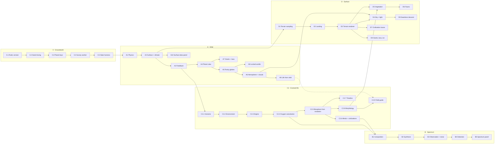

# The plan: Worlds Up Close

*Planet surfaces, evolved life, spectra and landing*

Aion Forge · planning document · rules version 1 → 2 · 26 Sep 2026

A phased plan to let an observer approach any planet, see a surface that follows from its physics, read its atmosphere through a spectrum, and find life that evolved there under that planet's own conditions. New physical properties feed back into the simulation, so habitability, life and civilizations become consequences of the world rather than separate dice rolls.

Nothing in this plan has been implemented yet.

> **Amended by `Worlds-Up-Close-Revision-1.md`.** Where the two disagree, the revision wins. In particular, these parts of this plan are replaced:
> - The ground rule "land needs an ozone shield". The original C2 prerequisites are now energy costs.
> - The "aquatic minds are capped" decision, replaced by the fire rule.
> - The frozen-planet climate of A2.
> - The C2.1 genome.
> - C2.4 as a separate step.
> - The cross-browser floating-point risk, now handled by deterministic math.
> - Per-phase-let rules-version bumps.
> - Every `docs/` path, which means `Documents/`.
>
> See the revision's *Resolutions* section (R1–R12).

## Contents

- [Summary](#summary)
- [Starting point](#starting-point)
- [Ground rules for every phase](#ground-rules-for-every-phase)
- [Build order and dependencies](#build-order-and-dependencies)
- [Phase 0 — Groundwork](#phase-0--groundwork)
- [Phase A — The planet from orbit](#phase-a--the-planet-from-orbit)
- [Phase C2 — Evolved life](#phase-c2--evolved-life)
- [Phase B — Spectrum viewer](#phase-b--spectrum-viewer)
- [Phase D — Standing on the surface](#phase-d--standing-on-the-surface)
- [Where the code goes](#where-the-code-goes)
- [Performance budgets](#performance-budgets)
- [Testing strategy](#testing-strategy)
- [Risks](#risks)
- [Decisions needed](#decisions-needed)

---

## Summary

The work splits into five phases.

- **Phase 0** is groundwork the others need.
- **A** adds a physical planet model (gravity, rotation, water, plates, climate) that feeds back into habitability, then draws the planet from orbit.
- **C2** replaces the single-roll biosphere with a lineage-based evolution model whose results decide life stage, oxygen and whether a mind arises.
- **B** turns the resulting atmosphere into a transit spectrum you read like an astronomer.
- **D** lands the observer on the surface.

| | Decision | Meaning |
|---|---|---|
| **Decided · life forms** | Evolve them (C2) | Creatures are outcomes of mutation, selection, competition and extinction under each planet's conditions. Nothing about a species is authored. |
| **Decided · new properties** | Feed back into the simulation | Tidal locking, ocean fraction, gravity and climate change habitability, life and civilizations. Existing seeds will produce different outcomes under rules version 2. |
| **Consequence** | Rules version 2 | Saved universes keep their seed and parameters, but their stored counts describe rules version 1. Phase 0.1 handles this openly instead of silently. |

## Starting point

What the simulation knows today, measured on the `UI-ReDesign` branch at commit `1bfddf5`.

| Measure | Value |
|---|---|
| Planets per universe (2,000 stars) | ~8,700 |
| Planets with a biosphere | ~930 |
| Star systems with organisms | ~590 |
| Civilizations | 80–100 |
| Full life survey, main thread | 8–22 ms |
| Planets inside the tidal-locking distance (A1 rule) | ~24% |

Seeds 100000, 42 and 7777 with default parameters. Roughly 45% of life today orbits stars under 0.6 M☉, so tidal locking will matter a lot once it feeds back.

### What a planet is today

A `Planet` is eleven numbers: orbit (AU), index, type, size (R⊕), mass (M⊕), temperature (K), atmosphere class, resource abundance, habitability score and a rarity flag. Its **type is a dice roll** within a temperature band (for example 35% ocean between 200 and 400 K), not a consequence of water. There is no surface, rotation, tilt or composition.

A `Biosphere` is one roll against habitability, then an exponential growth curve and random extinctions, summarised as complexity, diversity, stability, adaptability, biomass and a stage. A civilization is one more roll against complexity, with species traits drawn largely at random.

### Issues this plan fixes on the way

- **Symmetric seeds.** Biosphere and civilization streams are seeded with `galaxySeed ^ hostStarId ^ planetId ^ SALT`. XOR is symmetric, so star 2 / planet 5 and star 5 / planet 2 get identical random draws. Star ids run to 2,000 and planet ids to about 8, so many pairs collide.
- **Planet ids are only a position.** `planet.id` is the index within its system, so it is not unique across the galaxy. The timeline already needed a workaround for this.
- **Civilization age is arbitrary.** It is a random share of life's age, not the moment a mind actually appeared.

## Ground rules for every phase

- **Determinism.** Every new random stream comes from `mixSeed(galaxySeed, starId, planetIndex, SALT)`. No `Math.random`, no time-dependent simulation. Animation (cloud drift, rotation on screen) is presentation only and never feeds back.
- **Simulation and presentation stay apart.** The simulation produces data (`PlanetSurface`, `Phylogeny`, `AtmosphereComposition`, `Spectrum`). Renderers and panels only read it. The universe must still be fully computable in a test with no WebGL.
- **Rules, not outcomes.** We write physical and ecological rules (oxygen limits body size, gravity limits height, land needs an ozone shield). We never write "if X then a creature with wings".
- **Every new module explains itself.** A header comment answers why it exists, how it works, its assumptions and its limits, as CLAUDE.md §13 asks.
- **One phase-let, one commit.** Code, test, commit on the working branch, then move on, as in the UI rollout. Stop and ask only where a decision genuinely belongs to you.
- **Realistic, not game-like.** The same restraint as the UI redesign: instrument-style panels, natural-history plates, real units, no bouncing or glowing rewards.

## Build order and dependencies

The phases keep their labels, but they are not built strictly A → B → C2 → D. The spectrum reads oxygen and methane that C2 produces, so B comes after the C2 simulation. The field-guide illustrations (C2.8–C2.9) are presentation and can follow B. D needs everything before it.



| Step | Phase-lets | Changes outcomes? | You can see |
|---|---|---|---|
| 1 | 0.1–0.5 | Yes, once (seed fix) | Library marks older saves; nothing new on screen |
| 2 | A1–A3 | Yes | New planet facts in the panel; different life counts |
| 3 | A4–A10 | No | Approach a planet and see it from orbit |
| 4 | C2.1–C2.7 | Yes | Phylogeny-driven life stages, oxygen, dated evolutionary milestones |
| 5 | B1–B6 | No | Spectrum tab with biosignature detection |
| 6 | C2.8–C2.10 | No | Field guide with specimen plates and a tree of life |
| 7 | D1–D8, D10 | No | Land on a planet |
| 8 | D9, D6 (stretch) | No | Seamless descent, animals moving |

Sizes used below: **S** about one working session, **M** two to three, **L** four to six, **XL** more than six or with research risk.

Tags: **simulation** (changes outcomes), **presentation** (drawing and UI only), **infrastructure**, **stretch** (optional).

---

## Phase 0 — Groundwork

Changes nothing you can see except the Library note. Everything afterwards depends on it.

### 0.1 Rules version and saved-data compatibility
`infrastructure` · **M**

- **Objective:** Make it explicit which simulation rules produced a saved record, so a universe saved today is not silently described by numbers the new rules no longer produce.
- **Depends on:** Nothing.
- **Deliverables:**
  - `simulation/version.ts` exporting `SIMULATION_RULES_VERSION` (becomes 2 when 0.2 lands, and is bumped again by any later phase-let tagged "simulation").
  - `rulesVersion` on `UniverseMeta` and `ExperimentRecord`; universe files accept `version: 1` and `2`.
  - MySQL: `rules_version SMALLINT NOT NULL DEFAULT 1` on `universes` and `experiments`.
  - Library: records from older rules show "Counted under rules v1" and a **Recount** action that regenerates the universe and updates the stored counts.
- **Implementation:**
  - `ensureSchema` gains an idempotent migration step: read `information_schema.COLUMNS`, and run `ALTER TABLE … ADD COLUMN` only when the column is missing. Existing rows default to 1, which is correct because they were produced by today's rules.
  - `universePatchSchema` stays strict but gains a separate `recountSchema` (counts plus `rulesVersion`) on `PATCH /universes/:id/counts`, so ordinary edits still cannot touch counts.
  - Experiments are historical records: they keep their original counts and simply display their rules version. They are never recounted.
- **Verification:** Backend record tests for the new column and schema; migration run twice against the local database (second run is a no-op); save, reload, recount end to end in the browser.

### 0.2 Seed mixing and independent streams
`simulation` · **S**

- **Objective:** Give every subsystem its own statistically independent random stream, and remove the symmetric-XOR collision.
- **Depends on:** 0.1 (this is the first change that alters outcomes).
- **Deliverables:**
  - `mixSeed(...parts: number[]): number` in `rng.ts`, an order-sensitive 32-bit hash (MurmurHash3 finaliser applied after each part).
  - Named salts in one table: `PLANET, BIO, CIV, PHYSICS, SURFACE, CLIMATE, EVOLUTION, SPECTRUM, VISUAL`.
  - Biosphere and civilization streams switched to `mixSeed`.
- **Implementation:**

  ```text
  h = seed
  for part in parts: h = fmix32(h ^ fmix32(part + 0x9E3779B9))
  fmix32(x): x ^= x>>>16; x = imul(x,0x85EBCA6B); x ^= x>>>13; x = imul(x,0xC2B2AE35); x ^= x>>>16
  ```

  Galaxy, star and planet streams keep their current seeding in this step, so star positions and planetary systems stay identical. Only who has life, and at what stage, changes.
- **Verification:** A test that star 2 / planet 5 and star 5 / planet 2 now differ; a χ² uniformity check on 100,000 mixed seeds; existing determinism tests still pass; stats harness (0.5) records the new baseline.

### 0.3 Galaxy-unique planet keys
`infrastructure` · **S**

- **Objective:** Give each planet an identity that is unique in the galaxy, for caches, timeline subjects, discoveries and the planet view's texture cache.
- **Depends on:** Nothing.
- **Deliverables:** `Planet.key` (`"<starId>-<index>"`) and a `planetKey(starId, index)` helper. Timeline subject ids move to it, and the chronology test's per-system workaround is removed.
- **Implementation:** Additive field; `planet.id` stays as the index so nothing that uses it breaks.
- **Verification:** Uniqueness test across a full universe.

### 0.4 Life survey in a Web Worker
`infrastructure` · **M**

- **Objective:** Keep the interface responsive once each planet runs a surface model and an evolution model. Today's survey costs 8–22 ms; C2 could make it roughly 30 to 60 times heavier.
- **Depends on:** 0.3.
- **Deliverables:**
  - `workers/survey.worker.ts` (Vite `?worker` import) running `surveyLife` and returning the survey plus per-planet summaries.
  - A cache keyed by seed, parameters and rules version, so returning to a universe is instant.
  - Status bar progress ("Surveying life… 42%") while it runs; life markers and snapshot buttons wait for it.
- **Implementation:** The worker imports the same pure simulation modules, so tests keep calling them directly. Requests carry a generation number; a result for an older universe is dropped. Progress is posted every 100 stars.
- **Verification:** Worker result deep-equals the direct call for three seeds; switching seeds quickly never shows old markers; main-thread long tasks stay under 50 ms (Performance panel).

### 0.5 Statistics harness
`infrastructure` · **S**

- **Objective:** Measure how each simulation change shifts the universe, so drift is a documented decision rather than a surprise.
- **Depends on:** 0.4.
- **Deliverables:** `npm run stats`: a vitest bench file, excluded from `npm test`, that prints a table for seeds 100000, 42 and 7777 and the six presets: planets, life-bearing planets, systems with organisms, stage mix, civilizations, locked planets, ocean fraction distribution, and survey time. Results are appended to `docs/stats.md` with the commit id.
- **Implementation:** Reuses `surveyLife`; later phases add their own columns.
- **Verification:** Running it twice gives identical numbers apart from timings.

---

## Phase A — The planet from orbit

A1–A3 change the simulation, and A4–A10 draw the result. The rule throughout: what you see is the simulation's own surface grid, with visual detail added on top, never a separate invented picture.

### A1 Physical properties
`simulation` · **M**

- **Objective:** Derive the physical facts a surface needs from what the planet and star already are, plus a few new seeded draws.
- **Depends on:** 0.2, 0.3.
- **Deliverables:** `simulation/planetPhysics.ts` exporting `derivePhysics(planet, star, seed, cfg): PlanetPhysics` with the fields below, and a `Star.radius` field (R☉) exposed from the existing mass–radius relation.
- **Implementation:**

  | Property | Rule | Source |
  |---|---|---|
  | Surface gravity g | `M / R²` (Earth = 1) | derived |
  | Escape velocity | `11.2 · √(M / R)` km/s | derived |
  | Surface pressure | none 0.006 · thin 0.3 · moderate 1 · thick 5 · crushing 90 bar | from atmosphere class |
  | Tidally locked | `a < a_lock = C · (t★ · M★²)^(1/6)`, C ≈ 0.31 AU | derived |
  | Rotation period | locked: equals the orbital period `√(a³ / M★)` yr; otherwise log-uniform 8–60 h | PHYSICS stream |
  | Axial tilt | 80% within 0–35°, 20% within 35–90° | PHYSICS stream |
  | Snow line | `2.7 · √L★` AU | derived |
  | Water inventory | 0–1; median 0.08 inside the snow line, 0.5 beyond it, scaled down for mass < 0.1 M⊕ | PHYSICS stream |
  | Tectonic activity | 0–1; rises with mass, falls with age: `clamp(M^0.5 · e^(−age/8))` | derived |

  The locking rule follows the standard despinning-time scaling (time ∝ a⁶ / M★²), with C chosen so that Earth around the Sun is not locked and Mercury sits near the threshold. Planet mass and rigidity are ignored on purpose, to keep one understandable rule.
- **Verification:** Unit tests: Earth-like inputs give g ≈ 1 and no locking; an M dwarf at 0.05 AU is locked; a red dwarf's habitable-zone planets lock far more often than a G star's. Determinism test.

### A2 Surface and climate model
`simulation` · **L**

- **Objective:** Give each solid planet a coarse but real surface: continents, sea level, temperature and moisture per region. Ocean fraction and ice cover then follow from water, relief and climate instead of from a type roll.
- **Depends on:** A1.
- **Deliverables:**
  - `simulation/surface.ts`: `buildSurface(planet, physics, seed): PlanetSurface` on an icosphere grid.
  - `simulation/climate.ts`: `solveClimate(surface, physics, star): Climate`.
  - Summary fields: ocean, land and ice fractions; habitable-area fraction; mean, minimum and maximum temperature; for locked planets, the width of the temperate ring.
- **Implementation:**
  - **Grid.** Icosphere subdivision level 3 (642 cells) for the simulation, which is cheap enough to run on every solid planet in the worker. The renderer later samples this grid and adds detail; it never contradicts it.
  - **Plates.** 6–14 plate centres (more on larger planets) placed by jittered Fibonacci points from the SURFACE stream. Each is continental or oceanic, weighted by tectonic activity. Elevation = plate base height + uplift near convergent boundaries − rift depth near divergent ones. Relief amplitude scales with `1 / g`, so small planets get taller mountains.
  - **Sea level.** Solved by bisection so that the volume below it equals the water inventory. Oceans therefore fill the lowest regions, and a wet, flat planet becomes a true ocean world.
  - **Climate.** A one-layer energy balance per cell:

    ```text
    T_cell = T_mean + ΔT · (insolation_cell / insolation_mean − 1)
    ΔT    = ΔT_max · (1 − redistribution(pressure))
    insolation: annual-mean latitude profile with axial tilt,
                or cos(angle from substellar point) when tidally locked
    ```

    Thin atmospheres keep sharp contrasts; thick ones even them out. A locked planet with a thin atmosphere freezes on its night side and keeps a narrow habitable ring. With a thick one, the heat spreads and more of the planet can hold liquid water. Both are consequences of the rule, not special cases.
  - **Water phase.** A cell is ice below 263 K. It is liquid up to a boiling point set by pressure. Above that, the water is steam, and a planet whose oceans would all boil loses them as a runaway greenhouse, marked in the summary.
  - **Moisture.** Falls off with distance to the nearest ocean cell and rises with temperature.
- **Verification:** Property tests: zero water gives zero ocean; ocean fraction never falls as water rises; a planet with no tilt has cold poles; a locked planet's substellar point is its warmest cell; timing stays below 0.1 ms per planet on the level-3 grid.

### A3 Feed the surface back into the simulation
`simulation` · **M**

- **Objective:** Make habitability, planet type, life emergence and civilization potential depend on the surface model.
- **Depends on:** A2, 0.5.
- **Deliverables:**
  - Planet type becomes a result: *ocean* when ocean fraction > 0.9, *ice* when ice > 0.85, *desert* when ocean < 0.03 on a warm world, otherwise *rocky*. Gas giants and lava worlds keep their current rules.
  - `calcHabitability` rewritten from the habitable-area fraction, a gravity window (0.4–2.5 g), atmosphere and resources.
  - Biosphere emergence probability uses the habitable-area fraction instead of a type bonus.
  - Civilizations need land to use fire and metals: a planet with no land can still evolve minds (C2.6), but their technology is capped at *agricultural*.
- **Implementation:**
  - `pickType`'s random draw is still consumed, so the planet stream stays aligned and later planets in the same system keep their masses and orbits.
  - Tuning target: systems with organisms within ±25% of the 0.5 baseline for the default parameters. The actual shift is recorded in `docs/stats.md`. If it lands outside that range, we change a rule constant with a stated reason rather than adding a correction factor.
- **Verification:** Stats harness before and after; the README seed table and project notes updated; determinism tests.

### A4 Planet view: navigation and scene
`presentation` · **M**

- **Objective:** Add a third level of zoom: galaxy → system → planet.
- **Depends on:** A2.
- **Deliverables:**
  - **Approach** button in the planet panel, and double-click on a planet in the system view.
  - Breadcrumb *Galaxy / Star 1269 / 1269 c / Orbit*; Escape goes up a level.
  - `rendering/planet/PlanetView.ts` with its own `THREE.Scene`, sharing the existing `WebGLRenderer`. `UniverseRenderer` gains a `"planet"` mode and delegates to it.
  - Scale bar in kilometres (radius = size × 6,371 km).
- **Implementation:** The camera glides to the planet's mesh in the system view (existing tween). The planet scene then fades in over 400 ms, with no fade under reduced motion. Orbit controls allow 1.15–8 planet radii. Life markers and system meshes are hidden in this mode, just as they are in the system view. The planet view is disposed on exit, and its textures are cached by planet key for the last five planets.
- **Verification:** Browser check of approach, back navigation and repeated entries without GPU memory growth (`renderer.info.memory`).

### A5 Rocky, ocean, desert and ice globes
`presentation` · **L**

- **Objective:** Draw solid planets from their surface grid, lit by their own star.
- **Depends on:** A4.
- **Deliverables:** Cube-sphere mesh (6 × 128² quads); a GLSL globe shader in `rendering/planet/shaders/`, imported with Vite's `?raw`.
- **Implementation:**
  - **Data to GPU.** The CPU resamples the 642-cell grid into a 512 × 256 equirectangular `DataTexture` (elevation, temperature, moisture, zone) using inverse-distance weighting.
  - **Detail.** 3D simplex fBm (6 octaves), offset by a vector from the VISUAL stream, modulates the coastline and relief within limits, so continents keep the simulation's shape.
  - **Colour.** Rock and soil tones from temperature and moisture; ocean depth darkening; sea ice and snow above the local freeze line.
  - **Lighting.** One directional light coloured by `temperatureToColor(star.temperature)`, with intensity from stellar flux, a soft terminator, ocean specular glint and bump from the detail noise.
- **Verification:** Screenshots for five reference planets (Earth-like, ocean world, desert, snowball, low-gravity rocky); coastline agreement test: sampling the texture at every cell centre reproduces the simulation's land/ocean flag.

### A6 Atmosphere and clouds
`presentation` · **M**

- **Objective:** Make the atmosphere visible in proportion to its pressure.
- **Depends on:** A5.
- **Deliverables:** An atmosphere shell with a single-scattering rim; a cloud sphere.
- **Implementation:** Rim scattering scales with surface pressure, and its colour comes from a Rayleigh term applied to the star's spectrum, so a red dwarf's sky is not Earth blue. Cloud cover follows moisture and temperature; a crushing atmosphere is fully overcast (Venus-like). Clouds drift slowly on screen for presentation only; the drift never feeds back.
- **Verification:** Visual check across all five pressure classes; no rim at "none".

### A7 Gas giants and lava worlds
`presentation` · **M**

- **Objective:** Give worlds without a usable surface an honest appearance.
- **Depends on:** A4.
- **Deliverables:** A banded giant shader and a lava shader.
- **Implementation:**
  - **Giants.** The number of bands grows with rotation speed. Palette by cloud-top temperature: below 150 K, blue methane haze (ice giant look); 150–400 K, tan ammonia bands; above 1,000 K, dark with a glowing night side (hot Jupiter). Storm and ring probabilities come from the VISUAL stream.
  - **Lava worlds.** Dark basalt with emissive cracks whose brightness follows temperature, plus heat shimmer on the day side.
- **Verification:** One screenshot per temperature class.

### A8 Tidally locked worlds and rotation
`presentation` · **S**

- **Objective:** Show a locked planet's fixed day side and a free planet's spin.
- **Depends on:** A5.
- **Deliverables:** Locked planets keep their substellar point facing the star; free planets rotate on their axial tilt, with one real rotation compressed to about 60 s on screen.
- **Implementation:** The climate grid already places warmth around the substellar point, so the "eyeball" look (ice, with open ocean facing the star) needs no special drawing.
- **Verification:** A locked reference planet's warmest cell faces the star from every camera angle.

### A9 Life and civilization seen from orbit
`presentation` · **M**

- **Objective:** Make life and civilizations visible from orbit.
- **Depends on:** A6. Upgraded by C2.5.
- **Deliverables:** Vegetation tint on land and in shallow seas; night-side lights; orbital traces.
- **Implementation:**
  - **Vegetation.** Coverage follows biomass across habitable cells. Before C2 the colour comes from a table keyed on the star's spectrum. After C2 it comes from the evolved producers' pigment. The documented hypothesis: pigments absorb where the starlight is strongest, so G stars give green, K stars yellow-orange and M dwarfs very dark red to near-black.
  - **City lights.** From industrial stage onward. Their density follows population on temperate coastal land cells, placed by the VISUAL stream.
  - **Space age.** A faint shell of orbital points.
  - **Collapsed civilizations.** A few dim, scattered lights.
- **Verification:** No tint on lifeless planets; no lights on planets without a civilization.

### A10 Surface data in the planet panel
`presentation` · **S**

- **Objective:** Show the new physical facts with real units.
- **Depends on:** A2.
- **Deliverables:** A *Surface* section in `PlanetPanel`: gravity (g), pressure (bar), rotation (h, or "Tidally locked"), axial tilt (°), ocean / land / ice (%), habitable area (%), temperature range (K).
- **Implementation:** Formatters added to `ui/format.ts` with tests, in the same style as step 3 of the UI redesign.
- **Verification:** Format tests; screenshot.

---

## Phase C2 — Evolved life

The heart of the project. Life starts as one simple lineage and branches under mutation, selection, competition and catastrophe. Life stage, oxygen, and whether a mind appears are all read from the result.

> **Why lineages, not individuals.** Simulating organisms is impossible at this scale (about 930 living planets, up to 13 billion years each). A lineage (a population sharing a trait vector) is the smallest unit that still lets selection, niches and extinction work. Up to 32 lineages alive at once, stepped every 100 million years, keeps a planet's full history in the low hundreds of thousands of operations.

### C2.1 Genome and traits
`simulation` · **M**

- **Objective:** Define what can evolve, with physical meaning and units for every trait.
- **Depends on:** A3.
- **Deliverables:** `simulation/evolution/genome.ts`: `Genome` type, trait ranges and prerequisites, documented in the file header.
- **Implementation:**

  | Trait | Values | Notes |
  |---|---|---|
  | Energy source | chemical · light · eating others | discrete; switching needs an innovation event |
  | Pigment peak | 400–1,100 nm | light users only; selected towards the star's peak |
  | Organisation | 0 single cell → 1 colony → 2 multicellular → 3 tissues → 4 organs | continuous; each level has an oxygen prerequisite |
  | Body mass | 10⁻¹⁵ to 10⁵ kg (log) | ceiling from oxygen and gravity |
  | Habitat | deep water · shallow water · land · air | land needs support and an ozone shield; air needs low mass for the gravity |
  | Support | none · fluid pressure · shell · internal skeleton | limits mass on land |
  | Symmetry | none · radial · bilateral | bilateral enables directed movement |
  | Limbs | 0–12, robustness 0–1 | pairs when bilateral |
  | Senses | light sensitivity 0–1, eyes 0–8 | |
  | Nervous complexity | 0–1 | costly: needs energy surplus |
  | Sociality | 0–1 | |
  | Manipulators | 0–1 | specialised front limbs or tentacles |
  | Thermal tolerance | centre (K) and width | |
  | Diet level | producer · grazer · predator · decomposer | defines the niche with habitat |
  | Reproduction | fast and many ↔ slow and few | affects recovery after extinctions |

- **Verification:** Type tests; a prerequisite table test (for example, organisation 3 is impossible below the oxygen threshold).

### C2.2 Environment coupling
`simulation` · **S**

- **Objective:** Turn the planet model into the pressures evolution responds to.
- **Depends on:** C2.1, A2.
- **Deliverables:** `evolution/environment.ts`: `environmentFor(planet, physics, climate, star)` returning the pressures below.
- **Implementation:**
  - **Light.** The star's peak wavelength (Wien's law) and surface flux after the atmosphere.
  - **Gravity.** From A1.
  - **Habitats.** Area per habitat and temperature band, from the surface grid.
  - **Radiation.** M dwarfs flare more, which raises the UV hazard on land until ozone forms.
  - **Catastrophes.** Impact and volcanism rates from the existing extinction causes and from tectonic activity.
  - **Changing values.** Oxygen and ozone start at zero and change over time (C2.4).
- **Verification:** An Earth-like reference gives an Earth-like environment; a locked planet's land area sits in the temperate ring.

### C2.3 Evolution engine
`simulation` · **XL**

- **Objective:** Evolve lineages deterministically, from the origin of life to the present.
- **Depends on:** C2.2, 0.4.
- **Deliverables:** `evolution/engine.ts`: `evolve(env, lifeStartGyr, ageGyr, seed): Phylogeny`, returning every lineage (alive or extinct) with its parent, birth and death times, traits at death or at the present, and a list of firsts (the first light user, first multicellular life, first on land, first flight, first mind).
- **Implementation:** One ancestral lineage appears in shallow or deep water: a single chemical-energy cell. Then, every 100 Myr:
  1. **Mutate.** Continuous traits drift by seeded normal steps. Discrete innovations (a new energy source, a new organisation level, moving to a new habitat) happen with small probabilities, and only when their physical prerequisites are met.
  2. **Score fitness** in each lineage's niche: thermal match, light capture (pigment against the star's spectrum × flux), food available from the level below, a body-mass ceiling from oxygen (diffusion) and gravity (support), and the energy cost of a nervous system.
  3. **Compete.** Each niche (habitat × diet level) has a carrying capacity set by producer biomass below it. Lineages sharing a niche split it by fitness; one squeezed below a minimum share goes extinct.
  4. **Speciate.** A lineage splits with probability rising with fitness and empty neighbouring niches. The child inherits the traits plus a larger mutation, and may try a new habitat or diet.
  5. **Catastrophes.** Drawn from the environment's rates. Each kills lineages with a probability that rises with body size and specialisation. Recovery needs no special code: speciation fills the emptied niches.
  6. **Cap.** If more than 32 lineages are alive, the weakest in the most crowded niche goes extinct.

  Cost: up to 130 steps × 32 lineages ≈ 4,200 lineage-steps per planet, about 0.3–0.6 s for a whole universe in the worker. Only summaries leave the worker during the survey; the full tree is rebuilt on demand when a planet is opened, which is deterministic and fast for one planet.
- **Verification:** Determinism; no organ-level life without oxygen; maximum body mass falls with gravity across a sweep; mass extinctions are followed by bursts of speciation; per-planet time within budget.

### C2.4 Oxygen and ozone co-evolve with life
`simulation` · **M**

- **Objective:** Let life change its own atmosphere, which in turn opens new evolutionary paths.
- **Depends on:** C2.3.
- **Deliverables:** Per-step oxygen, ozone and methane levels stored with the phylogeny.
- **Implementation:**

  ```text
  O₂(t+1) = O₂(t) + production(light-user biomass) − sinks(volcanism, unoxidised crust)
  crust sink shrinks as it oxidises → a threshold crossing (a "great oxidation")
  ozone column ∝ O₂^0.5, shields land from UV
  CH₄ from chemical-energy producers, destroyed faster as O₂ rises
  ```

  Nothing fixes when oxidation happens: some worlds oxidise early, some never.
- **Verification:** No oxygen rise without light users; land colonisation never comes before the ozone threshold; methane falls after oxidation.

### C2.5 Biosphere summary from evolution
`simulation` · **M**

- **Objective:** Replace the single-roll biosphere with values read from the phylogeny, keeping the `Biosphere` interface so the existing panels and markers keep working.
- **Depends on:** C2.4.
- **Deliverables:** A new `generateBiosphere` body, plus a `phylogeny` summary attached to it.
- **Implementation:**
  - **Stage.** Microbial until organisation reaches 2; multicellular at 2; complex once there are organ-level lineages across at least three diet levels; dominant when biomass covers more than 60% of the habitable area.
  - **Complexity.** The highest organisation level, normalised.
  - **Diversity.** Living lineages divided by the cap.
  - **Stability.** Survival through the last catastrophes.
  - **Adaptability.** The spread of traits.
  - **Extinctions.** Taken from the engine's catastrophe log.
  - **Emergence.** Whether life starts at all stays a seeded roll against habitable area and time available, since abiogenesis has no mechanism to simulate.
- **Verification:** Stats harness: record the stage mix before and after. Life markers, the biosphere panel and the snapshot counts all still work.

### C2.6 Minds and civilizations from lineages
`simulation` · **M**

- **Objective:** A civilization arises from a real lineage, and its species traits are that lineage's traits.
- **Depends on:** C2.5.
- **Deliverables:** `generateCivilization` takes the phylogeny; `intelligenceEmerges` becomes a query over it.
- **Implementation:** A mind appears in the first lineage that crosses a nervous-complexity threshold while social and holding manipulators. The threshold is scaled by the intelligence parameter. The civilization's age is the time since that step, which replaces today's arbitrary share of life's age.

  | Species trait | Comes from |
  |---|---|
  | intelligence | nervous complexity |
  | curiosity | senses × nervous complexity |
  | cooperation | sociality |
  | aggression | predator ancestry |
  | adaptability | thermal tolerance width |
  | resilience | reproduction strategy |

  Technology development after emergence keeps its own seeded stream. Aquatic minds exist but, following A3, stop at agricultural technology.
- **Verification:** No civilization without a qualifying lineage; civilization age never exceeds life's age; stats harness counts.

### C2.7 Evolution in the timeline
`simulation` · **S**

- **Objective:** Dated evolutionary milestones in the universe timeline.
- **Depends on:** C2.5.
- **Deliverables:** `recordBiologicalEvents` reads the phylogeny's firsts and mass extinctions.
- **Implementation:** Importance: first light user *significant*; oxidation *historic*; first multicellular *major*; first life on land *major*; mass extinction by severity; first mind *legendary*. Existing chronology tests are extended.
- **Verification:** Every event falls between the planet's formation and the present.

### C2.8 Morphology from traits
`presentation` · **L**

- **Objective:** Turn a lineage's traits into a body plan that can be drawn, deterministically.
- **Depends on:** C2.5.
- **Deliverables:** `presentation/morphology.ts`: `bodyPlan(lineage, env): BodyPlan`, outside `simulation/` because it only serves drawing.
- **Implementation:**
  - **Animals.** Segment count from body mass. Limb pairs on segments. Limb length ∝ g^−0.5 and girth ∝ g^0.5, so heavy worlds give squat bodies. Eye count and placement from senses. Skin tone from habitat and light.
  - **Producers.** A branching L-system: height ∝ 1/g, leaf area ∝ 1/flux, leaf colour from the evolved pigment.
  - **Microbes.** Cell shape and colony form (mats, filaments, stromatolite mounds).
  - Visual variation within the rules comes from the VISUAL stream seeded by the lineage.
- **Verification:** Body plans are deterministic; limb length falls monotonically with gravity.

### C2.9 Field guide and tree of life
`presentation` · **L**

- **Objective:** Show the organisms in the manner of a natural-history survey.
- **Depends on:** C2.8, A9.
- **Deliverables:**
  - A *Life* tab in the biosphere panel listing up to 12 living lineages, ranked by biomass and notability.
  - A specimen plate for each: a fine-line drawing on canvas with muted pigment and a scale bar in mm or m.
  - Facts per specimen: mass (kg), length (m), habitat, diet, energy source, and when the lineage arose ("1.2 Gyr ago").
  - A tree of life: a phylogeny chart on a Gyr time axis, with extinct branches greyed and mass extinctions as vertical rules.
- **Implementation:** Designations follow the planet's name and a lineage number (*1269 c · L-17*), with a plain descriptive line ("large bilateral grazer, shallow seas") and no invented species names. The drawing is on canvas, not WebGL, so it is cheap and sharp.
- **Verification:** Screenshots for a microbial, a complex and a dominant planet; the chart respects the time axis; keyboard navigation through the specimens.

### C2.10 Tuning and surprise audit
`simulation` · **M**

- **Objective:** Calibrate constants against the stats targets and record the unexpected behaviours worth keeping (CLAUDE.md principle 4).
- **Depends on:** C2.6.
- **Deliverables:** A `docs/evolution.md` with the constants, why each has its value, the measured distributions, and a "Surprises" list (for example, oceans of flight-capable swimmers on low-gravity worlds).
- **Implementation:** Parameter sweeps in the stats harness across the six presets.
- **Verification:** Presets keep their meaning: "Fragile Life" has few living worlds; "Rare Intelligence" has minds but very few.

---

## Phase B — Spectrum viewer

Detect life the way astronomers would: through the chemistry of an atmosphere seen against its star. Presentation of simulation data, with one new composition model.

### B1 Atmospheric composition
`simulation` · **M**

- **Objective:** Compute what gases each atmosphere holds, from geology, life and technology.
- **Depends on:** C2.4, C2.6.
- **Deliverables:** `simulation/atmosphereComposition.ts`: mixing ratios of N₂, O₂, O₃, CO₂, H₂O, CH₄, N₂O, NO₂, CFC-11 and CFC-12 for solid planets; H₂, He, CH₄, NH₃ and H₂O for giants.
- **Implementation:**
  - **Geology (abiotic baseline).** Set by pressure class, temperature (water vapour roughly follows Clausius–Clapeyron) and tectonic activity (CO₂ outgassing).
  - **Life (biotic).** O₂, O₃ and CH₄ from C2.4.
  - **Technology.** Industrial civilizations add CO₂ and NO₂; information-age ones add CFCs. CFCs break down within centuries, so they mark only a civilization that is active now; a collapsed one leaves none behind.
  - **False positives (deliberate).** A hot planet that lost its water can build up O₂ from water photolysis with no life at all, so O₂ on its own is not proof.
- **Verification:** Lifeless planets carry no biotic gases; the false-positive case occurs in a large sample.

### B2 Spectrum synthesis
`presentation` · **M**

- **Objective:** Produce a transit spectrum from composition, temperature and gravity.
- **Depends on:** B1.
- **Deliverables:** `simulation/spectrum.ts`: `transitSpectrum(planet, star, composition): Spectrum` on 600 log-spaced bins from 0.3 to 20 µm.
- **Implementation:**

  ```text
  H      = k·T / (μ·m_u·g)                         scale height
  z(λ)   = H · ln( Σ xᵢ·σᵢ(λ) / σ_ref )              effective height, clipped at 0
  depth  = (R_p + z(λ))² / R★²                       in ppm
  Rayleigh σ ∝ λ⁻⁴ ; cloud deck flattens z below the cloud top
  ```

  Band table (centres in µm): O₂ 0.76; O₃ 0.25, 0.6 and 9.6; H₂O 0.94, 1.4, 1.9, 2.7 and 6.3; CO₂ 4.3 and 15; CH₄ 1.7, 2.3, 3.3 and 7.7; N₂O 4.5 and 7.8; NO₂ 0.4–0.5; CFC-11 11.8; CFC-12 9.2 and 10.8. Each band is a Gaussian with an approximate strength. The table records what the values are based on, and says plainly that they are approximations.
- **Verification:** Band positions in the output; a lower gravity gives deeper features; clouds flatten the spectrum.

### B3 Observation time and noise
`presentation` · **S**

- **Objective:** Make detection a question of patience, as it is for real telescopes.
- **Depends on:** B2.
- **Deliverables:** An observation length from 1 to 200 transits; noise per bin ∝ 1/√(transits × stellar flux).
- **Implementation:** Noise comes from the SPECTRUM stream, seeded by the planet key and the number of transits, so the same observation always shows the same data. Dim stars and small planets need far more transits.
- **Verification:** The same inputs give an identical noisy spectrum; the noise falls as √n.

### B4 Detection and interpretation
`presentation` · **M**

- **Objective:** Say what the data supports, with confidence.
- **Depends on:** B3.
- **Deliverables:** Detection significance (σ) per gas, from the χ² difference between the model with and without it; a verdict.
- **Implementation:**

  | Evidence | Verdict |
  |---|---|
  | O₂ or O₃ together with CH₄, each ≥ 3σ | Strong biosignature (chemical disequilibrium) |
  | O₂ or O₃ alone | Ambiguous: could be abiotic |
  | CH₄ alone on a temperate world | Possible biosignature |
  | CFC ≥ 3σ | Technosignature |
  | Nothing ≥ 3σ | No detection at this depth |

- **Verification:** The verdict improves or holds as transits increase; the false-positive planets come out as "ambiguous", never "strong".

### B5 Spectrum panel
`presentation` · **M**

- **Objective:** An instrument-style panel for reading the spectrum.
- **Depends on:** B4.
- **Deliverables:** A *Spectrum* tab in the planet panel: an SVG chart with a log wavelength axis in µm, transit depth in ppm, error bars and labelled bands; a transits control; a detection table with σ values; a verdict line.
- **Implementation:** The first strong biosignature or technosignature detected in a universe can be saved as a discovery through the existing API.
- **Verification:** Chart labels match their values; readable in both themes; screenshots.

### B6 Spectrum tests and documentation
`infrastructure` · **S**

- **Objective:** Lock the behaviour down and explain its limits.
- **Depends on:** B5.
- **Deliverables:** Tests; a limitations section in the module header: no line-by-line radiative transfer, no emission or reflected-light spectra, approximate band strengths.
- **Verification:** All tests pass.

---

## Phase D — Standing on the surface

The furthest reach. The ground comes from the same surface model as the orbital view, so a coastline seen from orbit is the coastline you land beside.

### D1 Terrain sampling
`presentation` · **M**

- **Objective:** Elevation in metres at any latitude and longitude, identical on the CPU and GPU.
- **Depends on:** A2, A5.
- **Deliverables:** `rendering/surface/terrain.ts`: `elevationAt(lat, lon)` = the simulation grid interpolated, plus the same fBm as the globe shader, implemented in both TypeScript and GLSL from one table of constants.
- **Implementation:** Relief is scaled by gravity. Micro-detail octaves (below 100 m) exist only near the camera.
- **Verification:** CPU and GPU elevations agree within 0.5 m at 1,000 sample points (read back from a render target).

### D2 Choosing a landing site
`presentation` · **S**

- **Objective:** Pick where to land and get there.
- **Depends on:** D1.
- **Deliverables:** Click the globe to set a site (a raycast gives latitude and longitude), or pick from suggested sites (most habitable, a coastline, a civilization, the terminator of a locked world). A **Land** action.
- **Implementation:** At first a descent with a fade; the seamless version is D9. The breadcrumb gains *Surface · 12.4° N 71.0° E*.
- **Verification:** Landing on a chosen site places the camera over the correct terrain type.

### D3 Terrain renderer
`presentation` · **XL**

- **Objective:** Draw the ground around the site out to the horizon.
- **Depends on:** D2.
- **Deliverables:** Quadtree terrain chunks (65² vertices each) out to about 50 km, with planetary curvature for a true horizon, a floating origin to avoid precision loss, blended rock, soil and snow materials by slope and altitude, and water with waves that reflect the sky.
- **Implementation:** Chunks are built in a worker; seams are hidden with skirts. The horizon distance follows √(2·R·h), so small planets have visibly closer horizons.
- **Verification:** No cracks between LOD levels; 60 fps on the reference machine at 1080p.

### D4 Sky, light and the view overhead
`presentation` · **L**

- **Objective:** A sky that follows from the star and the atmosphere.
- **Depends on:** D3, A6.
- **Deliverables:**
  - **Scattering.** Analytic Rayleigh plus Mie scattering, driven by the star's spectrum and the surface pressure.
  - **The star.** Its disc's angular size is `2·atan(R★ / a)`.
  - **Day and night.** A locked world's star hangs fixed at an elevation set by the site's distance from the substellar point. A free world has a compressed day cycle.
  - **Night sky.** The actual galaxy seen from this star's position, drawn from the real star positions.
- **Implementation:** Shared constants with A6, so orbit and ground agree on sky colour.
- **Verification:** An Earth-like reference gives a blue sky; a red dwarf gives a warmer one; the star disc is larger for close orbits.

### D5 Vegetation from evolved producers
`presentation` · **L**

- **Objective:** Plants on the ground that are the evolved producers.
- **Depends on:** D3, C2.8.
- **Deliverables:** Meshes built from each producer lineage's L-system (a few variants per lineage, cached), placed by instancing.
- **Implementation:** Density follows biomass and moisture per cell; positions come from seeded Poisson-disc sampling per chunk; distant plants become impostors.
- **Verification:** Placement is deterministic per chunk; no vegetation where there is no life; frame budget held.

### D6 Animals
`presentation` · `stretch` · **XL**

- **Objective:** A few conspicuous animal lineages, moving in their habitat.
- **Depends on:** D5.
- **Deliverables:** Meshes from body plans; gaits worked out from limb count (a wave gait for many legs, alternating for two or four); simple wandering and herding by sociality.
- **Implementation:** Kept behind a switch until it meets the realism bar. There is a real risk of looking uncanny or game-like, and if so we stop at still specimens.
- **Verification:** Your review of a recording.

### D7 Traces of civilization
`presentation` · **L**

- **Objective:** Show a civilization's footprint at ground level.
- **Depends on:** D3.
- **Deliverables:** Footprint by stage: clearings and fires; field patterns; roads and haze; lit settlements and structures, drawn as restrained abstract masses; overgrown ruins after a collapse.
- **Implementation:** Density follows population on the site's cells; there is no architecture style, only volumes and light.
- **Verification:** No structures without a civilization.

### D8 Giants, lava and ice
`presentation` · **L**

- **Objective:** What "landing" means where there is no ground, or no safe ground.
- **Depends on:** D3, A7.
- **Deliverables:**
  - **Gas and ice giants.** A descent through layered cloud decks with lightning, which stops at about 10 bar with the message "no solid surface".
  - **Lava worlds.** Glowing flows and heat haze.
  - **Ice worlds.** Ice plains, with a note when the model implies an ocean under the ice.
- **Implementation:** Low-step raymarching for the cloud layers.
- **Verification:** Screenshots.

### D9 Seamless descent
`presentation` · `stretch` · **XL**

- **Objective:** Fly from orbit to the ground without a cut.
- **Depends on:** D4.
- **Deliverables:** A cube-sphere quadtree planet renderer that replaces both the A5 globe and the D3 local terrain.
- **Implementation:** A logarithmic depth buffer, chunk streaming, and shading shared with A5 and D3.
- **Verification:** No popping or precision jitter across a full descent.

### D10 Observer controls and performance
`presentation` · **M**

- **Objective:** Move around the surface like an instrument, not a game character.
- **Depends on:** D3.
- **Deliverables:** An observer camera: look by dragging, move with WASD, altitude shown in metres; a readout of position, altitude, temperature and air pressure. Automatic LOD reduction when the frame time exceeds budget.
- **Implementation:** No jumping, no collisions beyond staying above the ground, no inventory.
- **Verification:** Frame-time log across the reference planets.

---

## Where the code goes

| Path | Contents | Layer |
|---|---|---|
| `simulation/version.ts`, `rng.ts` | rules version; `mixSeed` and salts | simulation |
| `simulation/planetPhysics.ts` | gravity, locking, rotation, tilt, water, tectonics | simulation |
| `simulation/surface.ts`, `climate.ts` | icosphere grid, plates, sea level, energy balance | simulation |
| `simulation/evolution/` | `genome.ts`, `environment.ts`, `engine.ts`, `chemistry.ts` | simulation |
| `simulation/atmosphereComposition.ts`, `spectrum.ts` | gas mixing ratios; transit spectrum | simulation |
| `workers/survey.worker.ts` | runs the survey and evolution off the main thread | infrastructure |
| `presentation/morphology.ts` | traits → drawable body plan | presentation |
| `rendering/planet/` | `PlanetView.ts`, shaders (globe, atmosphere, clouds, giant, lava) | presentation |
| `rendering/surface/` | terrain, sky, vegetation, fauna, structures | presentation |
| `ui/` | `SurfaceSection`, `SpectrumPanel`, `FieldGuide`, `PhylogenyChart`, `SpecimenPlate` | presentation |
| `docs/` | `stats.md`, `evolution.md` | documentation |

`UniverseRenderer.ts` is already 859 lines. New views live in their own modules, and the renderer only switches between them.

## Performance budgets

| Work | Budget | Where it runs |
|---|---|---|
| Physics and surface grid, per solid planet | ≤ 0.1 ms | worker |
| Evolution, per living planet (summary) | ≤ 0.6 ms | worker |
| Whole-universe survey | ≤ 1.5 s | worker, with progress |
| Main-thread long task | ≤ 50 ms | main |
| Opening a planet (full phylogeny, textures) | ≤ 150 ms | worker + GPU upload |
| Orbit view frame | ≤ 8 ms | GPU, 1080p, integrated graphics |
| Surface view frame | ≤ 16 ms | GPU, with automatic LOD |
| Spectrum computation | ≤ 10 ms | main |

Measured before optimising, as CLAUDE.md §11 asks. A budget that is exceeded is investigated before any caching or approximation is added.

## Testing strategy

- **Determinism** for every new generator: the same seed gives deep-equal output, and different seeds differ.
- **Physical property tests** instead of golden numbers. For example, ocean fraction never falls as water rises, and maximum body mass falls with gravity. These survive tuning.
- **Statistics harness** run at the end of every simulation phase-let, with results appended to `docs/stats.md`.
- **Rendering**: reference screenshots for fixed planets, checked in the browser pane; CPU/GPU parity tests for terrain.
- **Worker**: output deep-equals the direct call.
- **Backend**: record tests for the rules-version column and recount.

## Risks

| Risk | Effect | Mitigation |
|---|---|---|
| Feedback makes life much rarer or more common | Universes feel empty or crowded | ±25% target per step, measured by the stats harness; tune rule constants with stated reasons |
| Evolution too slow | Long waits after generating | Worker, lineage cap, 100 Myr step, summaries only during the survey |
| Evolution too uniform | Every world grows the same creatures | Surprise audit (C2.10); environment spread across planets is large, especially gravity and light |
| Creatures look game-like or uncanny | Breaks the realistic tone | Natural-history plates first; animated animals are a stretch goal behind a switch |
| Floating-point results differ across browsers | A seed could differ between Chrome and Firefox | Already true for today's `Math.pow` and `Math.exp`; determinism is guaranteed within one engine; documented |
| Saved universes look different after reload | Confusion | Rules version with a visible note and a Recount action (0.1) |
| Scope growth | The project stalls in D | D6 and D9 marked stretch; every phase is usable when it ends |

## Decisions needed

| Question | Recommendation | Needed before |
|---|---|---|
| Fix the symmetric-seed collision now, knowing it changes today's outcomes? | Yes, in 0.2, since rules v2 changes outcomes anyway | 0.2 |
| How far may life counts drift from today's baseline? | ±25% for the default parameters | A3 |
| Can aquatic minds build technology? | No, capped at agricultural, because fire and metals need land | A3 / C2.6 |
| Names for evolved organisms | Designations plus a descriptive line, no invented names | C2.9 |
| Require WebGL 2? | Yes: data textures and shader features need it, and support is near universal | A4 |
| Include the stretch goals D6 (animals) and D9 (seamless descent)? | Decide after D5, once the surface's realism can be judged | D6 |

---

*Prepared for the Aion Forge `UI-ReDesign` branch at commit `1bfddf5`. Measurements from seeds 100000, 42 and 7777 with default parameters.*
